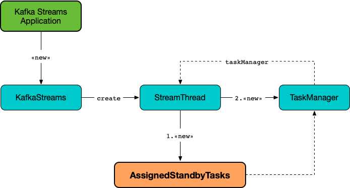

== [[AssignedStandbyTasks]] AssignedStandbyTasks -- AssignedTasks For StandbyTasks

`AssignedStandbyTasks` is a concrete <<kafka-streams-internals-AssignedTasks.adoc#, AssignedTasks>> for <<kafka-streams-internals-StandbyTask.adoc#, StandbyTasks>> that is <<creating-instance, created>> exclusively for the <<kafka-streams-internals-StreamThread.adoc#taskManager, TaskManager>> for a <<kafka-streams-internals-StreamThread.adoc#, StreamThread>> (when `KafkaStreams` is <<kafka-streams-KafkaStreams.adoc#creating-instance, created>>).

.AssignedStandbyTasks, TaskManager and StreamThread


[[logContext]]
[[creating-instance]]
`AssignedStandbyTasks` takes a `LogContext` when created.

[[taskTypeName]]
`AssignedStandbyTasks` uses *standby task* for <<kafka-streams-internals-AssignedTasks.adoc#taskTypeName, taskTypeName>>.

[[logging]]
[TIP]
====
Enable `ALL` logging level for `org.apache.kafka.streams.processor.internals.AssignedStandbyTasks` logger to see what happens inside.

Add the following line to `log4j.properties`:

```
log4j.logger.org.apache.kafka.streams.processor.internals.AssignedStandbyTasks=ALL
```

Refer to <<kafka-logging.adoc#log4j.properties, Application Logging Using log4j>>.
====
