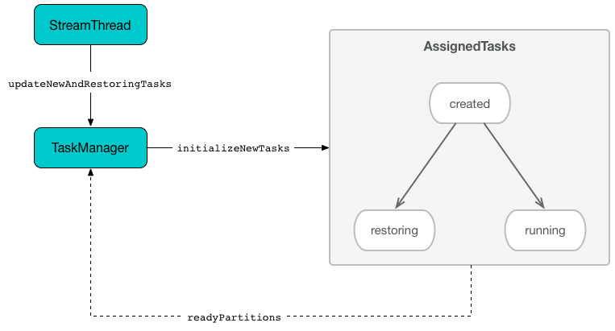

== [[AssignedTasks]] AssignedTasks

`AssignedTasks` is...FIXME

`AssignedTasks` manages tasks in the following internal registries that are the only way of assigning a status to a task, i.e. a task is in a given state if it is in one of the following registries:

1. <<running, running>> for tasks that are considered running (that `AssignedStreamsTasks` uses when requested to link:kafka-streams-AssignedStreamsTasks.adoc#process[process])

1. <<created, created>> for tasks that are considered new

1. <<suspended, suspended>> for...FIXME

1. <<restoring, restoring>> for...FIXME

1. FIXME

[[internal-registries]]
.AssignedTasks's Internal Properties (e.g. Registries, Counters and Flags)
[cols="1,2",options="header",width="100%"]
|===
| Name
| Description

| [[created]] `created`
a| FIXME

| [[restoring]] `restoring`
a| FIXME

| [[running]] `running`
a| Running tasks by their ids

`running` is a https://docs.oracle.com/javase/9/docs/api/java/util/concurrent/ConcurrentHashMap.html[java.util.concurrent.ConcurrentHashMap], i.e. `ConcurrentHashMap<TaskId, Task>`.

Used when...FIXME

Tasks IDs are added or removed as follows:

* Added when when `AssignedTasks` is requested to <<transitionToRunning, transition a task to a running state>>

* Removed when `AssignedTasks` is requested to <<suspend, suspend>> or <<clear, clear>>

| [[runningByPartition]] `runningByPartition`
| Kafka's `TopicPartitions` by the task

| [[suspended]] `suspended`
a| FIXME
|===

=== [[close]] `close` Method

[source, java]
----
void close(final boolean clean)
----

`close`...FIXME

NOTE: `close` is used when...FIXME

=== [[clear]] Removing All Task References -- `clear` Method

[source, java]
----
void clear()
----

`clear` simply removes all entries from the internal registries: <<runningByPartition, runningByPartition>>, <<restoringByPartition, restoringByPartition>>, <<running, running>>, <<created, created>>, <<suspended, suspended>> and <<restoredPartitions, restoredPartitions>>.

NOTE: `clear` is used exclusively when `AssignedTasks` is requested to <<close, close>>.

=== [[suspendTasks]] Suspending Tasks -- `suspendTasks` Internal Method

[source, java]
----
RuntimeException suspendTasks(final Collection<T> tasks)
----

`suspendTasks`...FIXME

NOTE: `suspendTasks` is used when...FIXME

=== [[suspend]] Suspending All Active Tasks -- `suspend` Method

[source, java]
----
RuntimeException suspend()
----

`suspend`...FIXME

NOTE: `suspend` is used when...FIXME

=== [[hasRunningTasks]] Checking If There Is At Least One Running Task -- `hasRunningTasks` Method

[source, java]
----
boolean hasRunningTasks()
----

`hasRunningTasks` simply checks whether there is at least one task registered in <<running, running>> internal registry or not.

NOTE: `hasRunningTasks` is used exclusively when `TaskManager` is requested to check if there are any link:kafka-streams-TaskManager.adoc#hasActiveRunningTasks[running] or link:kafka-streams-TaskManager.adoc#hasStandbyRunningTasks[standby] tasks registered.

=== [[updateRestored]] `updateRestored` Method

[source, java]
----
Set<TopicPartition> updateRestored(final Collection<TopicPartition> restored)
----

`updateRestored`...FIXME

NOTE: `updateRestored` is used when...FIXME

=== [[maybeResumeSuspendedTask]] `maybeResumeSuspendedTask` Method

[source, java]
----
boolean maybeResumeSuspendedTask(final TaskId taskId, final Set<TopicPartition> partitions)
----

`maybeResumeSuspendedTask`...FIXME

NOTE: `maybeResumeSuspendedTask` is used when...FIXME

=== [[transitionToRunning]] Scheduling Task For Execution -- `transitionToRunning` Internal Method

[source, java]
----
void transitionToRunning(final T task, final Set<TopicPartition> readyPartitions)
----

`transitionToRunning` simply makes a task available for scheduling.

Internally, `transitionToRunning` prints out the following DEBUG message to the logs:

```
transitioning [taskTypeName] [taskId] to running
```

`transitionToRunning` registers the input `task` in <<running, running>> internal registry.

NOTE: Registering a task in <<running, running>> internal registry is the only way to mark the task as running.

`transitionToRunning` requests the input `task` to link:kafka-streams-Task.adoc#initializeTopology[initializeTopology].

`transitionToRunning` registers the link:kafka-streams-Task.adoc#partitions[partitions] of the input `task` with the `task` (in <<runningByPartition, runningByPartition>> internal registry).

If the input `task` link:kafka-streams-Task.adoc#[has state stores] `transitionToRunning` adds the partitions to the input `readyPartitions`.

NOTE: The input `readyPartitions` could really be an output.

`transitionToRunning` registers the link:kafka-streams-Task.adoc#changelogPartitions[changelog partitions] of the input `task` with the `task` (in <<runningByPartition, runningByPartition>> internal registry).

NOTE: `transitionToRunning` is used when `AssignedTasks` is requested to <<initializeNewTasks, initializeNewTasks>>, <<maybeResumeSuspendedTask, maybeResumeSuspendedTask>> and <<updateRestored, updateRestored>>.

=== [[initializeNewTasks]] Initializing New Tasks -- `initializeNewTasks` Method

[source, java]
----
Set<TopicPartition> initializeNewTasks()
----

`initializeNewTasks` initializes new tasks, i.e. moves tasks from <<created, created>> registry to either <<restoring, restoring>> or <<running, running>> per whether a task has state stores that may need restoring or not, respectively. In the end `initializeNewTasks` gives the Kafka `TopicPartitions` of the tasks that have state stores.

.AssignedTasks.initializeNewTasks


NOTE: `initializeNewTasks` does nothing (and simply gives no `TopicPartitions`) unless <<created, created>> registry has at least one task.

`initializeNewTasks` prints out the following DEBUG message to the logs:

```
Initializing [taskTypeName]s [created]
```

`initializeNewTasks` walks over all tasks in <<created, created>>.

`initializeNewTasks` checks if a task should link:kafka-streams-Task.adoc#initializeStateStores[initializeStateStores].

If a task should link:kafka-streams-Task.adoc#initializeStateStores[initializeStateStores], `initializeNewTasks` simply <<transitionToRunning, schedules the task for execution>> (passing in the collection of Kafka `TopicPartitions` that `initializeNewTasks` gives in the end).

Otherwise, `initializeNewTasks` prints out the following DEBUG message to the logs and <<addToRestoring, addToRestoring>>.

```
Transitioning [taskTypeName] [taskId] to restoring
```

`initializeNewTasks` removes the tasks that have been processed successfully from <<created, created>> registry.

In case of `LockException`, `initializeNewTasks` prints out the following TRACE message to the logs:

```
Could not create [taskTypeName] [taskId] due to [message]; will retry
```

NOTE: `initializeNewTasks` is used exclusively when `TaskManager` is requested to link:kafka-streams-TaskManager.adoc#updateNewAndRestoringTasks[updateNewAndRestoringTasks].
