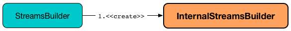

== [[InternalStreamsBuilder]] InternalStreamsBuilder

`InternalStreamsBuilder` is...FIXME

`InternalStreamsBuilder` is <<creating-instance, created>> along with link:kafka-streams-StreamsBuilder.adoc#internalStreamsBuilder[StreamsBuilder].

.Creating InternalStreamsBuilder

[[creating-instance]]
[[internalTopologyBuilder]]
`InternalStreamsBuilder` takes a link:kafka-streams-InternalTopologyBuilder.adoc[InternalTopologyBuilder] only when created.

`InternalStreamsBuilder` is an link:kafka-streams-InternalNameProvider.adoc[InternalNameProvider] and can be requested for a new name for a <<newProcessorName, processor>> or a <<newStoreName, store>>.

[[internal-registries]]
.InternalStreamsBuilder's Internal Properties (e.g. Registries, Counters and Flags)
[cols="1,2",options="header",width="100%"]
|===
| Name
| Description

| `index`
| [[index]] FIXME

Used when...FIXME
|===

=== [[addStateStore]] `addStateStore` Method

[source, java]
----
synchronized void addStateStore(final StoreBuilder builder)
----

`addStateStore`...FIXME

NOTE: `addStateStore` is used when...FIXME

=== [[stream]] Creating KStream -- `stream` Method

[source, java]
----
KStream<K, V> stream(
  final Collection<String> topics,
  final ConsumedInternal<K, V> consumed)
KStream<K, V> stream(
  final Pattern topicPattern,
  final ConsumedInternal<K, V> consumed)
----

`stream` creates a new processor name (with *KSTREAM-SOURCE* prefix) and requests <<internalTopologyBuilder, InternalTopologyBuilder>> to link:kafka-streams-InternalTopologyBuilder.adoc#addSource[register a new source topic].

In the end, `stream` gives a new instance of link:kafka-streams-KStreamImpl.adoc#creating-instance[KStreamImpl].

[source, scala]
----
import org.apache.kafka.streams.processor.internals.InternalTopologyBuilder
val internalTopologyBuilder = new InternalTopologyBuilder()

import org.apache.kafka.streams.kstream.internals.InternalStreamsBuilder
val internalStreamsBuilder = new InternalStreamsBuilder(internalTopologyBuilder)

val topics = Seq("input")
import org.apache.kafka.streams.kstream.internals.ConsumedInternal
val consumed = new ConsumedInternal[String, String]()
import collection.JavaConverters._
val kstream = internalStreamsBuilder.stream(topics.asJava, consumed)

import org.apache.kafka.streams.kstream.internals.KStreamImpl
val kstreamImpl = kstream.asInstanceOf[KStreamImpl[String, String]]
----

=== [[table]] Creating KTable for Topic -- `table` Method

[source, java]
----
KTable<K, V> table(
  final String topic,
  final ConsumedInternal<K, V> consumed,
  final MaterializedInternal<K, V, KeyValueStore<Bytes, byte[]>> materialized)
KTable<K, V> table(
  final String topic,
  final ConsumedInternal<K, V> consumed,
  final org.apache.kafka.streams.processor.StateStoreSupplier<KeyValueStore> storeSupplier)
----

`table`...FIXME

NOTE: `table` is used exclusively when `StreamsBuilder` is requested to link:kafka-streams-StreamsBuilder.adoc#table[create a KTable for a topic].

=== [[createKTable]] `createKTable` Internal Method

[source, scala]
----
KTable<K, V> createKTable(
  final ConsumedInternal<K, V> consumed,
  final String topic,
  final String storeName,
  final boolean isQueryable,
  final String source,
  final String name)
----

`createKTable`...FIXME

NOTE: `createKTable` is used exclusively when `InternalStreamsBuilder` is requested to <<table, create a KTable for a topic>>.

=== [[addGlobalStore]] `addGlobalStore` Method

[source, java]
----
synchronized void addGlobalStore(
  final StoreBuilder<KeyValueStore> storeBuilder,
  final String topic,
  final ConsumedInternal consumed,
  final ProcessorSupplier stateUpdateSupplier)
synchronized void addGlobalStore(
  final StoreBuilder<KeyValueStore> storeBuilder,
  final String sourceName,
  final String topic,
  final ConsumedInternal consumed,
  final String processorName,
  final ProcessorSupplier stateUpdateSupplier)
----

`addGlobalStore`...FIXME

NOTE: `addGlobalStore` is used when...FIXME

=== [[globalTable]] Creating GlobalKTable -- `globalTable` Method

[source, java]
----
<K, V> GlobalKTable<K, V> globalTable(
  final String topic,
  final ConsumedInternal<K, V> consumed,
  final MaterializedInternal<K, V, KeyValueStore<Bytes, byte[]>> materialized)
----

`globalTable` creates a link:kafka-streams-GlobalKTableImpl.adoc#creating-instance[GlobalKTableImpl] per the inputs.

Internally, `globalTable` requests `MaterializedInternal` to link:kafka-streams-Materialized.adoc#withLoggingDisabled[withLoggingDisabled].

`globalTable` then creates a link:kafka-streams-KeyValueStoreMaterializer.adoc#creating-instance[KeyValueStoreMaterializer] (with the input `materialized`) and requests to link:kafka-streams-KeyValueStoreMaterializer.adoc#materialize[materialize] (i.e. create a link:kafka-streams-StoreBuilder.adoc[StoreBuilder]).

`globalTable` creates a link:kafka-streams-KTableSource.adoc#creating-instance[KTableSource] (with the link:kafka-streams-StoreBuilder.adoc#name[name] of `StoreBuilder`).

`globalTable` requests <<internalTopologyBuilder, InternalTopologyBuilder>> to link:kafka-streams-InternalTopologyBuilder.adoc#addGlobalStore[register a global state store] (with the source and processor names starting with `KSTREAM-SOURCE-` prefix).

`globalTable` creates a link:kafka-streams-GlobalKTableImpl.adoc#creating-instance[GlobalKTableImpl] with the following:

* link:kafka-streams-KTableSourceValueGetterSupplier.adoc#creating-instance[KTableSourceValueGetterSupplier] with the link:kafka-streams-StoreBuilder.adoc#name[name] of `StoreBuilder`

* link:kafka-streams-GlobalKTableImpl.adoc#queryable[queryable] flag being link:kafka-streams-MaterializedInternal.adoc#queryable[that] of the input `MaterializedInternal`

NOTE: `globalTable` is used exclusively when `StreamsBuilder` is requested to link:kafka-streams-StreamsBuilder.adoc#globalTable[create a GlobalKTable].

=== [[newProcessorName]] Requesting New Processor Name -- `newProcessorName` Method

[source, java]
----
String newProcessorName(final String prefix)
----

NOTE: `newProcessorName` is part of link:kafka-streams-InternalNameProvider.adoc#newProcessorName[InternalNameProvider Contract] to...FIXME.

`newProcessorName` simply takes the input `prefix` followed by the <<index, index>>.

NOTE: The <<index, index>> counter is what makes it bound to a `InternalStreamsBuilder`.

[source, scala]
----
import org.apache.kafka.streams.kstream.internals.InternalStreamsBuilder
import org.apache.kafka.streams.processor.internals.InternalTopologyBuilder
val newBuilder = new InternalStreamsBuilder(new InternalTopologyBuilder)

val name = newBuilder.newProcessorName("PREFIX")
scala> println(name)
PREFIX0000000001
----

=== [[newStoreName]] Requesting New Store Name -- `newStoreName` Method

[source, java]
----
String newStoreName(final String prefix)
----

NOTE: `newStoreName` is part of link:kafka-streams-InternalNameProvider.adoc#newStoreName[InternalNameProvider Contract] to...FIXME.

`newStoreName` simply concatenates the input `prefix`, `STATE-STORE-` and the <<index, index>>.

NOTE: The <<index, index>> counter is what makes it bound to a `InternalStreamsBuilder`.

[source, scala]
----
import org.apache.kafka.streams.kstream.internals.InternalStreamsBuilder
import org.apache.kafka.streams.processor.internals.InternalTopologyBuilder
val newBuilder = new InternalStreamsBuilder(new InternalTopologyBuilder)

val name = newBuilder.newStoreName("PREFIX")
scala> println(name)
PREFIXSTATE-STORE-0000000001
----
