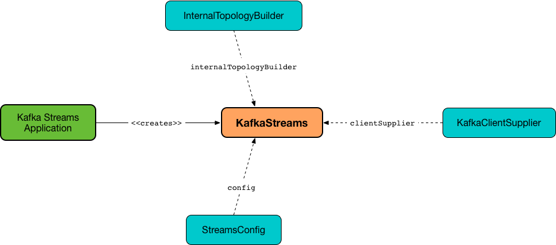

== [[KafkaStreams]] KafkaStreams

`KafkaStreams` is the entry point for *stream processing* (of Kafka records) in a Kafka Streams application.

`KafkaStreams` is simply a <<clientSupplier, Kafka client>> that consumes messages from and produces the processing results to Kafka topics (abstracted as link:kafka-streams-SourceNode.adoc[SourceNodes] and link:kafka-streams-SinkNode.adoc[SinkNodes], respectively).

.KafkaStreams


NOTE: A Kafka Streams developer describes the processing logic using a link:kafka-streams-Topology.adoc[Topology] directly (that is a graph of link:kafka-streams-Processor.adoc[processors]) or indirectly through a link:kafka-streams-StreamsBuilder.adoc[StreamsBuilder] that provides the high-level DSL to define transformations and build a stream processing topology.

[source, scala]
----
import org.apache.kafka.streams.KafkaStreams
val topology: Topology = ...

val config: StreamsConfig = ...
val ks = new KafkaStreams(topology, config)
----

Once <<creating-instance, created>>, `KafkaStreams` is <<start, started up>> to start consuming, processing, and producing records (as described by a <<topology, Topology>>).

[source, scala]
----
ks.start
----

`KafkaStreams` uses a <<internalTopologyBuilder, InternalTopologyBuilder>> for the following:

* Creating a <<streamsMetadataState, StreamsMetadataState>>, <<threads, StreamThreads>> and <<queryableStoreProvider, QueryableStoreProvider>>

* Requesting a <<kafka-streams-InternalTopologyBuilder.adoc#buildGlobalStateTopology, global processor topology>> (for a <<globalStreamThread, GlobalStreamThread>>)

[[internal-registries]]
.KafkaStreams's Internal Properties (e.g. Registries, Counters and Flags)
[cols="1,2",options="header",width="100%"]
|===
| Name
| Description

| `globalStreamThread`
a| [[globalStreamThread]] link:kafka-streams-GlobalStreamThread.adoc[GlobalStreamThread]

* Initialized exclusively when <<internalTopologyBuilder, InternalTopologyBuilder>> could link:kafka-streams-InternalTopologyBuilder.adoc#buildGlobalStateTopology[build a global ProcessorTopology]

* Started when `KafkaStreams` is being <<start, started>>

* Set to `null` while `KafkaStreams` is being <<close, closed>>

| `adminClient`
a| [[adminClient]] Kafka https://kafka.apache.org/20/javadoc/org/apache/kafka/clients/admin/AdminClient.html[AdminClient] for managing and inspecting topics, brokers, configurations and ACLs.

* Created while `KafkaStreams` is being <<creating-instance, created>> for the only purpose of link:kafka-streams-StreamThread.adoc#create[creating a StreamThread] (which is actually passed along to a link:kafka-streams-TaskManager.adoc#adminClient[TaskManager])

* Closed while `KafkaStreams` is being <<close, closed>>

| `queryableStoreProvider`
| [[queryableStoreProvider]] link:kafka-streams-QueryableStoreProvider.adoc[QueryableStoreProvider]

| `stateDirectory`
| [[stateDirectory]] link:kafka-streams-StateDirectory.adoc[StateDirectory]

| `stateLock`
| [[stateLock]] Object lock for...FIXME

| `streamsMetadataState`
| [[streamsMetadataState]] link:kafka-streams-StreamsMetadataState.adoc[StreamsMetadataState] (for the <<internalTopologyBuilder, InternalTopologyBuilder>> and link:kafka-streams-properties.adoc#application.server[application.server] configuration property)

| `threads`
a| [[threads]] <<kafka-streams-StreamThread.adoc#, Stream processor threads>> (aka `StreamThread`)

NOTE: The number of stream processor threads per KafkaStreams instance is controlled by <<kafka-streams-properties.adoc#num.stream.threads, num.stream.threads>> configuration property (default: `1` processing thread).

* Created when `KafkaStreams` is <<creating-instance, created>>
* Started when `KafkaStreams` is <<start, started>>
* Shut down when `KafkaStreams` is <<close, closed>>
|===

[[logging]]
[TIP]
====
Enable `DEBUG` logging level for `org.apache.kafka.streams.KafkaStreams` logger to see what happens inside.

Add the following line to `log4j.properties`:

```
log4j.logger.org.apache.kafka.streams.KafkaStreams=DEBUG
```

Refer to link:kafka-logging.adoc#log4j.properties[Application Logging Using log4j].
====

=== [[cleanUp]] Cleaning Up Local Directory of State Store -- `cleanUp` Method

[source, java]
----
void cleanUp()
----

`cleanUp` simply requests <<stateDirectory, StateDirectory>> to link:kafka-streams-StateDirectory.adoc#clean[clean] when `KafkaStreams` is not <<isRunning, running>>.

NOTE: `cleanUp` can only be executed before `KafkaStreams` will be <<start, started>> or after has been <<close, closed>>.

`cleanUp` reports a `IllegalStateException` when `KafkaStreams` is <<isRunning, running>>.

```
Cannot clean up while running.
```

=== [[isRunning]] `isRunning` Internal Method

[source, java]
----
boolean isRunning()
----

`isRunning`...FIXME

NOTE: `isRunning` is used when...FIXME

=== [[close]] Closing KafkaStreams -- `close` Method

[source, java]
----
void close()  // <1>
synchronized boolean close(final long timeout, final TimeUnit timeUnit)
----
<1> Calls `close(final long timeout, final TimeUnit timeUnit)` with 0 timeout

`close`...FIXME

IMPORTANT: Always execute `close` on a `KafkaStreams` instance even if you never call <<start, start>> to avoid resource leaks.

=== [[localThreadsMetadata]] `localThreadsMetadata` Method

[source, java]
----
Set<ThreadMetadata> localThreadsMetadata()
----

`localThreadsMetadata`...FIXME

NOTE: `localThreadsMetadata` is used when...FIXME

=== [[creating-instance]] Creating KafkaStreams Instance

[source, java]
----
// public API
KafkaStreams(
  final Topology topology,
  final Properties props) // <1>

// public API (mostly for testing)
KafkaStreams(
  final Topology topology,
  final Properties props,
  final KafkaClientSupplier clientSupplier) // <3>
KafkaStreams(
  final Topology topology,
  final Properties props,
  final Time time)  // <4>

// private/internal API
KafkaStreams(
  final InternalTopologyBuilder internalTopologyBuilder,
  final StreamsConfig config,
  final KafkaClientSupplier clientSupplier) // <5>
KafkaStreams(
  final InternalTopologyBuilder internalTopologyBuilder,
  final StreamsConfig config,
  final KafkaClientSupplier clientSupplier,
  final Time time)  // <6>
----
<1> Calls the internal `KafkaStreams` (5) with a new DefaultKafkaClientSupplier
<5> Calls the internal `KafkaStreams` (6) with `SystemTime`

`KafkaStreams` takes the following when created:

* [[internalTopologyBuilder]] link:kafka-streams-InternalTopologyBuilder.adoc[InternalTopologyBuilder]
* [[config]] link:kafka-streams-StreamsConfig.adoc[StreamsConfig]
* [[clientSupplier]] link:kafka-streams-KafkaClientSupplier.adoc[KafkaClientSupplier]
* [[time]] `Time`

`KafkaStreams` initializes the <<internal-registries, internal registries and counters>>.

While being created, `KafkaStreams`...FIXME

=== [[setRunningFromCreated]] `setRunningFromCreated` Internal Method

[source, java]
----
boolean setRunningFromCreated()
----

`setRunningFromCreated`...FIXME

NOTE: `setRunningFromCreated` is used exclusively when `KafkaStreams` is <<start, started>>.

=== [[toString]] Describing Itself (Text Representation) -- `toString` Method

[source, java]
----
String toString() // <1>
String toString(final String indent)
----
<1> Calls `toString(final String indent)` with an empty indent, i.e. `""`

NOTE: `toString` with an indent is *deprecated* and should not be used. Use <<localThreadsMetadata, localThreadsMetadata>> instead.

`toString`...FIXME

=== [[start]] Starting KafkaStreams -- `start` Method

[source, java]
----
synchronized void start()
throws IllegalStateException, StreamsException
----

`start` starts the <<topology, Topology>> (that in turn starts consuming, processing, and producing records).

Internally, `start` prints out the following DEBUG message to the logs:

```
Starting Streams client
```

`start` <<setRunningFromCreated, marks KafkaStreams as running>> (i.e. transitions from CREATED to RUNNING state and notifies link:kafka-streams-StateListener.adoc[StateListeners]).

`start` starts <<globalStreamThread, global stream thread>> if defined (which is when...FIXME)

`start` starts <<threads, stream threads>>.

`start` schedules a thread that requests <<stateDirectory, StateDirectory>> to link:kafka-streams-StateDirectory.adoc#cleanRemovedTasks[cleanRemovedTasks] every link:kafka-streams-properties.adoc#state.cleanup.delay.ms[state.cleanup.delay.ms] milliseconds.

You should see the following DEBUG message in the logs:

```
Started Streams client
```

In case the <<setRunningFromCreated, changing state to running>> fails, `start` merely prints out the following ERROR message to the logs:

```
Already stopped, cannot re-start
```

=== [[allMetadataForStore]] `allMetadataForStore` Method

[source, java]
----
Collection<StreamsMetadata> allMetadataForStore(final String storeName)
----

`allMetadataForStore`...FIXME

NOTE: `allMetadataForStore` is used when...FIXME

=== [[store]] `store` Method

[source, java]
----
<T> T store(final String storeName, final QueryableStoreType<T> queryableStoreType)
----

`store`...FIXME

NOTE: `store` is used when...FIXME
