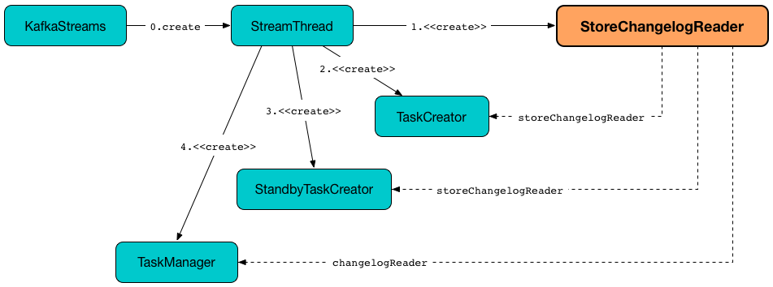

== [[StoreChangelogReader]] StoreChangelogReader

`StoreChangelogReader` is a concrete <<kafka-streams-ChangelogReader.adoc#, ChangelogReader>> that...FIXME

`StoreChangelogReader` is <<creating-instance, created>> for a <<kafka-streams-StreamThread.adoc#create, StreamThread>>.

.StoreChangelogReader

`StoreChangelogReader` uses the <<userStateRestoreListener, StateRestoreListener>> exclusively when <<register, registering a StateRestorer>>.

NOTE: link:kafka-streams-StreamThread.adoc[StreamThread] uses a `StoreChangelogReader` to create a link:kafka-streams-internals-TaskCreator.adoc#storeChangelogReader[TaskCreator], a link:kafka-streams-internals-StandbyTaskCreator.adoc#storeChangelogReader[StandbyTaskCreator] and a link:kafka-streams-internals-TaskManager.adoc#changelogReader[TaskManager].

[[internal-registries]]
.StoreChangelogReader's Internal Properties (e.g. Registries, Counters and Flags)
[cols="1m,2",options="header",width="100%"]
|===
| Name
| Description

| endOffsets
| [[endOffsets]]

| log
| [[log]]

| needsInitializing
| [[needsInitializing]]

| needsRestoring
| [[needsRestoring]]

| partitionInfo
| [[partitionInfo]]

| stateRestorers
| [[stateRestorers]]
|===

=== [[creating-instance]] Creating StoreChangelogReader Instance

`StoreChangelogReader` takes the following when created:

* [[restoreConsumer]] Kafka https://kafka.apache.org/20/javadoc/org/apache/kafka/clients/consumer/KafkaConsumer.html[Consumer] (`Consumer<byte[], byte[]>`)
* [[userStateRestoreListener]] <<kafka-streams-StateRestoreListener.adoc#, StateRestoreListener>>
* [[logContext]] `LogContext`

`StoreChangelogReader` initializes the <<internal-registries, internal registries and counters>>.

=== [[register]] Registering StateRestorer -- `register` Method

[source, java]
----
void register(final StateRestorer restorer)
----

NOTE: `register` is part of link:kafka-streams-ChangelogReader.adoc#register[ChangelogReader Contract] to...FIXME.

`register`...FIXME

=== [[reset]] `reset` Method

[source, java]
----
void reset()
----

NOTE: `reset` is part of link:kafka-streams-ChangelogReader.adoc#reset[ChangelogReader Contract] to...FIXME.

`reset`...FIXME

=== [[restore]] `restore` Method

[source, java]
----
Collection<TopicPartition> restore(final RestoringTasks active)
----

NOTE: `restore` is part of the <<kafka-streams-ChangelogReader.adoc#restore, ChangelogReader Contract>> to...FIXME.

`restore`...FIXME

=== [[restoredOffsets]] `restoredOffsets` Method

[source, java]
----
Map<TopicPartition, Long> restoredOffsets()
----

NOTE: `restoredOffsets` is part of link:kafka-streams-ChangelogReader.adoc#restoredOffsets[ChangelogReader Contract] to...FIXME.

`restoredOffsets`...FIXME

=== [[processNext]] `processNext` Internal Method

[source, java]
----
long processNext(
  final List<ConsumerRecord<byte[], byte[]>> records,
  final StateRestorer restorer,
  final Long endOffset)
----

`processNext`...FIXME

NOTE: `processNext` is used exclusively when `StoreChangelogReader` is requested to <<restore, restore>>.

=== [[startRestoration]] `startRestoration` Internal Method

[source, java]
----
void startRestoration(final Map<TopicPartition, StateRestorer> initialized)
----

`startRestoration`...FIXME

NOTE: `startRestoration` is used exclusively when `StoreChangelogReader` is requested to <<initialize, initialize>> (when requested to <<restore, restore>>).

=== [[initialize]] `initialize` Internal Method

[source, java]
----
void initialize()
----

`initialize`...FIXME

NOTE: `initialize` is used exclusively when `StateRestorer` is requested to <<restore, restore>>.
