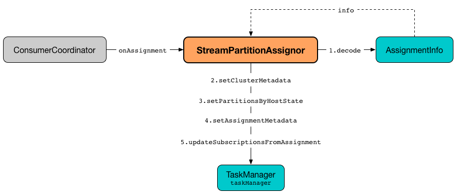

== [[StreamPartitionAssignor]] StreamPartitionAssignor -- Partition Assignment Strategy

`StreamPartitionAssignor` is a Kafka Consumer `PartitionAssignor` for a partition assignment strategy and distribute partition ownership across the members of a consumer group.

[[creating-instance]]
`StreamPartitionAssignor` is a Kafka `Configurable` that is instantiated by reflection and <<configure, takes configuration parameters>>.

`StreamPartitionAssignor` is registered when `StreamsConfig` is requested for link:kafka-streams-StreamsConfig.adoc#getConsumerConfigs[Kafka Consumer configuration] with `partition.assignment.strategy` (`ConsumerConfig.PARTITION_ASSIGNMENT_STRATEGY_CONFIG`) property.

TIP: Read https://cwiki.apache.org/confluence/display/KAFKA/Kafka+Client-side+Assignment+Proposal[Kafka Client-side Assignment Proposal] on the group management in Apache Kafka's Consumer API.

[[internal-registries]]
.StreamPartitionAssignor's Internal Properties (e.g. Registries, Counters and Flags)
[cols="1,2",options="header",width="100%"]
|===
| Name
| Description

| [[internalTopicManager]] `internalTopicManager`
| link:kafka-streams-InternalTopicManager.adoc[InternalTopicManager]

Used when...FIXME
|===

=== [[configure]] `configure` Method

[source, scala]
----
void configure(final Map<String, ?> configs)
----

NOTE: `configure` is part of Kafka Consumer's `Configurable` contract for classes that are instantiated by reflection and need to take configuration parameters.

`configure`...FIXME

=== [[assign]] `assign` Method

[source, java]
----
Map<String, Assignment> assign(Cluster metadata, Map<String, Subscription> subscriptions)
----

NOTE: `assign` is part of Kafka Consumer's `PartitionAssignor` contract to perform the group assignment given the member subscriptions and current cluster metadata.

`assign`...FIXME

=== [[subscription]] `subscription` Method

[source, java]
----
Subscription subscription(Set<String> topics)
----

NOTE: `subscription` is part of Kafka Consumer's `PartitionAssignor` contract to...FIXME.

`subscription`...FIXME

=== [[onAssignment]] Handling Partition Assignment From Group Leader -- `onAssignment` Method

[source, java]
----
void onAssignment(Assignment assignment)
----

[NOTE]
====
`onAssignment` is part of Kafka Consumer's `PartitionAssignor` contract for a group member to handle assignment from the leader.

`onAssignment` is executed when a group member has successfully joined a group.
====

.StreamPartitionAssignor.onAssignment


`onAssignment` takes the partitions (from the input `assignment`) and sorts it by topic and partition.

`onAssignment` requests `AssignmentInfo` to link:kafka-streams-AssignmentInfo.adoc#decode[decode] the additional metadata (i.e. the `userData` from the input `assignment`).

CAUTION: FIXME Finish me

In the end, `onAssignment` requests <<taskManager, TaskManager>> for the following:

1. link:kafka-streams-TaskManager.adoc#setClusterMetadata[Setting cluster metadata]

1. link:kafka-streams-TaskManager.adoc#setPartitionsByHostState[Notifying StreamsMetadataState about Cluster Metadata Changes]

1. link:kafka-streams-TaskManager.adoc#setAssignmentMetadata[Setting assigned metadata] with active and standby tasks

1. link:kafka-streams-TaskManager.adoc#updateSubscriptionsFromAssignment[updateSubscriptionsFromAssignment] with the assigned partitions

`onAssignment` reports an `TaskAssignmentException` if the numbers of partitions and active tasks are not equal.

```
[logPrefix]Number of assigned partitions [partitions] is not equal to the number of active taskIds [activeTasks], assignmentInfo=[info]
```
