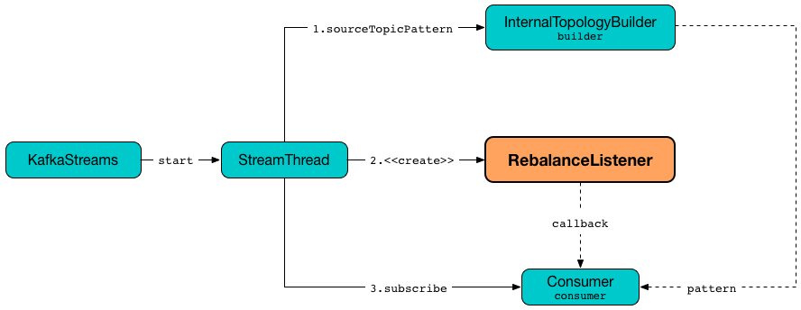

== [[RebalanceListener]] RebalanceListener

`RebalanceListener` is a Apache Kafka https://kafka.apache.org/10/javadoc/org/apache/kafka/clients/consumer/ConsumerRebalanceListener.html[ConsumerRebalanceListener] that listens to changes to the set of partitions assigned to a Kafka consumer.

.RebalanceListener, StreamThread and KafkaStreams


`RebalanceListener` is <<creating-instance, created>> exclusively when `StreamThread` is link:kafka-streams-StreamThread.adoc#rebalanceListener[created].

[[logging]]
[TIP]
====
`RebalanceListener` uses `org.apache.kafka.streams.processor.internals.StreamThread` <<log, logger>> for logging.

Enable `DEBUG` logging level for `org.apache.kafka.streams.processor.internals.StreamThread` logger to see what happens inside.

Add the following line to `log4j.properties`:

```
log4j.logger.org.apache.kafka.streams.processor.internals.StreamThread=DEBUG
```

Refer to link:kafka-logging.adoc#log4j.properties[Application Logging Using log4j].
====

=== [[onPartitionsAssigned]] Handling Partition Assignment -- `onPartitionsAssigned` Handler Method

[source, java]
----
void onPartitionsAssigned(final Collection<TopicPartition> assignment)
----

NOTE: `onPartitionsAssigned` is part of `ConsumerRebalanceListener` Contract in Apache Kafka to...FIXME.

Internally, `onPartitionsAssigned` first prints out the following DEBUG message to the logs:

```
at state [state]: partitions [assignment] assigned at the end of consumer rebalance.
  current suspended active tasks: [taskIds]
  current suspended standby tasks: [taskIds]
```

`onPartitionsAssigned` requests <<streamThread, StreamThread>> to set the state to `PARTITIONS_ASSIGNED` followed by requesting <<taskManager, TaskManager>> for link:kafka-streams-TaskManager.adoc#createTasks[processor tasks for assigned topic partitions].

In the end, `onPartitionsAssigned` prints out the following INFO message to the logs:

```
partition assignment took [duration] ms.
  current active tasks: [activeTaskIds]
  current standby tasks: [standbyTaskIds]
  previous active tasks: [prevActiveTaskIds]
```

`onPartitionsAssigned` does nothing (i.e. prints the messages to the logs) when the state transition was invalid.

=== [[onPartitionsRevoked]] `onPartitionsRevoked` Handler Method

[source, java]
----
void onPartitionsRevoked(final Collection<TopicPartition> assignment)
----

NOTE: `onPartitionsRevoked` is part of `ConsumerRebalanceListener` Contract in Apache Kafka to...FIXME.

`onPartitionsRevoked`...FIXME

=== [[creating-instance]] Creating RebalanceListener Instance

`RebalanceListener` takes the following when created:

* [[time]] `Time`
* [[taskManager]] link:kafka-streams-TaskManager.adoc[TaskManager]
* [[streamThread]] link:kafka-streams-StreamThread.adoc[StreamThread]
* [[log]] `Logger`
