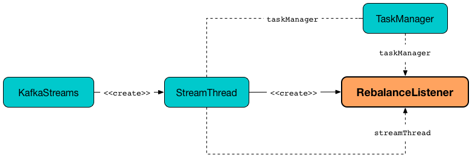

== [[RebalanceListener]] RebalanceListener -- Kafka ConsumerRebalanceListener for Partition Assignment Among Processor Tasks

`RebalanceListener` is a Apache Kafka https://kafka.apache.org/10/javadoc/org/apache/kafka/clients/consumer/ConsumerRebalanceListener.html[ConsumerRebalanceListener] callback interface that listens to changes to the partitions assigned to a single instance of a Kafka Streams application.

.RebalanceListener, StreamThread and KafkaStreams
image::images/kafka-streams-RebalanceListener.png[align="center"]

From the documentation of https://kafka.apache.org/10/javadoc/org/apache/kafka/clients/consumer/ConsumerRebalanceListener.html[org.apache.kafka.clients.consumer.ConsumerRebalanceListener]:

> `ConsumerRebalanceListener` is a callback interface that the user can implement to trigger custom actions when the set of partitions assigned to the consumer changes.

> When Kafka is managing the group membership, a partition re-assignment will be triggered any time the members of the group change or the subscription of the members changes. This can occur when processes die, new process instances are added or old instances come back to life after failure. Rebalances can also be triggered by changes affecting the subscribed topics (e.g. when the number of partitions is administratively adjusted).

> It is guaranteed that all consumer processes will invoke `onPartitionsRevoked` prior to any process invoking `onPartitionsAssigned`.

`RebalanceListener` is <<creating-instance, created>> exclusively when `StreamThread` is link:kafka-streams-StreamThread.adoc#rebalanceListener[created].

.Creating RebalanceListener


At the completion of a successful partition re-assignment (i.e. <<onPartitionsAssigned, onPartitionsAssigned>> event) `RebalanceListener` requests <<taskManager, TaskManager>> to link:kafka-streams-TaskManager.adoc#createTasks[creating processor tasks for assigned topic partitions].

At the start of a rebalance operation (i.e. <<onPartitionsRevoked, onPartitionsRevoked>> event) `RebalanceListener` requests <<taskManager, TaskManager>> to link:kafka-streams-TaskManager.adoc#suspendTasksAndState[suspending all stream tasks and state].

`RebalanceListener` uses <<streamThread, StreamThread>> for the following:

1. Changing the state (of the stream processor thread) at <<onPartitionsAssigned, partition assignment>> and <<onPartitionsRevoked, partition revocation>>

1. Clearing standby records at the end of <<onPartitionsRevoked, partition revocation>>

1. Notifying about the error caught at <<onPartitionsAssigned, partition assignment>> and <<onPartitionsRevoked, partition revocation>>

[[logging]]
[TIP]
====
`RebalanceListener` uses `org.apache.kafka.streams.processor.internals.StreamThread` <<log, logger>> for logging.

Enable `DEBUG` logging level for `org.apache.kafka.streams.processor.internals.StreamThread` logger to see what happens inside.

Add the following line to `log4j.properties`:

```
log4j.logger.org.apache.kafka.streams.processor.internals.StreamThread=DEBUG
```

Refer to link:kafka-logging.adoc#log4j.properties[Application Logging Using log4j].
====

=== [[onPartitionsAssigned]] Handling Partition Assignment -- `onPartitionsAssigned` Handler Method

[source, java]
----
void onPartitionsAssigned(final Collection<TopicPartition> assignment)
----

NOTE: `onPartitionsAssigned` is part of `ConsumerRebalanceListener` Contract in Apache Kafka to...FIXME.

Internally, `onPartitionsAssigned` first prints out the following DEBUG message to the logs:

```
at state [state]: partitions [assignment] assigned at the end of consumer rebalance.
  current suspended active tasks: [taskIds]
  current suspended standby tasks: [taskIds]
```

`onPartitionsAssigned` requests <<streamThread, StreamThread>> to set the state to `PARTITIONS_ASSIGNED` followed by requesting <<taskManager, TaskManager>> for link:kafka-streams-TaskManager.adoc#createTasks[processor tasks for assigned topic partitions].

In the end, `onPartitionsAssigned` prints out the following INFO message to the logs:

```
partition assignment took [duration] ms.
  current active tasks: [activeTaskIds]
  current standby tasks: [standbyTaskIds]
  previous active tasks: [prevActiveTaskIds]
```

`onPartitionsAssigned` does nothing (i.e. prints the messages to the logs) when the state transition was invalid.

=== [[onPartitionsRevoked]] Handling Partition Revocation -- `onPartitionsRevoked` Handler Method

[source, java]
----
void onPartitionsRevoked(final Collection<TopicPartition> assignment)
----

NOTE: `onPartitionsRevoked` is part of `ConsumerRebalanceListener` Contract in Apache Kafka to...FIXME.

`onPartitionsRevoked`...FIXME

=== [[creating-instance]] Creating RebalanceListener Instance

`RebalanceListener` takes the following when created:

* [[time]] `Time`
* [[taskManager]] link:kafka-streams-TaskManager.adoc[TaskManager]
* [[streamThread]] link:kafka-streams-StreamThread.adoc[StreamThread]
* [[log]] `Logger`
