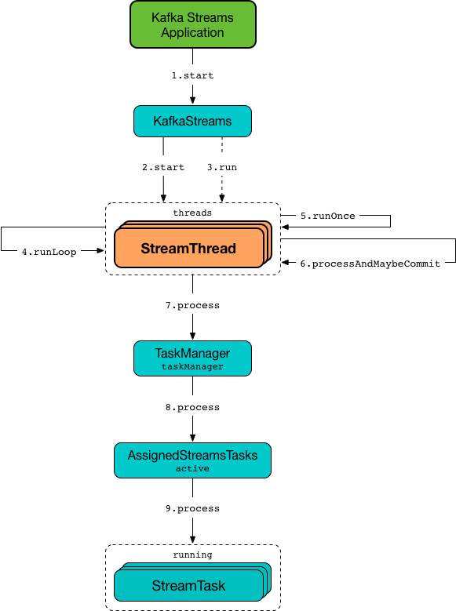
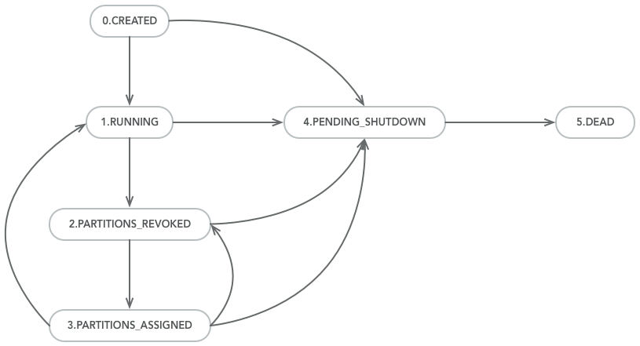
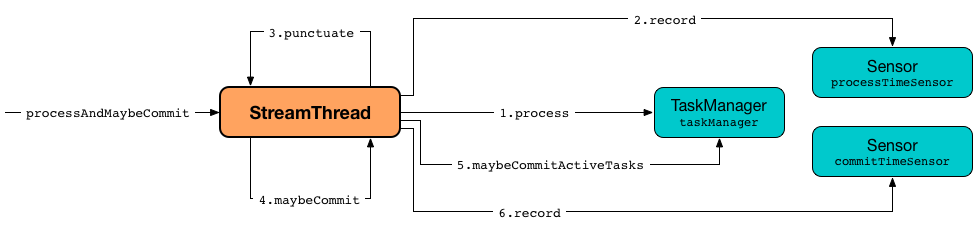
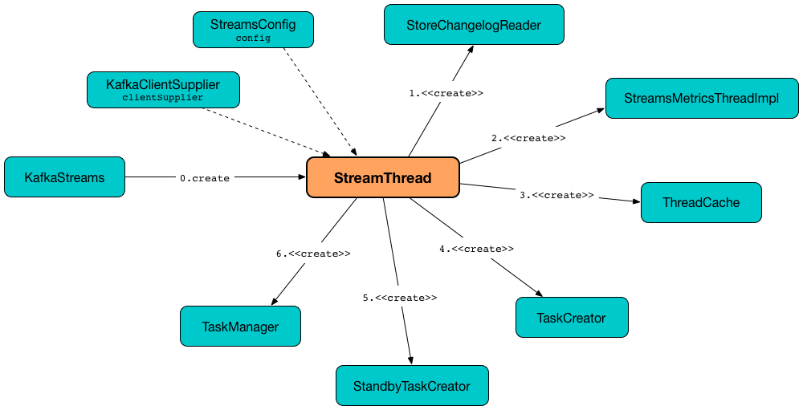

== [[StreamThread]] StreamThread -- Stream Processor Thread

`StreamThread` is the <<run, stream processor thread>> (a Java https://docs.oracle.com/javase/9/docs/api/java/lang/Thread.html[Thread]) in a Kafka Streams application that <<runLoop, runs the main record processing loop>>.

.StreamThread and Stream Processing


`StreamThread` uses a <<consumer, Kafka Consumer>> to subscribe to the <<kafka-streams-InternalTopologyBuilder.adoc#sourceTopicPattern, source topics>> (of the <<builder, InternalTopologyBuilder>>).

`StreamThread` is <<create, created>> exclusively when `KafkaStreams` is <<kafka-streams-KafkaStreams.adoc#creating-instance, created>>.

NOTE: `KafkaStreams` uses <<kafka-streams-KafkaStreams.adoc#threads, num.stream.threads>> configuration property for the number of `StreamThreads` to create (default: `1` processing thread).

[[pollTimeMs]]
`StreamThread` uses the link:kafka-streams-properties.adoc#poll.ms[poll.ms] configuration property as the *polling interval* for <<pollRequests, polling the topics for records>>.

[[commitTimeMs]]
`StreamThread` uses the <<kafka-streams-properties.adoc#commit.interval.ms, commit.interval.ms>> configuration property as the *flush interval* for persisting the position of a processor (when <<runOnce, runOnce>> and <<maybeCommit, maybeCommit>>).

`StreamThread` uses the <<consumer, Kafka Consumer>> to:

* Subscribe to topics (with <<rebalanceListener, RebalanceListener>>) right after `StreamThread` has been requested to <<runLoop, run the main record processing loop>>

* Poll the topics subscribed (and fetch records if available) right after `StreamThread` has been requested to <<pollRequests, get the next batch of records by polling>>

* <<resetInvalidOffsets, resetInvalidOffsets>> (when an `InvalidOffsetException` is reported while <<pollRequests, polling the topics for records>>)

`StreamThread` closes the Kafka <<consumer, consumer>> while <<completeShutdown, shuting down>>.

`StreamThread` uses `stream-thread [[clientId]-StreamThread-[STREAM_THREAD_ID]]` logging prefix.

`StreamThread` requires an <<builder, InternalTopologyBuilder>> to be <<create, created>> and uses it for the following:

* Creating a <<kafka-streams-TaskCreator.adoc#, TaskCreator>> and a <<kafka-streams-StandbyTaskCreator.adoc#, StandbyTaskCreator>>

* <<runLoop, Running the main record processing loop>> (and subscribing to the <<kafka-streams-InternalTopologyBuilder.adoc#sourceTopicPattern, source topics>>)

* <<resetInvalidOffsets, resetInvalidOffsets>>

`StreamThread` uses the <<taskManager, TaskManager>> for the following:

* FIXME

[[internal-registries]]
.StreamThread's Internal Properties (e.g. Registries, Counters and Flags)
[cols="1m,2",options="header",width="100%"]
|===
| Name
| Description

| builder
| [[builder]] link:kafka-streams-InternalTopologyBuilder.adoc[InternalTopologyBuilder]

| rebalanceListener
a| [[rebalanceListener]] link:kafka-streams-StreamThread-RebalanceListener.adoc[RebalanceListener]

* Used exclusively when `StreamThread` is requested to <<runLoop, run the main record processing loop>> (and requests the Kafka <<consumer, Consumer>> to subscribe to get dynamically assigned partitions of topics matching specified pattern)

NOTE: `StreamThread` requests <<builder, InternalTopologyBuilder>> for the link:kafka-streams-InternalTopologyBuilder.adoc#sourceTopicPattern[source topic pattern] to subscribe to.

| lastCommitMs
| [[lastCommitMs]] Time of the last <<maybeCommit, commit>>

| processStandbyRecords
| [[processStandbyRecords]] Flag to control whether to <<maybeUpdateStandbyTasks, maybeUpdateStandbyTasks>> after <<maybeCommit, maybeCommit>> was executed

| timerStartedMs
| [[timerStartedMs]] The timestamp when the timer has started
|===

[[logging]]
[TIP]
====
Enable any of `WARN`, `ERROR`, `INFO`, `DEBUG`, `TRACE` logging levels for `org.apache.kafka.streams.processor.internals.StreamThread` logger to see what happens inside.

Add the following line to `log4j.properties`:

```
log4j.logger.org.apache.kafka.streams.processor.internals.StreamThread=TRACE
```

Refer to link:kafka-logging.adoc#log4j.properties[Application Logging Using log4j].
====

=== [[state]][[State]] Life Cycle of StreamThread -- StreamThread's States

`StreamThread` can be in exactly one of the following *states* at any given point in time:

[start=0]
1. [[CREATED]] `CREATED` - The initial state of `StreamThread` right after it was <<creating-instance, created>>
1. [[RUNNING]] `RUNNING` - `StreamThread` was requested for the following:
* <<run, run>>
* <<runOnce, runOnce>> when `StreamThread` is in <<PARTITIONS_ASSIGNED, PARTITIONS_ASSIGNED>> state and <<taskManager, TaskManager>> was positive after link:kafka-streams-TaskManager.adoc#updateNewAndRestoringTasks[updateNewAndRestoringTasks]
* <<runOnce, runOnce>> when `StreamThread` polled for records and happened to transition to <<PARTITIONS_ASSIGNED, PARTITIONS_ASSIGNED>> state, but (again) only when <<taskManager, TaskManager>> was positive after link:kafka-streams-TaskManager.adoc#updateNewAndRestoringTasks[updateNewAndRestoringTasks]
1. [[PARTITIONS_REVOKED]] `PARTITIONS_REVOKED` - `RebalanceListener` was requested to link:kafka-streams-StreamThread-RebalanceListener.adoc#onPartitionsRevoked[handle partition revocation]
1. [[PARTITIONS_ASSIGNED]] `PARTITIONS_ASSIGNED` - `RebalanceListener` was requested to link:kafka-streams-StreamThread-RebalanceListener.adoc#onPartitionsAssigned[handle partition assignment]
1. [[PENDING_SHUTDOWN]] `PENDING_SHUTDOWN` - `StreamThread` was requested to <<shutdown, shutdown>> or <<completeShutdown, completeShutdown>>
1. [[DEAD]] `DEAD` - `StreamThread` is requested to <<completeShutdown, completeShutdown>>

.StreamThread's Life Cycle


`StreamThread` can be transitioned to another state by executing <<setState, setState>>.

NOTE: `StreamThread` defines a Java enumeration `State` with the states above ordered by ordinal. When created, they are assigned the state ordinals that could transition to. You can check whether a transition is valid or not using `State.isValidTransition`.

[source, scala]
----
import org.apache.kafka.streams.processor.internals.StreamThread.State._

scala> CREATED.ordinal
res1: Int = 0

scala> CREATED.isValidTransition(RUNNING)
res2: Boolean = true

scala> CREATED.isValidTransition(DEAD)
res3: Boolean = false
----

=== [[setStateListener]] `setStateListener` Method

[source, java]
----
void setStateListener(final StreamThread.StateListener listener)
----

`setStateListener`...FIXME

NOTE: `setStateListener` is used when...FIXME

=== [[pollRequests]] Polling for Records -- `pollRequests` Internal Method

[source, java]
----
ConsumerRecords<byte[], byte[]> pollRequests(final long pollTimeMs)
----

`pollRequests`...FIXME

[NOTE]
====
`pollRequests` is used exclusively when `StreamThread` is requested to <<runOnce, consume records once>>:

* With `0` for `pollTimeMs` when in `PARTITIONS_ASSIGNED` <<state, state>>

* With <<pollTimeMs, pollTimeMs>> in any other state but `PARTITIONS_ASSIGNED`
====

=== [[resetInvalidOffsets]] `resetInvalidOffsets` Internal Method

[source, java]
----
void resetInvalidOffsets(final InvalidOffsetException e)
----

`resetInvalidOffsets`...FIXME

NOTE: `resetInvalidOffsets` is used exclusively when `StreamThread` is requested to <<pollRequests, pollRequests>> (and an `InvalidOffsetException` is reported).

=== [[completeShutdown]] `completeShutdown` Internal Method

[source, java]
----
void completeShutdown(final boolean cleanRun)
----

`completeShutdown`...FIXME

NOTE: `completeShutdown` is used when `StreamThread` is requested to <<run, run>> and <<shutdown, shutdown>>.

=== [[shutdown]] `shutdown` Method

[source, java]
----
void shutdown()
----

`shutdown`...FIXME

NOTE: `shutdown` is used exclusively when `KafkaStreams` is requested to link:kafka-streams-KafkaStreams.adoc#close[close].

=== [[runOnce]] Polling Records Once -- `runOnce` Method

[source, java]
----
long runOnce(final long recordsProcessedBeforeCommit)
----

`runOnce` does...FIXME

[NOTE]
====
`recordsProcessedBeforeCommit` starts as `UNLIMITED_RECORDS` (i.e. `-1`) in the <<runLoop, main record processing loop>> (where the record stream processing starts off), and is passed along to every invocation of `runOnce`.

`runOnce` can <<adjustRecordsProcessedBeforeCommit, adjust>> `recordsProcessedBeforeCommit` (i.e. scale it down or up) given the current processing latency and commit time.

Eventually, `recordsProcessedBeforeCommit` reaches <<processAndMaybeCommit, processAndMaybeCommit>>.
====

Internally, `runOnce` first <<runOnce-branches-state, branches off>> per <<state, state>>.

[[runOnce-branches-state]]
.runOnce's State Branches
[cols="1,2",options="header",width="100%"]
|===
| PARTITIONS_ASSIGNED
| Other states

a|

1. `runOnce` <<pollRequests, pollRequests>> with timeout `0`

1. Requests <<taskManager, TaskManager>> to link:kafka-streams-TaskManager.adoc#updateNewAndRestoringTasks[updateNewAndRestoringTasks]

  i. (optionally) Changes the <<state, state>> to `RUNNING`

a|

1. `runOnce` <<pollRequests, pollRequests>> with timeout as defined by <<pollTimeMs, poll.ms>> configuration property

1. If (for some reason) the <<state, state>> has changed to `PARTITIONS_ASSIGNED` `runOnce` requests <<taskManager, TaskManager>> to link:kafka-streams-TaskManager.adoc#updateNewAndRestoringTasks[updateNewAndRestoringTasks]

  i. (optionally) Changes the <<state, state>> to `RUNNING`
|===

If there are records to processed (i.e. <<pollRequests, pollRequests>> gave records) and the <<taskManager, TaskManager>> has link:kafka-streams-TaskManager.adoc#hasActiveRunningTasks[active running tasks], `runOnce` requests `pollTimeSensor` to record the current poll latency.

`runOnce` <<addRecordsToTasks, addRecordsToTasks>> followed by <<processAndMaybeCommit, processAndMaybeCommit>> (with the input number of records as `recordsProcessedBeforeCommit`).

With at least one record processed (as computed in <<processAndMaybeCommit, processAndMaybeCommit>>) `runOnce` requests `processTimeSensor` to record the current process latency and <<adjustRecordsProcessedBeforeCommit, adjustRecordsProcessedBeforeCommit>>.

CAUTION: FIXME How would you name the block above with the records polled and `taskManager.hasActiveRunningTasks()`? What's the purpose of the above?

`runOnce` <<punctuate, punctuate>>

`runOnce` <<maybeCommit, maybeCommit>> (with <<timerStartedMs, timerStartedMs>>)

`runOnce` <<maybeUpdateStandbyTasks, maybeUpdateStandbyTasks>> (with <<timerStartedMs, timerStartedMs>>)

NOTE: `runOnce` is used exclusively when `StreamThread` is requested to <<runLoop, run the main record processing loop>>.

=== [[maybeUpdateStandbyTasks]] `maybeUpdateStandbyTasks` Internal Method

[source, java]
----
void maybeUpdateStandbyTasks(final long now)
----

`maybeUpdateStandbyTasks`...FIXME

NOTE: `maybeUpdateStandbyTasks` is used exclusively when `StreamThread` is requested to <<runOnce, consume records once>>.

=== [[creating-instance]] Creating StreamThread Instance

`StreamThread` takes the following when created:

* [[time]] `Time`
* [[config]] <<kafka-streams-StreamsConfig.adoc#, StreamsConfig>>
* [[producer]] Kafka http://kafka.apache.org/20/javadoc/org/apache/kafka/clients/producer/KafkaProducer.html[Producer] (`Producer<byte[], byte[]>`)
* [[restoreConsumer]] Kafka https://kafka.apache.org/20/javadoc/org/apache/kafka/clients/consumer/KafkaConsumer.html[Consumer] (`Consumer<byte[], byte[]>`)
* [[consumer]] Kafka https://kafka.apache.org/20/javadoc/org/apache/kafka/clients/consumer/KafkaConsumer.html[Consumer] (`Consumer<byte[], byte[]>`)
* [[originalReset]] `originalReset`
* [[taskManager]] <<kafka-streams-TaskManager.adoc#, TaskManager>>
* [[streamsMetrics]] <<kafka-streams-StreamsMetricsThreadImpl.adoc#, StreamsMetricsThreadImpl>>
* [[builder]] <<kafka-streams-InternalTopologyBuilder.adoc#, InternalTopologyBuilder>>
* [[threadClientId]] `threadClientId`
* [[logContext]] `LogContext`
* [[versionProbingFlag]] `versionProbingFlag` flag

`StreamThread` initializes the <<internal-registries, internal registries and counters>>.

=== [[runLoop]] Running Main Record Processing Loop -- `runLoop` Internal Method

[source, java]
----
void runLoop()
----

`runLoop` requests the <<consumer, Consumer>> to subscribe to the link:kafka-streams-InternalTopologyBuilder.adoc#sourceTopicPattern[source topics] (from <<builder, InternalTopologyBuilder>>) with <<rebalanceListener, ConsumerRebalanceListener>>.

`runLoop` <<runOnce, runs once>> in a loop (as long as <<isRunning, isRunning>> flag is turned on).

In case of `TaskMigratedException`, `runLoop` prints out the following WARN message to the logs.

```
Detected a task that got migrated to another thread. This implies that this thread missed a rebalance and dropped out of the consumer group. Trying to rejoin the consumer group now.
```

NOTE: `runLoop` is used exclusively when `StreamThread` is <<run, started>>.

=== [[run]] Starting Stream Processor Thread -- `run` Method

[source, java]
----
void run()
----

NOTE: `run` is part of Java's https://docs.oracle.com/javase/10/docs/api/java/lang/Thread.html#run--[Thread Contract] to be executed by a JVM thread.

`run` prints out the following INFO message to the logs.

```
Starting
```

`run` <<setState, sets the state>> to `RUNNING` and <<runLoop, runs the main record processing loop>>.

At the end, `run` <<completeShutdown, shuts down>> (per `cleanRun` flag that says whether <<runLoop, running the main loop>> stopped cleanly or not).

`run` re-throws any `KafkaException`.

`run` prints out the following ERROR message to the logs for any other `Exception`.

```
Encountered the following error during processing: [exception]
```

NOTE: `run` is used exclusively when `KafkaStreams` is requested to link:kafka-streams-KafkaStreams.adoc#start[start].

=== [[setState]] Setting New State -- `setState` Method

[source, java]
----
boolean setState(final State newState)
----

`setState`...FIXME

NOTE: `setState` is used when...FIXME

=== [[setRebalanceException]] `setRebalanceException` Method

[source, java]
----
void setRebalanceException(final Throwable rebalanceException)
----

`setRebalanceException`...FIXME

NOTE: `setRebalanceException` is used when...FIXME

=== [[adjustRecordsProcessedBeforeCommit]] Adjusting Number Of Records Processed Before Commit (Per Current Processing and Commit Times) -- `adjustRecordsProcessedBeforeCommit` Internal Method

[source, java]
----
long adjustRecordsProcessedBeforeCommit(
  final long prevRecordsProcessedBeforeCommit,
  final long totalProcessed,
  final long processLatency,
  final long commitTime)
----

`adjustRecordsProcessedBeforeCommit` adjusts (scales up or down) the <<recordsProcessedBeforeCommit, number of records process before commit>> per current `processLatency` and `commitTime` times.

If `processLatency` is greater than `0` and `commitTime`, `adjustRecordsProcessedBeforeCommit` scales `recordsProcessedBeforeCommit` down and prints out the following DEBUG message to the logs:

```
processing latency [processLatency] > commit time [commitTime] for [totalProcessed] records. Adjusting down recordsProcessedBeforeCommit=[recordsProcessedBeforeCommit]
```

If however `prevRecordsProcessedBeforeCommit` is available (measured) and `processLatency` is greater than `0` (but not `commitTime`), `adjustRecordsProcessedBeforeCommit` scales `recordsProcessedBeforeCommit` up and prints out the following DEBUG message to the logs:

```
processing latency [processLatency] < commit time [commitTime] for [totalProcessed] records. Adjusting up recordsProcessedBeforeCommit=[recordsProcessedBeforeCommit]
```

NOTE: `adjustRecordsProcessedBeforeCommit` is used exclusively when `StreamThread` is requested to <<runOnce, poll records once>> (and there have been records available).

=== [[toString]] Describing Itself (Text Representation) -- `toString` Method

[source, java]
----
String toString() // <1>
String toString(final String indent)
----
<1> Calls `toString(final String indent)` with an empty indent, i.e. `""`

`toString` gives a text representation with "StreamsThread threadId:" and the thread name followed by the link:kafka-streams-TaskManager.adoc#toString[text representation] of the <<taskManager, TaskManager>>.

[source, scala]
----
FIXME toString in action
----

NOTE: `toString` is used when `KafkaStreams` is requested to link:kafka-streams-KafkaStreams.adoc#toString[describe itself].

=== [[processAndMaybeCommit]] Processing Records (with Optional Commit) -- `processAndMaybeCommit` Internal Method

[source, java]
----
long processAndMaybeCommit(final long recordsProcessedBeforeCommit)
----

`processAndMaybeCommit` repeats the following processing loop until the number of active stream tasks that processed records successfully is 0 (i.e. no record has been processed).

.StreamThread.processAndMaybeCommit, TaskManager and Sensors


NOTE: `processAndMaybeCommit` is used exclusively when `StreamThread` is requested to <<runOnce, poll records once>> (and there have been records to be processed).

==== [[processAndMaybeCommit-processing-loop]] Processing Loop of `processAndMaybeCommit`

`processAndMaybeCommit` requests <<taskManager, TaskManager>> to link:kafka-streams-TaskManager.adoc#process[process records] (by all active stream tasks).

If the number of active stream tasks that processed records successfully is greater than 0, `processAndMaybeCommit` requests process time sensor to record processing time (as <<computeLatency, computeLatency>> by the number of stream tasks that processed records).

NOTE: `processAndMaybeCommit` uses <<streamsMetrics, StreamsMetricsThreadImpl>> to access the link:kafka-streams-StreamsMetricsThreadImpl.adoc#processTimeSensor[process time sensor].

`processAndMaybeCommit` increments the total number of processed records by the number of active stream tasks processed records.

`processAndMaybeCommit` <<punctuate, punctuate>>.

`processAndMaybeCommit` resets the total number of processed records followed by <<maybeCommit, maybeCommit>> when all the following conditions are met:

1. The input `recordsProcessedBeforeCommit` is not `UNLIMITED_RECORDS`
1. The total number of processed records is greater than the input `recordsProcessedBeforeCommit`

`processAndMaybeCommit` requests <<taskManager, TaskManager>> to link:kafka-streams-TaskManager.adoc#maybeCommitActiveTasks[maybeCommitActiveTasks].

If the number of active stream tasks that committed records is greater than 0, `processAndMaybeCommit` requests commit time sensor to record commit time (as <<computeLatency, computeLatency>> by the number of stream tasks that committed records).

NOTE: `processAndMaybeCommit` uses <<streamsMetrics, StreamsMetricsThreadImpl>> to access the link:kafka-streams-StreamsMetricsThreadImpl.adoc#commitTimeSensor[commit time sensor].

=== [[UNLIMITED_RECORDS]][[recordsProcessedBeforeCommit]] Tracking Number Of Records Processed Before Commit and `UNLIMITED_RECORDS` Marker

`StreamThread` tracks the *number of records processed before commit* (aka `recordsProcessedBeforeCommit`).

`StreamThread` uses `UNLIMITED_RECORDS` marker (i.e. `-1`) as the "zero" to say that no record has been processed yet.

[source, java]
----
private final static int UNLIMITED_RECORDS = -1;
----

When `StreamThread` is <<run, started>> (and <<runLoop, runs the main record processing loop>>), the number of records processed before commit is `UNLIMITED_RECORDS` (which makes it clear that the `StreamThread` has just been started and there has been no way that any record could have been processed).

The main event loop <<runOnce, polls records once>> and gives the number of records processed in this one-off poll that becomes the number of records processed before commit from the moment in time on.

The number of records processed before commit may have changed but could still be `UNLIMITED_RECORDS` for the following:

1. There were no records to be polled
1. FIXME Anything else (that could have happened in <<runOnce, runOnce>>)?

CAUTION: FIXME Review <<runOnce, runOnce>> yet again to focus on `UNLIMITED_RECORDS`.

At some point `StreamThread` <<processAndMaybeCommit, may want to commit>> the records that have been processed so far that happens when the number of records processed before commit is no longer `UNLIMITED_RECORDS` and...FIXME

When requested for <<adjustRecordsProcessedBeforeCommit, adjusting the number of records processed before commit>>, `StreamThread` uses `UNLIMITED_RECORDS` for a local `recordsProcessedBeforeCommit` that is then scaled up or down per the current processing and commit times.

NOTE: <<adjustRecordsProcessedBeforeCommit, Adjusting the number of records processed before commit>> can only scale up when the current number of records processed before commit (while <<runOnce, polling records once>>) is not `UNLIMITED_RECORDS` (and the processing time is not greater than commit time).

=== [[isRunning]] Checking If StreamThread Is Running -- `isRunning` Method

[source, java]
----
boolean isRunning()
----

`isRunning` is `true` when `StreamThread` is in one of the following <<state, states>>:

* <<RUNNING, RUNNING>>
* <<PARTITIONS_REVOKED, PARTITIONS_REVOKED>>
* <<PARTITIONS_ASSIGNED, PARTITIONS_ASSIGNED>>

Otherwise, `isRunning` is `false`.

NOTE: `isRunning` is simply a pass-through variant of <<State, State.isRunning>>.

[NOTE]
====
`isRunning` is used when:

* `StreamThread` is requested to <<runLoop, run the main record processing loop>>

* `KafkaStreams` is requested to link:kafka-streams-KafkaStreams.adoc#close[close].
====

=== [[addRecordsToTasks]] Adding Records to Active Stream Tasks (And Reporting Skipped Records) -- `addRecordsToTasks` Internal Method

[source, java]
----
void addRecordsToTasks(final ConsumerRecords<byte[], byte[]> records)
----

For every Kafka https://kafka.apache.org/11/javadoc/org/apache/kafka/common/TopicPartition.html[TopicPartition] in the input Kafka link:++https://kafka.apache.org/11/javadoc/org/apache/kafka/clients/consumer/ConsumerRecords.html#partitions--++[ConsumerRecords] `addRecordsToTasks` requests the <<taskManager, TaskManager>> for the link:kafka-streams-TaskManager.adoc#activeTask[active stream processor task] (for the partition).

With the `StreamTask`, `addRecordsToTasks` requests the `ConsumerRecords` for the link:++https://kafka.apache.org/11/javadoc/org/apache/kafka/clients/consumer/ConsumerRecords.html#records-org.apache.kafka.common.TopicPartition-++[records for the given partition] followed by requesting the `StreamTask` to link:kafka-streams-StreamTask.adoc#addRecords[addRecords] (with the partition and the records).

`addRecordsToTasks` counts the total number of added records to every `StreamTask` (per partition).

In the end, `addRecordsToTasks` requests <<streamsMetrics, StreamsMetricsThreadImpl>> for the link:kafka-streams-StreamsMetricsThreadImpl.adoc#skippedRecordsSensor[skippedRecordsSensor] and requests it to record the number of records that were not added to any of the active `StreamTasks` (and hence skipped) at <<timerStartedMs, timerStartedMs>> time.

NOTE: https://kafka.apache.org/11/javadoc/org/apache/kafka/clients/consumer/ConsumerRecords.html[ConsumerRecords] is a container that holds the list of `ConsumerRecord` per partition for a particular topic. There is one `ConsumerRecord` list for every topic partition returned by a `Consumer.poll(long)` operation.

NOTE: `addRecordsToTasks` is used exclusively when `StreamThread` is requested to <<runOnce, consume records once>>.

=== [[create]] Creating StreamThread Instance -- `create` Factory Method

[source, java]
----
StreamThread create(
  final InternalTopologyBuilder builder,
  final StreamsConfig config,
  final KafkaClientSupplier clientSupplier,
  final AdminClient adminClient,
  final UUID processId,
  final String clientId,
  final Metrics metrics,
  final Time time,
  final StreamsMetadataState streamsMetadataState,
  final long cacheSizeBytes,
  final StateDirectory stateDirectory,
  final StateRestoreListener userStateRestoreListener)
----

.Creating StreamThread


`create` prints out the following INFO message to the logs:

```
Creating restore consumer client
```

`create` requests the input `StreamsConfig` for link:kafka-streams-StreamsConfig.adoc#getRestoreConsumerConfigs[getRestoreConsumerConfigs] for a new `threadClientId` (of the format `[clientId]-StreamThread-[STREAM_THREAD_ID]`).

`create` requests the input `KafkaClientSupplier` for link:kafka-streams-KafkaClientSupplier.adoc#getRestoreConsumer[getRestoreConsumer] for the `restoreConsumerConfigs`.

`create` creates a <<kafka-streams-StoreChangelogReader.adoc#, StoreChangelogReader>> (with the `restoreConsumer`, the given <<kafka-streams-StateRestoreListener.adoc#, StateRestoreListener>> and the configured <<kafka-streams-properties.adoc#poll.ms, poll.ms>>).

(Only with eos enabled) `create`...FIXME

`create` creates a link:kafka-streams-StreamsMetricsThreadImpl.adoc#creating-instance[StreamsMetricsThreadImpl] with the following:

* the input `Metrics`
* *stream-metrics* link:kafka-streams-StreamsMetricsThreadImpl.adoc#groupName[group name]
* `thread.[clientId]-StreamThread-[STREAM_THREAD_ID]` link:kafka-streams-StreamsMetricsThreadImpl.adoc#prefix[prefix]
* link:kafka-streams-StreamsMetricsThreadImpl.adoc#tags[Tags] with one entry with `client-id` and the `[clientId]-StreamThread-[STREAM_THREAD_ID]` value.

`create` creates a `ThreadCache` (with `cacheSizeBytes` (for the `maxCacheSizeBytes`) and the `StreamsMetricsThreadImpl`).

`create` creates a link:kafka-streams-TaskCreator.adoc#creating-instance[TaskCreator] and a link:kafka-streams-StandbyTaskCreator.adoc#creating-instance[StandbyTaskCreator] that are used exclusively to create a link:kafka-streams-TaskManager.adoc#creating-instance[TaskManager] (with a new link:kafka-streams-AssignedStreamsTasks.adoc#creating-instance[AssignedStreamsTasks] and link:kafka-streams-AssignedStandbyTasks.adoc#creating-instance[AssignedStandbyTasks]).

`create` prints out the following INFO message to the logs:

```
Creating consumer client
```

`create` requests the input `StreamsConfig` for link:kafka-streams-properties.adoc#application.id[application.id] configuration property.

`create` requests the input `StreamsConfig` for the link:kafka-streams-StreamsConfig.adoc#getMainConsumerConfigs[configuration of a Kafka Consumer] for the application ID and the `threadClientId` (of the format `[clientId]-StreamThread-[STREAM_THREAD_ID]`).

`create` adds `++__task.manager.instance__++` configuration key that points to the `TaskManager`.

(Only with non-empty `latestResetTopicsPattern` and `earliestResetTopicsPattern` patterns) `create`...FIXME

`create` requests the input `KafkaClientSupplier` for a link:kafka-streams-KafkaClientSupplier.adoc#getConsumer[Kafka Consumer] (with the `consumerConfigs`).

`create` link:kafka-streams-TaskManager.adoc#setConsumer[registers] the Kafka `Consumer` with the `TaskManager`.

In the end, `create` creates a <<creating-instance, StreamThread>>.

NOTE: `create` is used exclusively when `KafkaStreams` is link:kafka-streams-KafkaStreams.adoc#creating-instance[created].

=== [[punctuate]] `punctuate` Internal Method

[source, java]
----
void punctuate()
----

`punctuate`...FIXME

NOTE: `punctuate` is used when `StreamThread` is requested to <<run, start>> (and <<runOnce, polls records once>> and <<processAndMaybeCommit, processes records (with optional commit)>>).

=== [[enforceRebalance]] `enforceRebalance` Internal Method

[source, java]
----
void enforceRebalance()
----

`enforceRebalance`...FIXME

NOTE: `enforceRebalance` is used when...FIXME

=== [[maybeCommit]] Committing All Tasks (When Commit Interval Elapsed) -- `maybeCommit` Method

[source, java]
----
void maybeCommit(final long now)
----

`maybeCommit` commits all tasks (owned by this <<taskManager, TaskManager>>) if the <<commitTimeMs, commit interval>> has elapsed (i.e. the commit interval is non-negative and the time since the <<lastCommitMs, last commit>> is long gone).

`maybeCommit` prints out the following TRACE message to the logs:

```
Committing all active tasks [activeTaskIds] and standby tasks [standbyTaskIds] since [time]ms has elapsed (commit interval is [commitTimeMs]ms)
```

`maybeCommit` requests the <<taskManager, TaskManager>> to <<kafka-streams-TaskManager.adoc#commitAll, commitAll>>.

Only if there are still running active and standby tasks, `maybeCommit` does the following:

. Requests the <<streamsMetrics, StreamsMetricsThreadImpl>> for the <<kafka-streams-StreamsMetricsThreadImpl.adoc#commitTimeSensor, commitTimeSensor>> and records the commit time (as the latency of committing all the tasks by their number)

. Requests the <<taskManager, TaskManager>> to <<kafka-streams-TaskManager.adoc#maybePurgeCommitedRecords, maybePurgeCommitedRecords>>

`maybeCommit` prints out the following DEBUG message to the logs:

```
Committed all active tasks [activeTaskIds] and standby tasks [standbyTaskIds] in [duration]ms
```

`maybeCommit` updates the <<lastCommitMs, lastCommitMs>> internal counter with the input `now` time.

`maybeCommit` turns the <<processStandbyRecords, processStandbyRecords>> flag on.

NOTE: `maybeCommit` is used when `StreamThread` is requested to <<runOnce, poll records once>> (directly and indirectly in <<processAndMaybeCommit, processAndMaybeCommit>>).
