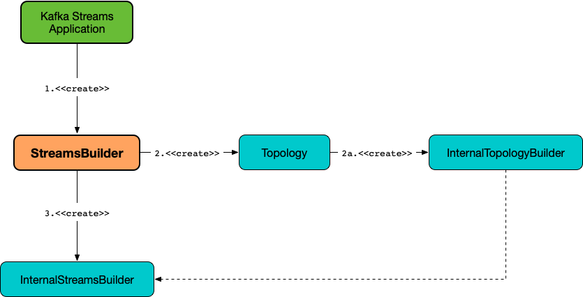

== [[StreamsBuilder]] StreamsBuilder -- The Entry Point to High-Level Streams DSL

`StreamsBuilder` is the entry point to the <<kafka-streams-streams-dsl.adoc#, Streams DSL -- High-Level Stream Processing DSL>>.

`StreamsBuilder` provides the <<operators, operators>> to <<build, build a processor topology>> of <<addStateStore, local>> and <<addGlobalStore, global>> state stores, <<globalTable, global tables>>, <<stream, streams>>, and <<table, tables>>.

TIP: Use <<kafka-streams-scala.adoc#, Scala API for Kafka Streams>> to make your Kafka Streams development more pleasant if Scala is the programming language of your choice.

[[operators]]
.StreamsBuilder API / Operators
[cols="1,3",options="header",width="100%"]
|===
| Operator
| Description

| <<addGlobalStore-detailed, addGlobalStore>>
a| [[addGlobalStore]]

[source, java]
----
StreamsBuilder addGlobalStore(
  StoreBuilder storeBuilder,
  String topic,
  Consumed consumed,
  ProcessorSupplier stateUpdateSupplier)
----

Adds a global <<kafka-streams-StateStore.adoc#, StateStore>> (given <<kafka-streams-StoreBuilder.adoc#, StoreBuilder>>, <<kafka-streams-Consumed.adoc#, Consumed>> and <<kafka-streams-ProcessorSupplier.adoc#, ProcessorSupplier>>) to the topology.

| <<addStateStore-detailed, addStateStore>>
a| [[addStateStore]]

[source, java]
----
StreamsBuilder addStateStore(StoreBuilder builder)
----

Adds a <<kafka-streams-StateStore.adoc#, StateStore>> to the topology (given <<kafka-streams-StoreBuilder.adoc#, StoreBuilder>>).

| <<build-detailed, build>>
a| [[build]]

[source, java]
----
Topology build()  // <1>
Topology build(Properties props)
----
<1> Uses `null` for the `Properties`

Builds the <<kafka-streams-Topology.adoc#, topology>>.

| <<globalTable-internals, globalTable>>
a| [[globalTable]]

[source, java]
----
GlobalKTable<K, V> globalTable(
  String topic)
GlobalKTable<K, V> globalTable(
  String topic,
  Consumed<K, V> consumed)
GlobalKTable<K, V> globalTable(
  String topic,
  Materialized<K, V, KeyValueStore<Bytes, byte[]>> materialized)
GlobalKTable<K, V> globalTable(
  String topic,
  Consumed<K, V> consumed,
  Materialized<K, V, KeyValueStore<Bytes, byte[]>> materialized)
----

Creates a <<kafka-streams-GlobalKTable.adoc#, GlobalKTable>> for the given topic (and <<kafka-streams-Consumed.adoc#, Consumed>>, <<kafka-streams-Materialized.adoc#, Materialized>> or both).

| <<stream-internals, stream>>
a| [[stream]]

[source, java]
----
KStream<K, V> stream(
  Collection<String> topics)
KStream<K, V> stream(
  Collection<String> topics,
  Consumed<K, V> consumed)
KStream<K, V> stream(
  Pattern topicPattern)
KStream<K, V> stream(
  Pattern topicPattern,
  Consumed<K, V> consumed)
KStream<K, V> stream(
  String topic)
KStream<K, V> stream(
  String topic,
  Consumed<K, V> consumed)
----

Creates a <<kafka-streams-KStream.adoc#, KStream>> for the given topic(s) (and <<kafka-streams-Consumed.adoc#, Consumed>>).

| <<table-detailed, table>>
a| [[table]]

[source, java]
----
KTable<K, V> table(
  String topic)
KTable<K, V> table(
  String topic,
  Consumed<K, V> consumed)
KTable<K, V> table(
  String topic,
  Materialized<K, V, KeyValueStore<Bytes, byte[]>> materialized)
KTable<K, V> table(
  String topic,
  Consumed<K, V> consumed,
  Materialized<K, V, KeyValueStore<Bytes, byte[]>> materialized)
----

Creates a <<kafka-streams-KTable.adoc#, KTable>> for the given topic (and <<kafka-streams-Consumed.adoc#, Consumed>>, <<kafka-streams-Materialized.adoc#, Materialized>> or both).

|===

[[creating-instance]]
`StreamsBuilder` takes no arguments when created.

[source, scala]
----
import org.apache.kafka.streams.StreamsBuilder
val builder = new StreamsBuilder
----

A typical Kafka Streams application (that uses <<kafka-streams-streams-dsl.adoc#, Streams DSL>> and <<kafka-streams-scala.adoc#, Scala API for Kafka Streams>>) looks as follows:

[source, scala]
----
// Using Scala API for Kafka Streams
import org.apache.kafka.streams.scala._
import ImplicitConversions._
import Serdes._

val builder = new StreamsBuilder

// Add a KStream if needed
// K and V are the types of keys and values, accordingly
builder.stream[K, V](...)

// Add a KTable if needed
builder.table[K, V](...)

// Add a global store if needed
builder.addGlobalStore(...)

// Add a global store if needed
builder.globalTable[K, V](...)

// In the end, build a topology
val topology = builder.build
----

[[topology]]
[[internalStreamsBuilder]]
[[internalTopologyBuilder]]
When <<creating-instance, created>>, `StreamsBuilder` creates an empty <<kafka-streams-Topology.adoc#, Topology>> (that you enrich using the <<operators, operators>>). The topology is immediately requested for the <<kafka-streams-Topology.adoc#internalTopologyBuilder, InternalTopologyBuilder>> that is in turn used to create an <<kafka-streams-internals-InternalStreamsBuilder.adoc#, InternalStreamsBuilder>>.

.StreamsBuilder, Topology and InternalStreamsBuilder

All <<operators, operators>> use the <<internalStreamsBuilder, InternalStreamsBuilder>> behind the scenes. In other words, `StreamsBuilder` offers a more <<operators, developer-friendly high-level API>> for developing Kafka Streams applications than using the <<kafka-streams-internals-InternalStreamsBuilder.adoc#, InternalStreamsBuilder>> API directly (and is a façade of `InternalStreamsBuilder`).

=== [[table-detailed]] Creating KTable for Topic -- `table` Method

[source, java]
----
KTable<K, V> table(
  String topic)
KTable<K, V> table(
  String topic,
  Consumed<K, V> consumed)
KTable<K, V> table(
  String topic,
  Materialized<K, V, KeyValueStore<Bytes, byte[]>> materialized)
KTable<K, V> table(
  String topic,
  Consumed<K, V> consumed,
  Materialized<K, V, KeyValueStore<Bytes, byte[]>> materialized)
----

`table`...FIXME

=== [[globalTable-internals]] Adding GlobalKTable to Topology -- `globalTable` Method

[source, java]
----
GlobalKTable<K, V> globalTable(
  String topic)
GlobalKTable<K, V> globalTable(
  String topic,
  Consumed<K, V> consumed)
GlobalKTable<K, V> globalTable(
  String topic,
  Materialized<K, V, KeyValueStore<Bytes, byte[]>> materialized)
GlobalKTable<K, V> globalTable(
  String topic,
  Consumed<K, V> consumed,
  Materialized<K, V, KeyValueStore<Bytes, byte[]>> materialized)
----

`globalTable` creates an <<kafka-streams-internals-ConsumedInternal.adoc#, ConsumedInternal>> for the given <<kafka-streams-Consumed.adoc#, Consumed>>.

`globalTable` creates a new <<kafka-streams-internals-MaterializedInternal.adoc#, MaterializedInternal>> (with a new <<kafka-streams-Materialized.adoc#, Materialized>> with the <<kafka-streams-internals-ConsumedInternal.adoc#keySerde, keySerde>> and the <<kafka-streams-internals-ConsumedInternal.adoc#valueSerde, valueSerde>> of the `ConsumedInternal`).

NOTE: The new <<kafka-streams-internals-MaterializedInternal.adoc#, MaterializedInternal>> uses `KeyValueStore<Bytes, byte[]>` <<kafka-streams-StateStore.adoc#, StateStore>>.

`globalTable` requests the `MaterializedInternal` to <<kafka-streams-internals-MaterializedInternal.adoc#generateStoreNameIfNeeded, generateStoreNameIfNeeded>> (with the <<internalStreamsBuilder, InternalStreamsBuilder>> and the input `topic` name).

In the end, `globalTable` requests the <<internalStreamsBuilder, InternalStreamsBuilder>> to <<kafka-streams-internals-InternalStreamsBuilder.adoc#globalTable, add a GlobalKTable to the topology>> (with the `topic` name, the `ConsumedInternal` and the `MaterializedInternal`).

.Demo: Non-queryable GlobalKTable
[source, scala]
----
import org.apache.kafka.streams.scala._
import ImplicitConversions._
import Serdes._

import org.apache.kafka.streams.scala.StreamsBuilder
val builder = new StreamsBuilder

val globalTable = builder.globalTable[String, String](topic = "global-table")
scala> :type globalTable
org.apache.kafka.streams.kstream.GlobalKTable[String,String]

assert(globalTable.queryableStoreName == null)

val topology = builder.build
scala> println(topology.describe)
Topologies:
   Sub-topology: 0 for global store (will not generate tasks)
    Source: KTABLE-SOURCE-0000000001 (topics: [global-table])
      --> KTABLE-SOURCE-0000000002
    Processor: KTABLE-SOURCE-0000000002 (stores: [global-table-STATE-STORE-0000000000])
      --> none
      <-- KTABLE-SOURCE-0000000001
----

.Demo: Queryable GlobalKTable
[source, scala]
----
import org.apache.kafka.streams.scala._
import ImplicitConversions._
import Serdes._

import org.apache.kafka.streams.scala.StreamsBuilder
val builder = new StreamsBuilder

import org.apache.kafka.streams.state.Stores
val supplier = Stores.inMemoryKeyValueStore("queryable-store-name")

import org.apache.kafka.streams.scala.kstream.Materialized
val materialized = Materialized.as[String, String](supplier)
val zipCodes = builder.globalTable[String, String](topic = "zip-codes", materialized)

scala> :type zipCodes
org.apache.kafka.streams.kstream.GlobalKTable[String,String]

assert(zipCodes.queryableStoreName == "queryable-store-name")

val topology = builder.build
scala> println(topology.describe)
Topologies:
   Sub-topology: 0 for global store (will not generate tasks)
    Source: KTABLE-SOURCE-0000000000 (topics: [zip-codes])
      --> KTABLE-SOURCE-0000000001
    Processor: KTABLE-SOURCE-0000000001 (stores: [queryable-store-name])
      --> none
      <-- KTABLE-SOURCE-0000000000
----

=== [[addGlobalStore-detailed]] Registering Global State Store (in Topology) -- `addGlobalStore` Method

[source, java]
----
StreamsBuilder addGlobalStore(
  StoreBuilder storeBuilder,
  String topic,
  Consumed consumed,
  ProcessorSupplier stateUpdateSupplier)
----

`addGlobalStore`...FIXME

=== [[addStateStore-detailed]] `addStateStore` Method

[source, java]
----
StreamsBuilder addStateStore(StoreBuilder builder)
----

`addStateStore`...FIXME

=== [[stream-internals]] Creating KStream (of Records from One or Many Topics) -- `stream` Method

[source, java]
----
KStream<K, V> stream(
  Collection<String> topics)
KStream<K, V> stream(
  Collection<String> topics,
  Consumed<K, V> consumed)
KStream<K, V> stream(
  Pattern topicPattern)
KStream<K, V> stream(
  Pattern topicPattern,
  Consumed<K, V> consumed)
KStream<K, V> stream(
  String topic)
KStream<K, V> stream(
  String topic,
  Consumed<K, V> consumed)
----

`stream` creates a link:kafka-streams-KStream.adoc[KStream] (of keys of type `K` and values of type `V`) for the defined topic(s) and the parameters in the input link:kafka-streams-Consumed.adoc[Consumed].

[source, scala]
----
scala> :type builder
org.apache.kafka.streams.StreamsBuilder

// Create a KStream to read records from the input topic
// Keys and values of the records are of String type
val input = builder.stream[String, String]("input")

scala> :type input
org.apache.kafka.streams.kstream.KStream[String,String]
----

Internally, `stream` creates a <<kafka-streams-internals-ConsumedInternal.adoc#, ConsumedInternal>> (for the input link:kafka-streams-Consumed.adoc[Consumed]) and requests the <<internalStreamsBuilder, InternalStreamsBuilder>> to link:kafka-streams-internals-InternalStreamsBuilder.adoc#stream[create a KStream] (for the input `topics` and the `ConsumedInternal`).

=== [[build-detailed]] Building Topology -- `build` Method

[source, java]
----
Topology build()
Topology build(Properties props)
----

`build` requests the <<internalStreamsBuilder, InternalStreamsBuilder>> to <<kafka-streams-internals-InternalStreamsBuilder.adoc#buildAndOptimizeTopology, buildAndOptimizeTopology>> (with the given `Properties`) and returns the underlying <<topology, topology>>.
