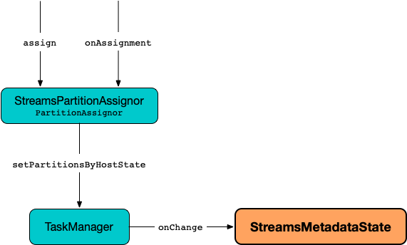

== [[StreamsMetadataState]] StreamsMetadataState

`StreamsMetadataState` manages the <<clusterMetadata, Kafka cluster metadata>> for a <<kafka-streams-KafkaStreams.adoc#streamsMetadataState, KafkaStreams>> instance.

.StreamsMetadataState and Cluster Metadata Changes (from StreamsPartitionAssignor)

`StreamsMetadataState` is <<creating-instance, created>> exclusively for the <<kafka-streams-StreamThread.adoc#taskManager, TaskManager>> of the <<kafka-streams-KafkaStreams.adoc#threads, stream processor threads>> of a <<kafka-streams-KafkaStreams.adoc#streamsMetadataState, KafkaStreams>> instance.

[[StreamsMetadata]]
`StreamsMetadata` represents the metadata of a <<kafka-streams-KafkaStreams.adoc#, KafkaStreams>> instance (process) in a Kafka Streams application:

* [[hostInfo]] A user-defined endpoint (with a host and a port)
* [[stateStoreNames]] Names of state stores
* [[topicPartitions]] Kafka https://kafka.apache.org/21/javadoc/org/apache/kafka/common/TopicPartition.html[TopicPartitions] (that this instance is assigned to)

[[internal-registries]]
.StreamsMetadataState's Internal Properties (e.g. Registries, Counters and Flags)
[cols="1m,2",options="header",width="100%"]
|===
| Name
| Description

| allMetadata
a| [[allMetadata]][[getAllMetadata]] `StreamsMetadatas` for...FIXME

Used when...FIXME

| clusterMetadata
a| [[clusterMetadata]] Cluster metadata, i.e. a subset of the nodes, topics, and partitions in the Kafka cluster (as a Kafka https://kafka.apache.org/21/javadoc/org/apache/kafka/common/Cluster.html[Cluster]) that is given when `StreamsMetadataState` is <<onChange, notified about cluster metadata changes>>

Used when:

* <<getMetadataWithKey, getMetadataWithKey>>

* <<isInitialized, isInitialized>>

* <<toString, toString>>

| globalStores
| [[globalStores]] Names of the global link:kafka-streams-StateStore.adoc[StateStores]

Used when...FIXME
|===

=== [[creating-instance]] Creating StreamsMetadataState Instance

`StreamsMetadataState` takes the following when created:

* [[builder]] link:kafka-streams-InternalTopologyBuilder.adoc[InternalTopologyBuilder]
* [[thisHost]] `HostInfo`

`StreamsMetadataState` initializes the <<internal-registries, internal registries and counters>>.

=== [[getAllMetadataForStore]] `getAllMetadataForStore` Method

[source, java]
----
Collection<StreamsMetadata> getAllMetadataForStore(final String storeName)
----

`getAllMetadataForStore`...FIXME

NOTE: `getAllMetadataForStore` is used exclusively when `KafkaStreams` is requested to link:kafka-streams-KafkaStreams.adoc#allMetadataForStore[allMetadataForStore].

=== [[onChange]] Intercepting Cluster Metadata Changes -- `onChange` Method

[source, scala]
----
void onChange(
  final Map<HostInfo, Set<TopicPartition>> currentState,
  final Cluster clusterMetadata)
----

`onChange` simply records the given `Cluster` as the <<clusterMetadata, Cluster>> and <<rebuildMetadata, rebuildMetadata>> (with the given current state of Kafka `TopicPartition` per `HostInfo`).

NOTE: `onChange` is used exclusively when `TaskManager` is requested to <<kafka-streams-TaskManager.adoc#setPartitionsByHostState, notify the StreamsMetadataState about cluster metadata changes>>.

=== [[rebuildMetadata]] `rebuildMetadata` Internal Method

[source, scala]
----
void rebuildMetadata(final Map<HostInfo, Set<TopicPartition>> currentState)
----

`rebuildMetadata`...FIXME

NOTE: `rebuildMetadata` is used when...FIXME

=== [[toString]] Describing Itself (Textual Representation) -- `toString` Method

[source, java]
----
String toString() // <1>
String toString(final String indent)
----
<1> Uses an empty indent

`toString`...FIXME

NOTE: `toString` is used when...FIXME

=== [[isInitialized]] `isInitialized` Internal Method

[source, java]
----
boolean isInitialized()
----

`isInitialized`...FIXME

NOTE: `isInitialized` is used when...FIXME

=== [[getMetadataWithKey]] `getMetadataWithKey` Method

[source, java]
----
StreamsMetadata getMetadataWithKey(
  final String storeName,
  final K key,
  final Serializer<K> keySerializer)
----

`getMetadataWithKey`...FIXME

NOTE: `getMetadataWithKey` is used when...FIXME
