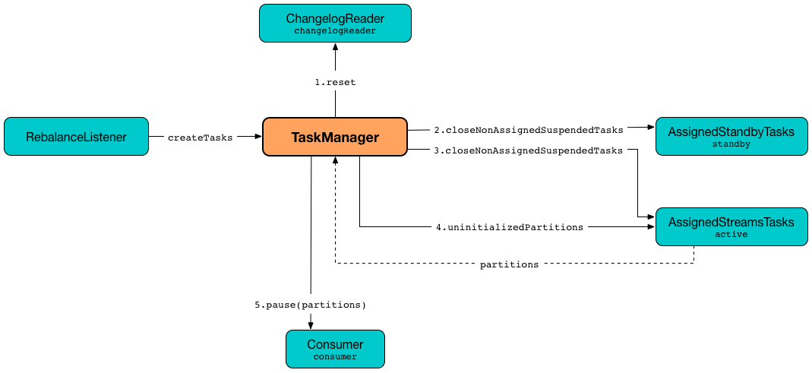

== [[TaskManager]] TaskManager

`TaskManager` is...FIXME

`TaskManager` is <<creating-instance, created>> exclusively when `StreamThread` is link:kafka-streams-StreamThread.adoc#create[created].

`TaskManager` uses Kafka's <<adminClient, AdminClient>> for <<maybePurgeCommitedRecords, maybePurgeCommitedRecords>> and for `StreamPartitionAssignor` to link:kafka-streams-StreamPartitionAssignor.adoc#configure[configure] itself (and create the internal link:kafka-streams-StreamPartitionAssignor.adoc#internalTopicManager[InternalTopicManager]).

`TaskManager` manages tasks through <<active, AssignedStreamsTasks>> and <<standby, AssignedStandbyTasks>> collection of tasks.

[[internal-registries]]
.TaskManager's Internal Properties (e.g. Registries, Counters and Flags)
[cols="1,2",options="header",width="100%"]
|===
| Name
| Description

| [[assignedActiveTasks]] `assignedActiveTasks`
|

| [[assignedStandbyTasks]] `assignedStandbyTasks`
|

| [[consumer]] `consumer`
a| Kafka https://kafka.apache.org/10/javadoc/org/apache/kafka/clients/consumer/KafkaConsumer.html[Consumer] (of keys and values as array of bytes)

[[setConsumer]]
Assigned right when `StreamThread` is link:kafka-streams-StreamThread.adoc#create[created] (and corresponds to the link:kafka-streams-StreamThread.adoc#consumer[Kafka consumer] from the link:kafka-streams-KafkaClientSupplier.adoc#getConsumer[KafkaClientSupplier] that was used to create the link:kafka-streams-KafkaStreams.adoc#creating-instance[KafkaStreams])
|===

[[logging]]
[TIP]
====
Enable one of `ERROR`, `WARN`, `DEBUG`, `TRACE` logging levels for `org.apache.kafka.streams.processor.internals.TaskManager` logger to see what happens inside.

Add the following line to `log4j.properties`:

```
log4j.logger.org.apache.kafka.streams.processor.internals.TaskManager=TRACE
```

Refer to link:kafka-logging.adoc#log4j.properties[Application Logging Using log4j].
====

=== [[addStreamTasks]] `addStreamTasks` Internal Method

[source, java]
----
void addStreamTasks(final Collection<TopicPartition> assignment)
----

`addStreamTasks`...FIXME

NOTE: `addStreamTasks` is used exclusively when `TaskManager` is requested to <<createTasks, create processor tasks for assigned topic partitions>>.

=== [[maybePurgeCommitedRecords]] `maybePurgeCommitedRecords` Method

[source, java]
----
void maybePurgeCommitedRecords()
----

`maybePurgeCommitedRecords`...FIXME

NOTE: `maybePurgeCommitedRecords` is used exclusively when...FIXME

=== [[updateSubscriptionsFromAssignment]] `updateSubscriptionsFromAssignment` Method

[source, java]
----
void updateSubscriptionsFromAssignment(List<TopicPartition> partitions)
----

`updateSubscriptionsFromAssignment`...FIXME

NOTE: `updateSubscriptionsFromAssignment` is used exclusively when `StreamPartitionAssignor` is requested to link:kafka-streams-StreamPartitionAssignor.adoc#onAssignment[onAssignment]

=== [[updateSubscriptionsFromMetadata]] `updateSubscriptionsFromMetadata` Method

[source, java]
----
void updateSubscriptionsFromMetadata(Set<String> topics)
----

`updateSubscriptionsFromMetadata`...FIXME

NOTE: `updateSubscriptionsFromMetadata` is used when `StreamPartitionAssignor` is requested to link:kafka-streams-StreamPartitionAssignor.adoc#subscription[subscription]

=== [[suspendTasksAndState]] Suspending All (Active and Standby) Stream Tasks And State -- `suspendTasksAndState` Method

[source, java]
----
void suspendTasksAndState()
----

`suspendTasksAndState`...FIXME

NOTE: `suspendTasksAndState` is used exclusively when `RebalanceListener` handles link:kafka-streams-StreamThread-RebalanceListener.adoc#onPartitionsAssigned[onPartitionsAssigned].

=== [[addStandbyTasks]] `addStandbyTasks` Internal Method

[source, java]
----
void addStreamTasks(final Collection<TopicPartition> assignment)
----

`addStandbyTasks`...FIXME

NOTE: `addStandbyTasks` is used exclusively when `TaskManager` is requested to <<createTasks, create tasks for assigned topic partitions>>.

=== [[process]] `process` Method

[source, java]
----
int process()
----

`process`...FIXME

NOTE: `process` is used exclusively when `StreamThread` is requested to link:kafka-streams-StreamThread.adoc#processAndMaybeCommit[processAndMaybeCommit].

=== [[maybeCommitActiveTasks]] `maybeCommitActiveTasks` Method

[source, java]
----
int maybeCommitActiveTasks()
----

`maybeCommitActiveTasks`...FIXME

NOTE: `maybeCommitActiveTasks` is used exclusively when `StreamThread` is requested to link:kafka-streams-StreamThread.adoc#processAndMaybeCommit[processAndMaybeCommit].

=== [[updateNewAndRestoringTasks]] `updateNewAndRestoringTasks` Method

[source, java]
----
boolean updateNewAndRestoringTasks()
----

`updateNewAndRestoringTasks`...FIXME

NOTE: `updateNewAndRestoringTasks` is used exclusively when `StreamThread` is requested to link:kafka-streams-StreamThread.adoc#runOnce[consume records once].

=== [[activeTask]] Getting Active Stream Processor Task for Topic Partition -- `activeTask` Method

[source, java]
----
StreamTask activeTask(final TopicPartition partition)
----

`activeTask`...FIXME

NOTE: `activeTask` is used exclusively when `StreamThread` is requested to link:kafka-streams-StreamThread.adoc#addRecordsToTasks[addRecordsToTasks].

=== [[creating-instance]] Creating TaskManager Instance

`TaskManager` takes the following when created:

* [[changelogReader]] `ChangelogReader`
* [[processId]] `UUID`
* [[logPrefix]] `logPrefix`
* [[restoreConsumer]] Kafka https://kafka.apache.org/10/javadoc/org/apache/kafka/clients/consumer/KafkaConsumer.html[Consumer] (of keys and values as array of bytes)
* [[streamsMetadataState]] `StreamsMetadataState`
* [[taskCreator]] `StreamThread.AbstractTaskCreator<StreamTask>`
* [[standbyTaskCreator]] `StreamThread.AbstractTaskCreator<StandbyTask>`
* [[adminClient]] Kafka https://kafka.apache.org/10/javadoc/org/apache/kafka/clients/admin/AdminClient.html[AdminClient]
* [[active]] link:kafka-streams-AssignedStreamsTasks.adoc[AssignedStreamsTasks]
* [[standby]] `AssignedStandbyTasks`

`TaskManager` initializes the <<internal-registries, internal registries and counters>>.

=== [[hasActiveRunningTasks]] `hasActiveRunningTasks` Method

[source, java]
----
boolean hasActiveRunningTasks()
----

`hasActiveRunningTasks` simply asks <<active, AssignedStreamsTasks>> whether it link:kafka-streams-AssignedTasks.adoc#hasRunningTasks[has any tasks registered or not].

.TaskManager and AssignedStreamsTasks


NOTE: `hasActiveRunningTasks` is used exclusively when `StreamThread` is requested to link:kafka-streams-StreamThread.adoc#runOnce[consume records once] (and there are records to be processed).

=== [[hasStandbyRunningTasks]] `hasStandbyRunningTasks` Method

[source, java]
----
boolean hasStandbyRunningTasks()
----

`hasStandbyRunningTasks` simply asks <<standby, AssignedStandbyTasks>> whether it link:kafka-streams-AssignedTasks.adoc#hasRunningTasks[has any tasks registered or not].

.TaskManager and AssignedStandbyTasks


NOTE: `hasStandbyRunningTasks` is used exclusively when `StreamThread` is requested to link:kafka-streams-StreamThread.adoc#maybeUpdateStandbyTasks[maybeUpdateStandbyTasks] (while link:kafka-streams-StreamThread.adoc#runOnce[consuming records once]).

=== [[createTasks]] Creating Processor Tasks for Assigned Topic Partitions -- `createTasks` Method

[source, java]
----
void createTasks(final Collection<TopicPartition> assignment)
----

.TaskManager.createTasks


`createTasks` requests <<changelogReader, ChangelogReader>> to link:kafka-streams-ChangelogReader.adoc#reset[reset].

`createTasks` requests <<standby, AssignedStandbyTasks>> and <<active, AssignedStreamsTasks>> to link:kafka-streams-AssignedTasks.adoc#closeNonAssignedSuspendedTasks[closeNonAssignedSuspendedTasks] (with <<assignedStandbyTasks, assignedStandbyTasks>> and <<assignedActiveTasks, assignedActiveTasks>>, respectively).

`createTasks` <<addStreamTasks, addStreamTasks>> for the input `assignment` partitions.

`createTasks` <<addStandbyTasks, addStandbyTasks>>.

`createTasks` requests <<active, AssignedStreamsTasks>> for link:kafka-streams-AssignedTasks.adoc#uninitializedPartitions[uninitializedPartitions] and requests the <<consumer, Kafka consumer>> to pause them.

NOTE: `createTasks` triggers `Consumer.pause` method that suspends fetching records from partitions until they have been resumed using `Consumer.resume`.

You should see the following TRACE message in the logs:

```
Pausing partitions: [partitions]
```

`createTasks` reports an `IllegalStateException` if <<consumer, consumer>> is `null`.

```
stream-thread [threadClientId] consumer has not been initialized while adding stream tasks. This should not happen.
```

NOTE: `createTasks` is used exclusively when `RebalanceListener` handles link:kafka-streams-StreamThread-RebalanceListener.adoc#onPartitionsAssigned[onPartitionsAssigned].
