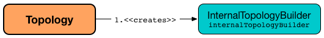

== [[Topology]] Topology -- Directed Acyclic Graph of Stream Processing Nodes

`Topology` is a *directed acyclic graph of stream processing nodes* that represents the stream processing logic of a Kafka Streams application.

`Topology` can be <<creating-instance, created>> directly (as part of <<kafka-streams-processor-api.adoc#, Low-Level Processor API>>) or indirectly using <<kafka-streams-streams-dsl.adoc#, Streams DSL -- High-Level Stream Processing DSL>>.

`Topology` provides the <<operators, fluent API>> to add <<addStateStore, local>> and <<addGlobalStore, global>> state stores, <<addSource, sources>>, <<addProcessor, processors>> and <<addSink, sinks>> to build advanced stream processing graphs.

[[creating-instance]]
`Topology` takes no arguments when created.

[source, scala]
----
// Created directly
import org.apache.kafka.streams.Topology
val topology = new Topology

// Created using Streams DSL (StreamsBuilder API)
// Scala API for Kafka Streams
import org.apache.kafka.streams.scala._
import ImplicitConversions._
import Serdes._

val builder = new StreamsBuilder
val topology = builder.build
scala> :type topology
org.apache.kafka.streams.Topology
----

Once <<creating-instance, created>>, `Topology` can be extended with <<addSource, sources>>, <<addProcessor, processors>> (optionally <<connectProcessorAndStateStores, connected to one or more state stores>>), <<addSink, sinks>>, with <<addStateStore, local>> and <<addGlobalStore, global>> state stores.

[source, scala]
----
scala> :type topology
org.apache.kafka.streams.Topology

import org.apache.kafka.streams.state.Stores
val storeBuilder = Stores
  .keyValueStoreBuilder[String, String](
    Stores.inMemoryKeyValueStore("in-memory-key-value-store"),
    Serdes.String,
    Serdes.String)
  .withLoggingDisabled  // this is for a global table
val sourceName = "demo-source-processor"
val timestampExtractor = null
val keyDeserializer = Serdes.String.deserializer
val valueDeserializer = Serdes.String.deserializer
val topic = "demo-topic"
val processorName = "demo-processor-supplier"
import org.apache.kafka.streams.kstream.internals.KTableSource
val stateUpdateSupplier = new KTableSource[String, String]("store-name")
topology.addGlobalStore(
  storeBuilder,
  sourceName,
  timestampExtractor,
  keyDeserializer,
  valueDeserializer,
  topic,
  processorName,
  stateUpdateSupplier)
----

`Topology` can be <<describe, described>>.

[source, scala]
----
scala> :type topology
org.apache.kafka.streams.Topology

scala> println(topology.describe)
Topologies:
   Sub-topology: 0 for global store (will not generate tasks)
    Source: demo-source-processor (topics: [demo-topic])
      --> demo-processor-supplier
    Processor: demo-processor-supplier (stores: [in-memory-key-value-store])
      --> none
      <-- demo-source-processor
----

`Topology` is a logical representation of a <<kafka-streams-internals-ProcessorTopology.adoc#, ProcessorTopology>>.

[[operators]]
.Topology API / Methods
[cols="1m,2",options="header",width="100%"]
|===
| Method
| Description

| addGlobalStore
a| [[addGlobalStore]]

[source, java]
----
Topology addGlobalStore(
  StoreBuilder storeBuilder,
  String sourceName,
  Deserializer keyDeserializer,
  Deserializer valueDeserializer,
  String topic,
  String processorName,
  ProcessorSupplier stateUpdateSupplier)
Topology addGlobalStore(
  StoreBuilder storeBuilder,
  String sourceName,
  TimestampExtractor timestampExtractor,
  Deserializer keyDeserializer,
  Deserializer valueDeserializer,
  String topic,
  String processorName,
  ProcessorSupplier stateUpdateSupplier)
----

Adds a global <<kafka-streams-StateStore.adoc#, StateStore>> (with the <<kafka-streams-StoreBuilder.adoc#, StoreBuilder>>, <<kafka-streams-ProcessorSupplier.adoc#, ProcessorSupplier>> and optional <<kafka-streams-TimestampExtractor.adoc#, TimestampExtractor>>) to the topology.

Internally, `addGlobalStore` simply requests the <<internalTopologyBuilder, InternalTopologyBuilder>> to <<kafka-streams-internals-InternalTopologyBuilder.adoc#addGlobalStore, add a global store>>.

| addProcessor
a| [[addProcessor]]

[source, java]
----
Topology addProcessor(
  String name,
  ProcessorSupplier supplier,
  String... parentNames)
----

Adds a new <<kafka-streams-Processor.adoc#, processor node>> (with the <<kafka-streams-ProcessorSupplier.adoc#, ProcessorSupplier>>) to the topology

Internally, `addProcessor` simply requests the <<internalTopologyBuilder, InternalTopologyBuilder>> to <<kafka-streams-internals-InternalTopologyBuilder.adoc#addProcessor, add a processor>>.

| addSink
a| [[addSink]]

[source, java]
----
Topology addSink(
  String name,
  String topic,
  Serializer<K> keySerializer,
  Serializer<V> valueSerializer,
  StreamPartitioner<? super K, ? super V> partitioner,
  String... parentNames)
Topology addSink(
  String name,
  String topic,
  Serializer<K> keySerializer,
  Serializer<V> valueSerializer,
  String... parentNames)
Topology addSink(
  String name,
  String topic,
  StreamPartitioner<? super K, ? super V> partitioner,
  String... parentNames)
Topology addSink(
  String name,
  String topic,
  String... parentNames)
Topology addSink(
  String name,
  TopicNameExtractor<K, V> topicExtractor,
  Serializer<K> keySerializer,
  Serializer<V> valueSerializer,
  StreamPartitioner<? super K, ? super V> partitioner,
  String... parentNames)
Topology addSink(
  String name,
  TopicNameExtractor<K, V> topicExtractor,
  Serializer<K> keySerializer,
  Serializer<V> valueSerializer,
  String... parentNames)
Topology addSink(
  String name,
  TopicNameExtractor<K, V> topicExtractor,
  StreamPartitioner<? super K, ? super V> partitioner,
  String... parentNames)
Topology addSink(
  String name,
  TopicNameExtractor<K, V> topicExtractor,
  String... parentNames)
----

Adds a new <<kafka-streams-internals-SinkNode.adoc#, sink node>> (with the optional <<kafka-streams-TopicNameExtractor.adoc#, TopicNameExtractor>> and <<kafka-streams-StreamPartitioner.adoc#, StreamPartitioner>>) to the topology.

Internally, `addSink` simply requests the <<internalTopologyBuilder, InternalTopologyBuilder>> to <<kafka-streams-internals-InternalTopologyBuilder.adoc#addSink, add a sink>>.

| addSource
a| [[addSource]]

[source, java]
----
Topology addSource(
  AutoOffsetReset offsetReset,
  String name,
  Deserializer keyDeserializer,
  Deserializer valueDeserializer,
  Pattern topicPattern)
Topology addSource(
  AutoOffsetReset offsetReset,
  String name,
  Deserializer keyDeserializer,
  Deserializer valueDeserializer,
  String... topics)
Topology addSource(
  AutoOffsetReset offsetReset,
  String name,
  Pattern topicPattern)
Topology addSource(
  AutoOffsetReset offsetReset,
  String name,
  String... topics)
Topology addSource(
  AutoOffsetReset offsetReset,
  String name,
  TimestampExtractor timestampExtractor,
  Deserializer keyDeserializer,
  Deserializer valueDeserializer,
  Pattern topicPattern)
Topology addSource(
  AutoOffsetReset offsetReset,
  String name,
  TimestampExtractor timestampExtractor,
  Deserializer keyDeserializer,
  Deserializer valueDeserializer,
  String... topics)
Topology addSource(
  AutoOffsetReset offsetReset,
  TimestampExtractor timestampExtractor,
  String name,
  Pattern topicPattern)
Topology addSource(
  AutoOffsetReset offsetReset,
  TimestampExtractor timestampExtractor,
  String name,
  String... topics)
Topology addSource(
  String name,
  Deserializer keyDeserializer,
  Deserializer valueDeserializer,
  Pattern topicPattern)
Topology addSource(
  String name,
  Deserializer keyDeserializer,
  Deserializer valueDeserializer,
  String... topics)
Topology addSource(
  String name,
  Pattern topicPattern)
Topology addSource(
  String name,
  String... topics)
Topology addSource(
  TimestampExtractor timestampExtractor,
  String name,
  Pattern topicPattern)
Topology addSource(
  TimestampExtractor timestampExtractor,
  String name,
  String... topics)
----

Adds a new <<kafka-streams-internals-SourceNode.adoc#, source node>> (with the optional <<AutoOffsetReset, AutoOffsetReset>> and <<kafka-streams-TimestampExtractor.adoc#, TimestampExtractor>>) to the topology.

Internally, `addSource` simply requests the <<internalTopologyBuilder, InternalTopologyBuilder>> to <<kafka-streams-internals-InternalTopologyBuilder.adoc#addSource, add a source>>.

| addStateStore
a| [[addStateStore]]

[source, java]
----
Topology addStateStore(
  StoreBuilder storeBuilder,
  String... processorNames)
----

Adds a new <<kafka-streams-StateStore.adoc#, state store>> (as a <<kafka-streams-StoreBuilder.adoc#, StoreBuilder>>) to the topology and associates it with processors

Internally, `addStateStore` simply requests the <<internalTopologyBuilder, InternalTopologyBuilder>> to <<kafka-streams-internals-InternalTopologyBuilder.adoc#addStateStore, add a state store>>.

| connectProcessorAndStateStores
a| [[connectProcessorAndStateStores]]

[source, java]
----
Topology connectProcessorAndStateStores(
  String processorName,
  String... stateStoreNames)
----

Connects the <<kafka-streams-internals-ProcessorNode.adoc#, processor node>> with <<kafka-streams-StateStore.adoc#, state stores>> (by name).

Internally, `connectProcessorAndStateStores` simply requests the <<internalTopologyBuilder, InternalTopologyBuilder>> to <<kafka-streams-internals-InternalTopologyBuilder.adoc#connectProcessorAndStateStores, connect a processor with state stores>>.

| describe
a| [[describe]]

[source, java]
----
TopologyDescription describe()
----

Describes the topology via <<kafka-streams-TopologyDescription.adoc#, TopologyDescription>> (_meta representation_)

Internally, `describe` simply requests the <<internalTopologyBuilder, InternalTopologyBuilder>> to <<kafka-streams-internals-InternalTopologyBuilder.adoc#describe, describe a topology>>.

|===

[[internalTopologyBuilder]]
Internally, `Topology` uses an <<kafka-streams-internals-InternalTopologyBuilder.adoc#, InternalTopologyBuilder>> for all the <<operators, methods>> and is simply a thin layer atop (that aims at making Kafka Streams developers' life simpler).

.Topology and InternalTopologyBuilder

[[AutoOffsetReset]]
`Topology` defines *offset reset policy* (`AutoOffsetReset`) that can be one of the following values:

* [[EARLIEST]] `EARLIEST`
* [[LATEST]] `LATEST`
