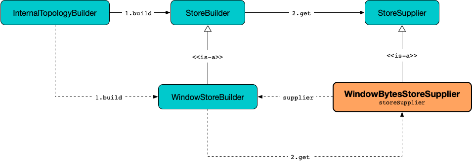

== [[WindowBytesStoreSupplier]] WindowBytesStoreSupplier Contract -- StoreSuppliers of WindowStores

[[get]]
`WindowBytesStoreSupplier` is the <<contract, extension>> of the <<kafka-streams-StoreSupplier.adoc#, StoreSupplier contract>> for <<implementations, state store suppliers>> that <<kafka-streams-StoreSupplier.adoc#get, supply WindowStores>> (i.e. <<kafka-streams-StateStore-WindowStore.adoc#, WindowStores>> of type `<Bytes, byte[]>`).

.WindowBytesStoreSupplier et al.

[[implementations]]
NOTE: <<kafka-streams-internals-RocksDbWindowBytesStoreSupplier.adoc#, RocksDbWindowBytesStoreSupplier>> is the one and only known implementation of the <<contract, WindowBytesStoreSupplier Contract>>.

[[contract]]
.WindowBytesStoreSupplier Contract
[cols="1m,2",options="header",width="100%"]
|===
| Property
| Description

| retainDuplicates
a| [[retainDuplicates]]

[source, java]
----
boolean retainDuplicates()
----

Used exclusively when `WindowStoreBuilder` is requested to <<kafka-streams-internals-WindowStoreBuilder.adoc#maybeWrapLogging, maybeWrapLogging>>.

| retentionPeriod
a| [[retentionPeriod]]

[source, java]
----
long retentionPeriod()
----

Used exclusively when `WindowStoreBuilder` is requested for the <<kafka-streams-internals-WindowStoreBuilder.adoc#retentionPeriod, retentionPeriod>>.

| segmentIntervalMs
a| [[segmentIntervalMs]]

[source, java]
----
long segmentIntervalMs()
----

Used exclusively when `WindowStoreBuilder` is requested to <<kafka-streams-internals-WindowStoreBuilder.adoc#maybeWrapCaching, maybeWrapCaching>>.

| windowSize
a| [[windowSize]]

[source, java]
----
long windowSize()
----

Used exclusively when `WindowStoreBuilder` is requested to <<kafka-streams-internals-WindowStoreBuilder.adoc#maybeWrapCaching, maybeWrapCaching>>.

|===
