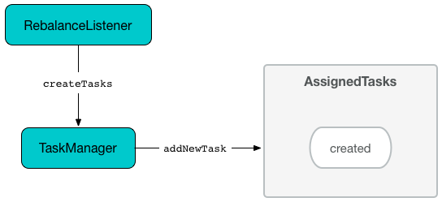

== [[AssignedTasks]] AssignedTasks

`AssignedTasks` is the <<contract, abstraction>> of <<implementations, collections of tasks>> to manage status of multiple tasks as a whole.

`AssignedTasks` uses the following <<internal-properties, internal registries>> to determine the status of a task:

* <<running, running>> for tasks that are considered *running* (that `AssignedStreamsTasks` uses when requested to link:kafka-streams-AssignedStreamsTasks.adoc#process[process])

* <<created, created>> for tasks that are considered *new*

* <<suspended, suspended>> for tasks that are considered *suspended*

* <<restoring, restoring>> for tasks that are considered *restoring*

`AssignedTasks` gives the <<toString, toString>> method to list the tasks by their status.

NOTE: `AssignedTasks` is a Java abstract class and cannot be <<creating-instance, created>> directly. It is created indirectly when the <<implementations, concrete AssignedTasks>> are.

[[implementations]]
.AssignedTasks
[cols="30m,70",options="header",width="100%"]
|===
| Task
| Description

| <<kafka-streams-AssignedStandbyTasks.adoc#, AssignedStandbyTasks>>
| Manages <<kafka-streams-internals-StandbyTask.adoc#, StandbyTasks>>

| <<kafka-streams-AssignedStreamsTasks.adoc#, AssignedStreamsTasks>>
| Manages <<kafka-streams-internals-StreamTask.adoc#, StreamTasks>>
|===

=== [[close]] `close` Method

[source, java]
----
void close(final boolean clean)
----

`close`...FIXME

NOTE: `close` is used when...FIXME

=== [[closeZombieTask]] Closing Zombie Task -- `closeZombieTask` Method

[source, java]
----
RuntimeException closeZombieTask(final T task)
----

`closeZombieTask`...FIXME

NOTE: `closeZombieTask` is used when...FIXME

=== [[clear]] Removing All Task References -- `clear` Method

[source, java]
----
void clear()
----

`clear` simply removes all entries from the internal registries: <<runningByPartition, runningByPartition>>, <<restoringByPartition, restoringByPartition>>, <<running, running>>, <<created, created>>, <<suspended, suspended>> and <<restoredPartitions, restoredPartitions>>.

NOTE: `clear` is used exclusively when `AssignedTasks` is requested to <<close, close>>.

=== [[suspendTasks]] Suspending Tasks -- `suspendTasks` Internal Method

[source, java]
----
RuntimeException suspendTasks(final Collection<T> tasks)
----

`suspendTasks`...FIXME

NOTE: `suspendTasks` is used exclusively when `AssignedTasks` is requested to <<suspend, suspend all active tasks>>.

=== [[hasRunningTasks]] Checking If There Is At Least One Running Task -- `hasRunningTasks` Method

[source, java]
----
boolean hasRunningTasks()
----

`hasRunningTasks` simply checks whether there is at least one task registered in <<running, running>> internal registry or not.

NOTE: `hasRunningTasks` is used exclusively when `TaskManager` is requested to check if there are any link:kafka-streams-internals-TaskManager.adoc#hasActiveRunningTasks[running] or link:kafka-streams-internals-TaskManager.adoc#hasStandbyRunningTasks[standby] tasks registered.

=== [[updateRestored]] `updateRestored` Method

[source, java]
----
Set<TopicPartition> updateRestored(final Collection<TopicPartition> restored)
----

`updateRestored`...FIXME

NOTE: `updateRestored` is used when...FIXME

=== [[transitionToRunning]] Marking Task As Ready For Execution and Processing Records -- `transitionToRunning` Internal Method

[source, java]
----
void transitionToRunning(final T task)
----

`transitionToRunning` simply records the given task as available for processing records (_transitions the task to the running state_).

Internally, `transitionToRunning` prints out the following DEBUG message to the logs:

```
Transitioning [taskTypeName] [taskId] to running
```

`transitionToRunning` marks the task as running (by adding it to the <<running, running>> internal registry).

NOTE: Registering a task in the <<running, running>> internal registry is the only way to mark the task as running and ready for <<kafka-streams-AssignedStreamsTasks.adoc#process, processing records>>.

`transitionToRunning` requests the task to <<kafka-streams-internals-Task.adoc#initializeTopology, initialize the topology of processor nodes>>.

`transitionToRunning` registers the <<kafka-streams-internals-Task.adoc#partitions, partitions>> and the <<kafka-streams-internals-Task.adoc#changelogPartitions, changelog partitions>> of the task (in the <<runningByPartition, runningByPartition>> internal registry).

[NOTE]
====
`transitionToRunning` is used when:

* `AssignedStreamsTasks` is requested to <<kafka-streams-AssignedStreamsTasks.adoc#updateRestored, updateRestored>>

* `AssignedTasks` is requested to <<initializeNewTasks, initialize new tasks>> and <<maybeResumeSuspendedTask, attempt to resume a suspended task>>
====

=== [[addNewTask]] Adding New Task -- `addNewTask` Method

[source, java]
----
void addNewTask(final T task)
----

`addNewTask` just adds the input `task` in <<created, created>> internal registry.

.AssignedTasks and Adding New Task


NOTE: `addNewTask` is used exclusively when `TaskManager` is requested to link:kafka-streams-internals-TaskManager.adoc#createTasks[create processor tasks for assigned topic partitions] (that in turn triggers link:kafka-streams-internals-TaskManager.adoc#addStandbyTasks[addStandbyTasks] and link:kafka-streams-internals-TaskManager.adoc#addStreamTasks[addStreamTasks]).

=== [[initializeNewTasks]] Initializing New Tasks -- `initializeNewTasks` Method

[source, java]
----
void initializeNewTasks()
----

`initializeNewTasks` initializes new tasks, i.e. moves tasks from <<created, created>> registry to either <<restoring, restoring>> or <<running, running>> per whether a task has state stores that may need restoring or not, respectively. In the end `initializeNewTasks` gives the Kafka `TopicPartitions` of the tasks that have state stores.

.AssignedTasks.initializeNewTasks
image::images/kafka-streams-AssignedTasks-initializeNewTasks.png[align="center"]

NOTE: `initializeNewTasks` does nothing unless there is at least one task in the <<created, created>> internal registry.

`initializeNewTasks` prints out the following DEBUG message to the logs:

```
Initializing [taskTypeName]s [created]
```

`initializeNewTasks` walks over all tasks in the <<created, created>> internal registry.

`initializeNewTasks` requests a task to <<kafka-streams-internals-Task.adoc#initializeStateStores, initialize state stores>> (if there are any state stores at all).

If the above yielded `true`, `initializeNewTasks` <<transitionToRunning, marks the task as ready for execution and processing records>>.

Otherwise, when the above <<kafka-streams-internals-Task.adoc#initializeStateStores, state store initialization>> yielded `false`, `initializeNewTasks` prints out the following DEBUG message to the logs and the concrete `AssignedStreamsTasks` is requested to <<kafka-streams-AssignedStreamsTasks.adoc#addToRestoring, register the StreamTask as restoring>>.

```
Transitioning [taskTypeName] [taskId] to restoring
```

In the end, `initializeNewTasks` removes the task (after being processed successfully) from the <<created, created>> internal registry.

In case of `LockException`, `initializeNewTasks` prints out the following TRACE message to the logs:

```
Could not create [taskTypeName] [taskId] due to [message]; will retry
```

NOTE: `initializeNewTasks` is used exclusively when `TaskManager` is requested to <<kafka-streams-internals-TaskManager.adoc#updateNewAndRestoringTasks, updateNewAndRestoringTasks>>.

=== [[closeNonAssignedSuspendedTasks]] Closing Non-Assigned Suspended Tasks -- `closeNonAssignedSuspendedTasks` Method

[source, java]
----
void closeNonAssignedSuspendedTasks(final Map<TaskId, Set<TopicPartition>> newAssignment)
----

`closeNonAssignedSuspendedTasks` closes non-assigned tasks that were suspended, but are no longer assigned to the Kafka Streams instance or the partitions of the task and the assignment do not match.

Internally, `closeNonAssignedSuspendedTasks` takes the <<suspended, suspended>> tasks and for every task checks if either condition holds:

1. `newAssignment` does not contain the id of the suspended task

1. The link:kafka-streams-internals-Task.adoc#partitions[partitions] of the suspended task are not equal the partitions in `newAssignment` for the task id

If either condition holds, `closeNonAssignedSuspendedTasks` prints out the following DEBUG message to the logs, requests the task to link:kafka-streams-internals-Task.adoc#closeSuspended[closeSuspended] (with the `clean` flag enabled) and in the end removes the task from <<suspended, suspended>> tasks.

```
Closing suspended and not re-assigned [taskType] [id]
```

In case of a `Exception`, `closeNonAssignedSuspendedTasks` prints out the following ERROR message to the logs followed by the exception message.

```
Failed to remove suspended [taskType] [id] due to the following error
```

NOTE: `closeNonAssignedSuspendedTasks` is used exclusively when `TaskManager` is requested to link:kafka-streams-internals-TaskManager.adoc#createTasks[create processor tasks for assigned topic partitions].

=== [[maybeResumeSuspendedTask]] Attempting to Resume Suspended Task -- `maybeResumeSuspendedTask` Method

[source, java]
----
boolean maybeResumeSuspendedTask(
  final TaskId taskId,
  final Set<TopicPartition> partitions)
----

`maybeResumeSuspendedTask` returns `true` after successful transitioning a task (by its `taskId`) from suspended to running state when the partitions of the suspended task and the input ones are equal. Otherwise, `maybeResumeSuspendedTask` reports an exception (`RuntimeException` or `TaskMigratedException`) or returns `false`.

Internally, `maybeResumeSuspendedTask` branches off per whether the task (for the given <<kafka-streams-TaskId.adoc#, TaskId>>) is <<suspended, suspended>> or not.

If not, `maybeResumeSuspendedTask` returns `false`.

If the task is <<suspended, suspended>>, `maybeResumeSuspendedTask` prints out the following TRACE message to the logs:

```
found suspended [taskTypeName] [taskId]
```

`maybeResumeSuspendedTask` checks whether the link:kafka-streams-internals-Task.adoc#partitions[partitions] of the task are exactly the input `partitions`.

If the partitions do not match, `maybeResumeSuspendedTask` prints out the following WARN message to the logs:

```
couldn't resume task [taskId] assigned partitions [partitions], task partitions [partitions]
```

If however the partitions are equal, `maybeResumeSuspendedTask` removes the task (by the input `taskId`) from <<suspended, suspended>> registry and requests the task to link:kafka-streams-internals-Task.adoc#resume[resume].

`maybeResumeSuspendedTask` <<transitionToRunning, schedules the task for execution>> and prints out the following TRACE message to the logs:

```
resuming suspended [taskTypeName] [taskId]
```

`maybeResumeSuspendedTask` returns `true`.

In case of `TaskMigratedException`, `maybeResumeSuspendedTask` <<closeZombieTask, closeZombieTask>>. If it gives a `RuntimeException`, `maybeResumeSuspendedTask` re-throws it. Otherwise, `maybeResumeSuspendedTask` removes the task (by the input `taskId`) from <<suspended, suspended>> registry (_again?!_) and re-throws the initial `TaskMigratedException`.

NOTE: `maybeResumeSuspendedTask` is used when `TaskManager` is requested to link:kafka-streams-internals-TaskManager.adoc#createTasks[create processor tasks for assigned topic partitions] (and register new link:kafka-streams-internals-TaskManager.adoc#addStandbyTasks[standby] and link:kafka-streams-internals-TaskManager.adoc#addStreamTasks[stream] tasks).

=== [[toString]] Describing Itself (Textual Representation) -- `toString` Method

[source, java]
----
String toString(final String indent)
----

`toString` gives a text representation and <<describe, describes>> the following:

* <<running, running>> tasks with "Running:" header

* <<suspended, suspended>> tasks with "Suspended:" header

* <<restoring, restoring>> tasks with "Restoring:" header

* <<created, created>> tasks with "New:" header

[source, scala]
----
FIXME toString in action
----

NOTE: `toString` is used exclusively when `TaskManager` is requested to link:kafka-streams-internals-TaskManager.adoc#toString[describe itself].

=== [[describe]] `describe` Internal Method

[source, java]
----
void describe(
  final StringBuilder builder,
  final Collection<T> tasks,
  final String indent,
  final String name)
----

`describe` simply requests every task in the input `tasks` to link:kafka-streams-internals-Task.adoc#toString[describe itself] and uses the `indent` and `name` to create a text representation.

[source, scala]
----
FIXME toString in action
----

NOTE: `describe` is used exclusively when `AssignedTasks` is requested for a <<toString, text representation>>.

=== [[uninitializedPartitions]] Getting Partitions of New Tasks with State Store -- `uninitializedPartitions` Method

[source, java]
----
Set<TopicPartition> uninitializedPartitions()
----

`uninitializedPartitions` gives the link:kafka-streams-internals-Task.adoc#partitions[partitions] of the new tasks (from <<created, created>> registry) that link:kafka-streams-internals-Task.adoc#hasStateStores[have state store].

NOTE: `uninitializedPartitions` gives an empty set of partitions if <<created, created>> is empty, i.e. has no tasks registered.

NOTE: `uninitializedPartitions` is used exclusively when `TaskManager` is requested to link:kafka-streams-internals-TaskManager.adoc#createTasks[create processor tasks for assigned topic partitions].

=== [[suspend]] Suspending All Active Tasks -- `suspend` Method

[source, java]
----
RuntimeException suspend()
----

`suspend` prints out the following TRACE message to the logs and <<suspendTasks, suspendTasks>> (from <<running, running>>).

```
Suspending running [taskTypeName] [runningTaskIds]
```

`suspend` prints out the following TRACE message to the logs and <<closeNonRunningTasks, closeNonRunningTasks>> (from <<restoring, restoring>>).

```
Close restoring [taskTypeName] [restoring]
```

`suspend` prints out the following TRACE message to the logs and <<closeNonRunningTasks, closeNonRunningTasks>> (from <<created, created>>).

```
Close created [taskTypeName] [created]
```

`suspend` removes all task ids from <<previousActiveTasks, previousActiveTasks>> and adds the task ids from <<running, running>>.

In the end, `suspend` removes all entries from <<running, running>>, <<restoring, restoring>>, <<created, created>>, <<runningByPartition, runningByPartition>> and <<restoringByPartition, restoringByPartition>>.

NOTE: `suspend` is used exclusively when `TaskManager` is requested to <<kafka-streams-internals-TaskManager.adoc#suspendTasksAndState, suspend all active and standby stream tasks and state>>.

=== [[closeNonRunningTasks]] `closeNonRunningTasks` Internal Method

[source, java]
----
RuntimeException closeNonRunningTasks(final Collection<T> tasks)
----

`closeNonRunningTasks` link:kafka-streams-internals-Task.adoc#close[closes] every task in the given `tasks` one by one (with `clean` and `isZombie` flags off).

In case of a `RuntimeException`, `closeNonRunningTasks` prints out the following ERROR to the logs followed by the exception.

```
Failed to close [taskTypeName], [id]"
```

NOTE: `closeNonRunningTasks` is used exclusively when `AssignedTasks` is requested to <<suspend, suspend all active tasks>> (and the input tasks are <<restoring, restoring>> and <<created, created>>).

=== [[applyToRunningTasks]] Executing Task Action with Every Running Task  -- `applyToRunningTasks` Method

[source, java]
----
void applyToRunningTasks(final TaskAction<T> action)
----

`applyToRunningTasks` applies the input `action` to every <<running, running>> task.

`applyToRunningTasks` throws the first `RuntimeException` if thrown.

[NOTE]
====
`applyToRunningTasks` is used when:

* `AssignedStreamsTasks` is requested to link:kafka-streams-AssignedStreamsTasks.adoc#maybeCommit[maybeCommit]

* `AssignedTasks` is requested to <<commit, commit>>
====

==== [[applyToRunningTasks-TaskMigratedException]] `applyToRunningTasks` and TaskMigratedException

In case of a `TaskMigratedException`, `applyToRunningTasks` prints out the following INFO message to the logs:

```
Failed to commit [taskTypeName] [taskId] since it got migrated to another thread already. Closing it as zombie before triggering a new rebalance.
```

`applyToRunningTasks` <<closeZombieTask, closeZombieTask>>. If it gives a `RuntimeException`, `applyToRunningTasks` re-throws it. Otherwise, `applyToRunningTasks` removes the task (from the iterator but what about <<running, running>>?) and re-throws the initial `TaskMigratedException`.

==== [[applyToRunningTasks-RuntimeException]] `applyToRunningTasks` and RuntimeException

In case of a `RuntimeException`, `applyToRunningTasks` prints out the following ERROR message to the logs followed by the exception.

```
Failed to [actionName] [taskTypeName] [taskId] due to the following error:
```

`applyToRunningTasks` records the `RuntimeException` for a later re-throwing.

=== [[creating-instance]] Creating AssignedTasks Instance

`AssignedTasks` takes the following when created:

* [[logContext]] `LogContext`
* [[taskTypeName]] `taskTypeName`

`AssignedTasks` initializes the <<internal-properties, internal properties>>.

=== [[addToRestoring]] Registering Task for (State Store) Restoring -- `addToRestoring` Internal Method

[source, java]
----
void addToRestoring(final T task)
----

`addToRestoring` records the input <<kafka-streams-internals-Task.adoc#, task>> in the <<restoring, restoring>> internal registry.

`addToRestoring` records the task's <<kafka-streams-internals-Task.adoc#partitions, partitions>> and <<kafka-streams-internals-Task.adoc#changelogPartitions, changelogPartitions>> in the <<restoringByPartition, restoringByPartition>> internal registry.

NOTE: `addToRestoring` is used exclusively when `AssignedTasks` is requested to <<initializeNewTasks, initialize new tasks>> (and the task is a <<kafka-streams-internals-StreamTask.adoc#, StreamTask>> and <<kafka-streams-internals-Task.adoc#initializeStateStores, has state stores that need restoring>>).

=== [[commit]] Committing Running Tasks -- `commit` Method

[source, java]
----
int commit()
----

`commit`...FIXME

NOTE: `commit` is used exclusively when `TaskManager` is requested to <<kafka-streams-internals-TaskManager.adoc#commitAll, commitAll>>.

=== [[internal-properties]] Internal Properties

[cols="30m,70",options="header",width="100%"]
|===
| Name
| Description

| commitAction
a| [[commitAction]] `TaskAction` that requests <<running, running tasks>> to <<kafka-streams-internals-Task.adoc#commit, commit>> at <<commit, commit>>

| created
a| [[created]] *New tasks* by their ids

* Tasks are added when `AssignedTasks` is requested to <<addNewTask, addNewTask>>

* Tasks are removed when `AssignedTasks` is requested to <<initializeNewTasks, initializeNewTasks>>, <<suspend, suspend>> or <<clear, clear>>

| previousActiveTasks
a| [[previousActiveTasks]]

| restoring
a| [[restoring]]

| log
a| [[log]]

| running
a| [[running]] Running tasks by their ids

`running` is a https://docs.oracle.com/javase/9/docs/api/java/util/concurrent/ConcurrentHashMap.html[java.util.concurrent.ConcurrentHashMap], i.e. `ConcurrentHashMap<TaskId, Task>`.

Used when...FIXME

Tasks IDs are added or removed as follows:

* Added when `AssignedTasks` is requested to <<transitionToRunning, transition a task to a running state>>

* Removed when `AssignedTasks` is requested to <<suspend, suspend>> or <<clear, clear>>

| runningByPartition
a| [[runningByPartition]] Kafka https://kafka.apache.org/22/javadoc/org/apache/kafka/common/TopicPartition.html[partitions] per <<kafka-streams-internals-Task.adoc#, task>> (that processes records)

| suspended
a| [[suspended]]
|===
