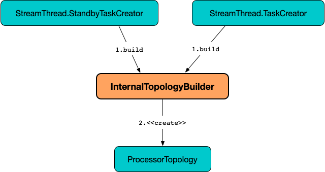
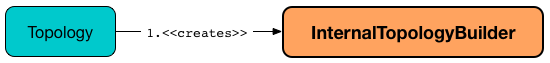

== [[InternalTopologyBuilder]] InternalTopologyBuilder

`InternalTopologyBuilder` is used to <<build, build a topology of processor nodes>> (for <<kafka-streams-internals-StandbyTaskCreator.adoc#, StreamThread.StandbyTaskCreators>> and <<kafka-streams-internals-TaskCreator.adoc#, StreamThread.TaskCreator>>).

.InternalTopologyBuilder and ProcessorTopology


`InternalTopologyBuilder` is <<creating-instance, created>> exclusively for a <<kafka-streams-Topology.adoc#internalTopologyBuilder, Topology>> (and acts as a developer-friendly frontend).

.InternalTopologyBuilder and Topology


[[creating-instance]]
`InternalTopologyBuilder` takes no arguments when created.

[source, scala]
----
import org.apache.kafka.streams.processor.internals.InternalTopologyBuilder
val builder = new InternalTopologyBuilder
----

`InternalTopologyBuilder` uses <<nodeFactories, node factories>> to <<build, build a topology>>. `InternalTopologyBuilder` supports <<kafka-streams-internals-InternalTopologyBuilder-ProcessorNodeFactory.adoc#, ProcessorNodeFactory>>, <<kafka-streams-internals-InternalTopologyBuilder-SourceNodeFactory.adoc#, SourceNodeFactory>>, and <<kafka-streams-internals-InternalTopologyBuilder-SinkNodeFactory.adoc#, SinkNodeFactory>> factory types only (and throws a `TopologyException` for unknown factories).

`InternalTopologyBuilder` can have one or more sources that are added (_registered_) using <<addSource, addSource>> method (which simply registers a <<kafka-streams-internals-InternalTopologyBuilder-SourceNodeFactory.adoc#, SourceNodeFactory>> under a name).

[source, scala]
----
scala> :type builder
org.apache.kafka.streams.processor.internals.InternalTopologyBuilder

val sourceNodeName = "sourceNode"

import org.apache.kafka.streams.processor.WallclockTimestampExtractor
val timestampExtractor = new WallclockTimestampExtractor
import org.apache.kafka.common.serialization.StringDeserializer
val keyDeserializer = new StringDeserializer
val valDeserializer = new StringDeserializer
val topics = Seq("input")
import org.apache.kafka.streams.Topology.AutoOffsetReset
builder.addSource(
  AutoOffsetReset.LATEST,
  sourceNodeName,
  timestampExtractor,
  keyDeserializer,
  valDeserializer,
  topics: _*)
----

`InternalTopologyBuilder` can have zero or more processor nodes that are added (registered) using <<addProcessor, addProcessor>> method (which simply registers a <<kafka-streams-internals-InternalTopologyBuilder-ProcessorNodeFactory.adoc#, ProcessorNodeFactory>> under a name with a <<kafka-streams-ProcessorSupplier.adoc#, ProcessorSupplier>> and one or more predecessors). Since processors require that the predecessors are already added to the topology, a topology has to have at least one <<addSource, source processor already added>>.

[source, scala]
----
scala> :type builder
org.apache.kafka.streams.processor.internals.InternalTopologyBuilder

assert(!builder.getSourceTopicNames.isEmpty)

val sourceTopicName = "input"

import collection.JavaConverters._
assert(builder.getSourceTopicNames.asScala.contains(sourceTopicName))

import org.apache.kafka.streams.processor.{Processor, ProcessorContext, ProcessorSupplier}
val supplier = new ProcessorSupplier[String, String] {
  def get = new Processor[String, String] {
    def init(context: ProcessorContext): Unit = {}
    def process(key: String, value: String): Unit = {}
    def close(): Unit = {}
  }
}
val processorNodeName = "processorNode"
val sourceNodeName = "sourceNode"
val predecessorNames = Seq(sourceNodeName)
builder.addProcessor(processorNodeName, supplier, predecessorNames: _*)
----

`InternalTopologyBuilder` can have zero or more sink nodes that are added (registered) using <<addSink, addSink>> method (which simply registers a <<kafka-streams-internals-InternalTopologyBuilder-SinkNodeFactory.adoc#, SinkNodeFactory>> under a name).

[source, scala]
----
scala> :type builder
org.apache.kafka.streams.processor.internals.InternalTopologyBuilder

// FIXME: Finish the demo
----

[[applicationId]]
`InternalTopologyBuilder` requires an *application ID*. The application ID is used as a namespace for the internal topics (so they do not clash with the topics of other Kafka Streams applications). The application ID is set using <<setApplicationId, setApplicationId>> (and is the <<kafka-streams-StreamsConfig.adoc#APPLICATION_ID_CONFIG, APPLICATION_ID_CONFIG>> configuration property that `KafkaStreams` requires when link:kafka-streams-KafkaStreams.adoc#creating-instance[created]).

[[setApplicationId]]
[source, java]
----
InternalTopologyBuilder setApplicationId(final String applicationId)
----

`InternalTopologyBuilder` uses the <<applicationId, application id>> when:

* <<buildProcessorNode, buildProcessorNode>> and <<topicGroups, topicGroups>> for the names of changelog topics (when a `StateStoreFactory` has link:kafka-streams-internals-InternalTopologyBuilder-StateStoreFactory.adoc#loggingEnabled[logging enabled])

* <<decorateTopic, decorateTopic>> to prefix (_decorate_) internal topic names

`InternalTopologyBuilder` has to be optimized using <<rewriteTopology, rewriteTopology>> (that sets the required <<applicationId, application ID>>).

[source, scala]
----
scala> :type builder
org.apache.kafka.streams.processor.internals.InternalTopologyBuilder

import org.apache.kafka.streams.StreamsConfig
import java.util.Properties
val props = new Properties
props.put(StreamsConfig.APPLICATION_ID_CONFIG, "app")
props.put(StreamsConfig.BOOTSTRAP_SERVERS_CONFIG, ":9092")
val config = new StreamsConfig(props)
builder.rewriteTopology(config)
----

`InternalTopologyBuilder` can be <<describe, described>> (using a <<kafka-streams-TopologyDescription.adoc#, TopologyDescription>>).

[source, scala]
----
scala> :type builder
org.apache.kafka.streams.processor.internals.InternalTopologyBuilder

// add nodes and stores

val description = builder.describe
scala> println(description)
Topologies:
   Sub-topology: 0
    Source: sourceNode (topics: [input])
      --> processorNode
    Processor: processorNode (stores: [])
      --> none
      <-- sourceNode
----

[[global-source-node]]
*Global Source Node* is a node from a link:kafka-streams-internals-InternalTopologyBuilder-SourceNodeFactory.adoc[SourceNodeFactory] with exactly one link:kafka-streams-internals-InternalTopologyBuilder-SourceNodeFactory.adoc#topics[topic] and registered in <<globalTopics, globalTopics>>. You can use <<isGlobalSource, isGlobalSource>> predicate to check if a name is of a global source node.

[[internal-registries]]
.InternalTopologyBuilder's Internal Properties (e.g. Registries, Counters and Flags)
[cols="1m,2",options="header",width="100%"]
|===
| Name
| Description

| copartitionSourceGroups
| [[copartitionSourceGroups]]

| earliestResetPatterns
| [[earliestResetPatterns]]

| earliestResetTopics
| [[earliestResetTopics]]

| globalStateStores
a| [[globalStateStores]] Global link:kafka-streams-StateStore.adoc[StateStores] by name

* A new global link:kafka-streams-StateStore.adoc[StateStore] is added exclusively when `InternalTopologyBuilder` is requested to <<addGlobalStore, add a global state store to a topology>>

NOTE: There are two types of link:kafka-streams-StateStore.adoc[StateStores], i.e. <<globalStateStores, global>> and <<stateFactories, regular>>. Use <<allStateStoreName, allStateStoreName>> to access them all.

[NOTE]
====
`InternalTopologyBuilder` comes with `globalStateStores` method to access `globalStateStores` registry as an unmodifiable collection. It is used when:

* `KafkaStreams` is link:kafka-streams-KafkaStreams.adoc#creating-instance[created] (and creates a link:kafka-streams-GlobalStateStoreProvider.adoc#creating-instance[GlobalStateStoreProvider] for the link:kafka-streams-KafkaStreams.adoc#queryableStoreProvider[QueryableStoreProvider])

* `StreamsMetadataState` is link:kafka-streams-StreamsMetadataState.adoc#creating-instance[created]
====

| globalTopics
a| [[globalTopics]] Names of global topics

* A new name is added when `InternalTopologyBuilder` is requested to <<addGlobalStore, add a global state store to a topology>>

* Used when `InternalTopologyBuilder` is requested to <<isGlobalSource, check if a node name is of a global source node>>

| internalTopicNames
a| [[internalTopicNames]] Names of the internal topics that were auto-created when `InternalTopologyBuilder` was requested to <<addInternalTopic, addInternalTopic>>

A new topic name is added when `InternalTopologyBuilder` is requested to <<addInternalTopic, addInternalTopic>>

| latestResetPatterns
| [[latestResetPatterns]]

| latestResetTopics
| [[latestResetTopics]]

| nodeFactories
a| [[nodeFactories]] link:kafka-streams-internals-InternalTopologyBuilder-NodeFactory.adoc[NodeFactories] by node name

* A new `NodeFactory` is added when `InternalTopologyBuilder` is requested to <<addGlobalStore, add a global state store to a topology>>, <<addProcessor, addProcessor>>, <<addSink, addSink>> and <<addSource, addSource>>

| nodeGrouper
| [[nodeGrouper]] link:kafka-streams-internals-QuickUnion.adoc[QuickUnion] of the names of node groups

Used when...FIXME

| nodeGroups
a| [[nodeGroups]] Node groups by ID, i.e. groups of node names that can be looked up by a group ID (`Map<Integer, Set<String>>`)

Initialized when `InternalTopologyBuilder` is requested for <<nodeGroups-accessor, node groups>> (the very first time since it never changes once <<makeNodeGroups, initialized>>)

* Reset (_nullified_) when <<addStateStore, registering a state store (as a StoreBuilder)>>

NOTE: <<nodeGroups-accessor, nodeGroups accessor>> is used to access `nodeGroups` registry.

| nodeToSinkTopic
| [[nodeToSinkTopic]]

| nodeToSourcePatterns
| [[nodeToSourcePatterns]]

| nodeToSourceTopics
a| [[nodeToSourceTopics]] Topic names by the source processor node name (without the <<applicationId, application ID>> prefix for internal topics)

New entries are added when `InternalTopologyBuilder` is requested for the following:

* <<addSource, addSource>> and <<addGlobalStore, addGlobalStore>>

* <<setRegexMatchedTopicsToSourceNodes, setRegexMatchedTopicsToSourceNodes>>

| sourceTopicNames
| [[sourceTopicNames]] Collection of <<addSource, registered>> topic names

Used when...FIXME

| stateFactories
a| [[stateFactories]][[getStateStores]] <<kafka-streams-internals-InternalTopologyBuilder-StateStoreFactory.adoc#, StateStoreFactories>> by name (of the <<kafka-streams-StoreBuilder.adoc#, StoreBuilder>>) (`Map<String, StateStoreFactory>`)

* A new `StateStoreFactory` added when <<addStateStore, registering a state store (as StoreBuilder)>>

Used when <<connectProcessorAndStateStore, connecting a state store with a processor node>>, <<buildProcessorNode, buildProcessorNode>>, <<allStateStoreName, allStateStoreName>>, <<topicGroups, topicGroups>>

| stateStoreNameToSourceRegex
| [[stateStoreNameToSourceRegex]]

| stateStoreNameToSourceTopics
| [[stateStoreNameToSourceTopics]]

| storeToChangelogTopic
a| [[storeToChangelogTopic]] Names of the <<kafka-streams-StateStore.adoc#, state stores>> and the names of the corresponding changelog topics (`Map<String, String>`)

`storeToChangelogTopic` manages <<kafka-streams-StateStore.adoc#, state stores>> with the `StateStoreFactory` with <<kafka-streams-internals-InternalTopologyBuilder-StateStoreFactory.adoc#loggingEnabled, change-logging enabled>>

A new pair is added when `InternalTopologyBuilder` is requested to <<buildProcessorNode, buildProcessorNode>> and <<connectSourceStoreAndTopic, associate the names of a state store and a topic>>

| subscriptionUpdates
| [[subscriptionUpdates]]

| topicPattern
a| [[topicPattern]] Source topics pattern (to subscribe to)

* Initialized the first time when `InternalTopologyBuilder` is requested for the <<sourceTopicPattern, source topics pattern>>

| topicToPatterns
| [[topicToPatterns]]
|===

[[logging]]
[TIP]
====
Enable `DEBUG` logging level for `org.apache.kafka.streams.processor.internals.InternalTopologyBuilder` logger to see what happens inside.

Add the following line to `log4j.properties`:

```
log4j.logger.org.apache.kafka.streams.processor.internals.InternalTopologyBuilder=DEBUG
```

Refer to link:kafka-logging.adoc#log4j.properties[Application Logging Using log4j].
====

=== [[decorateTopic]] Adding Application ID to Topic (As Prefix) -- `decorateTopic` Internal Method

[source, java]
----
String decorateTopic(final String topic)
----

`decorateTopic`...FIXME

[NOTE]
====
`decorateTopic` is used when:

* `InternalTopologyBuilder` <<buildSinkNode, buildSinkNode>>, <<buildSourceNode, buildSourceNode>>, <<maybeDecorateInternalSourceTopics, maybeDecorateInternalSourceTopics>> and <<topicGroups, topicGroups>>

* `SinkNodeFactory` is requested to link:kafka-streams-internals-InternalTopologyBuilder-SinkNodeFactory.adoc#build[build a sink node]
====

=== [[buildSinkNode]] `buildSinkNode` Internal Method

[source, java]
----
void buildSinkNode(
  final Map<String, ProcessorNode> processorMap,
  final Map<String, SinkNode> topicSinkMap,
  final Set<String> repartitionTopics,
  final SinkNodeFactory sinkNodeFactory,
  final SinkNode node)
----

`buildSinkNode`...FIXME

NOTE: `buildSinkNode` is used exclusively when `InternalTopologyBuilder` is requested to <<build, build a topology of processor nodes>>.

=== [[maybeDecorateInternalSourceTopics]] `maybeDecorateInternalSourceTopics` Internal Method

[source, java]
----
List<String> maybeDecorateInternalSourceTopics(final Collection<String> sourceTopics)
----

`maybeDecorateInternalSourceTopics`...FIXME

[NOTE]
====
`maybeDecorateInternalSourceTopics` is used when:

* `InternalTopologyBuilder` is requested to <<copartitionGroups, copartitionGroups>>, <<resetTopicsPattern, resetTopicsPattern>>, <<sourceTopicPattern, sourceTopicPattern>> and <<stateStoreNameToSourceTopics, stateStoreNameToSourceTopics>>

* `SourceNodeFactory` is requested to link:kafka-streams-internals-InternalTopologyBuilder-SourceNodeFactory.adoc#build[build a source node]
====

=== [[resetTopicsPattern]] `resetTopicsPattern` Internal Method

[source, java]
----
Pattern resetTopicsPattern(
  final Set<String> resetTopics,
  final Set<Pattern> resetPatterns,
  final Set<String> otherResetTopics,
  final Set<Pattern> otherResetPatterns)
----

`resetTopicsPattern`...FIXME

NOTE: `resetTopicsPattern` is used when...FIXME

=== [[copartitionGroups]] `copartitionGroups` Method

[source, java]
----
synchronized Collection<Set<String>> copartitionGroups()
----

`copartitionGroups`...FIXME

NOTE: `copartitionGroups` is used when...FIXME

=== [[addProcessor]] Registering Processor Node -- `addProcessor` Method

[source, java]
----
final void addProcessor(
  final String name,
  final ProcessorSupplier supplier,
  final String... predecessorNames)
----

`addProcessor` simply registers a new <<kafka-streams-internals-InternalTopologyBuilder-ProcessorNodeFactory.adoc#, ProcessorNodeFactory>> by the given name in the <<nodeFactories, nodeFactories>> internal registry.

`addProcessor` also adds the name to the <<nodeGrouper, nodeGrouper>> and unites the processor name with the predecessors.

In the end, `addProcessor` resets the <<nodeGroups, nodeGroups>> collection (i.e. `null`).

NOTE: A processor has a unique name, a <<kafka-streams-ProcessorSupplier.adoc#, ProcessorSupplier>> and at least one predecessor (that cannot be itself)

`addProcessor` requires that the given name, the <<kafka-streams-ProcessorSupplier.adoc#, ProcessorSupplier>> and the predecessor names are all defined (i.e. not `null`) or throws a `NullPointerException`.

`addProcessor` requires that the given name is unique across all the registered <<nodeFactories, nodeFactories>> or throws a `TopologyException`.

`addProcessor` requires that there is at least one predecessor name given or throws a `TopologyException`.

[NOTE]
====
`addProcessor` is used when:

* `Topology` is requested to <<kafka-streams-Topology.adoc#addProcessor, add a processor>>

* <<kafka-streams-internals-StreamsGraphNode.adoc#, StreamsGraphNodes>> (i.e. <<kafka-streams-internals-KTableKTableJoinNode.adoc#, KTableKTableJoinNode>>, <<kafka-streams-internals-OptimizableRepartitionNode.adoc#, OptimizableRepartitionNode>>, <<kafka-streams-internals-ProcessorGraphNode.adoc#, ProcessorGraphNode>>, <<kafka-streams-internals-StreamStreamJoinNode.adoc#, StreamStreamJoinNode>>, <<kafka-streams-internals-StreamTableJoinNode.adoc#, StreamTableJoinNode>>, <<kafka-streams-internals-TableProcessorNode.adoc#, TableProcessorNode>>, and <<kafka-streams-internals-TableSourceNode.adoc#, TableSourceNode>>) are requested to `writeToTopology`
====

=== [[buildProcessorNode]] `buildProcessorNode` Internal Method

[source, java]
----
void buildProcessorNode(
  Map<String, ProcessorNode> processorMap,
  Map<String, StateStore> stateStoreMap,
  ProcessorNodeFactory factory,
  ProcessorNode node)
----

`buildProcessorNode`...FIXME

NOTE: `buildProcessorNode` is used exclusively when `InternalTopologyBuilder` is requested to <<build, build a topology of processor nodes>>.

=== [[buildSourceNode]] `buildSourceNode` Internal Method

[source, java]
----
void buildSourceNode(
  final Map<String, SourceNode> topicSourceMap,
  final Set<String> repartitionTopics,
  final SourceNodeFactory sourceNodeFactory,
  final SourceNode node)
----

`buildSourceNode`...FIXME

NOTE: `buildSourceNode` is used exclusively when `InternalTopologyBuilder` is requested to link:kafka-streams-internals-InternalTopologyBuilder.adoc#build[build a topology of processor tasks] (aka *processor topology*).

=== [[addSource]] Registering Source Processor Node -- `addSource` Method

[source, scala]
----
final void addSource(
  final Topology.AutoOffsetReset offsetReset,
  final String name,
  final TimestampExtractor timestampExtractor,
  final Deserializer keyDeserializer,
  final Deserializer valDeserializer,
  final Pattern topicPattern)
final void addSource(
  final Topology.AutoOffsetReset offsetReset,
  final String name,
  final TimestampExtractor timestampExtractor,
  final Deserializer keyDeserializer,
  final Deserializer valDeserializer,
  final String... topics)
----

`addSource` simply registers a new <<kafka-streams-internals-InternalTopologyBuilder-SourceNodeFactory.adoc#, SourceNodeFactory>> by the given name in the <<nodeFactories, nodeFactories>> internal registry.

`addSource` <<maybeAddToResetList, maybeAddToResetList>> every topic in the given topics.

`addSource` adds few inputs to the following internal registries:

* Topics to <<sourceTopicNames, sourceTopicNames>>

* Name with the topics to <<nodeToSourceTopics, nodeToSourceTopics>>

* Name to <<nodeGrouper, nodeGrouper>>

In the end, `addSource` resets the <<nodeGroups, nodeGroups>> collection (i.e. `null`).

NOTE: A source processor has a unique name, a <<kafka-streams-Topology.adoc#AutoOffsetReset, Topology.AutoOffsetReset>>, a <<kafka-streams-TimestampExtractor.adoc#, TimestampExtractor>>, key and value deserializers, a <<kafka-streams-ProcessorSupplier.adoc#, ProcessorSupplier>> and at least one topic.

`addSource` requires that:

* There is at least one topic or throws a `TopologyException`

* Name is specified (not `null`) and unique across all the registered <<nodeFactories, nodeFactories>> or throws a `TopologyException`

* No topic <<validateTopicNotAlreadyRegistered, has been registered earlier>>

[NOTE]
====
`addSource` is used when:

* `Topology` is requested to <<kafka-streams-Topology.adoc#addSource, add a source node>>

* <<kafka-streams-internals-StreamsGraphNode.adoc#, StreamsGraphNode>> (i.e. <<kafka-streams-internals-StreamSourceNode.adoc#, StreamSourceNode>>) is requested to `writeToTopology`

====

=== [[maybeAddToResetList]] `maybeAddToResetList` Internal Method

[source, scala]
----
void maybeAddToResetList(
  final Collection<T> earliestResets,
  final Collection<T> latestResets,
  final Topology.AutoOffsetReset offsetReset,
  final T item)
----

`maybeAddToResetList`...FIXME

NOTE: `maybeAddToResetList` is used when...FIXME

=== [[validateTopicNotAlreadyRegistered]] `validateTopicNotAlreadyRegistered` Internal Method

[source, scala]
----
void validateTopicNotAlreadyRegistered(final String topic)
----

`validateTopicNotAlreadyRegistered`...FIXME

NOTE: `validateTopicNotAlreadyRegistered` is used when...FIXME

=== [[connectProcessorAndStateStores]] Connecting State Store with Processor Nodes -- `connectProcessorAndStateStores` Method

[source, java]
----
void connectProcessorAndStateStores(
  final String processorName,
  final String... stateStoreNames)
----

`connectProcessorAndStateStores` simply <<connectProcessorAndStateStore, connectProcessorAndStateStore>> with `processorName` and every state store name in `stateStoreNames`.

`connectProcessorAndStateStores` reports a `NullPointerException` when `processorName`, `stateStoreNames` or any state store name are `nulls`.

`connectProcessorAndStateStores` reports a `TopologyException` when `stateStoreNames` is an empty collection.

NOTE: `connectProcessorAndStateStores` (plural) is a public method that uses the internal <<connectProcessorAndStateStore, connectProcessorAndStateStore>> (singular) for a "bulk connect".

[NOTE]
====
`connectProcessorAndStateStores` is used when:

* `KStreamImpl` is requested to link:kafka-streams-internals-KStreamImpl.adoc#doStreamTableJoin[doStreamTableJoin], link:kafka-streams-internals-KStreamImpl.adoc#process[process], link:kafka-streams-internals-KStreamImpl.adoc#transform[transform], link:kafka-streams-internals-KStreamImpl.adoc#transformValues[transformValues]

* `KTableImpl` is requested to link:kafka-streams-internals-KTableImpl.adoc#buildJoin[buildJoin]

* `Topology` is requested to link:kafka-streams-Topology.adoc#connectProcessorAndStateStores[connectProcessorAndStateStores]
====

=== [[addGlobalStore]] Adding Global Key-Value State Store (to Topology) -- `addGlobalStore` Method

[source, java]
----
void addGlobalStore(
  final StoreBuilder<KeyValueStore> storeBuilder,
  final String sourceName,
  final TimestampExtractor timestampExtractor,
  final Deserializer keyDeserializer,
  final Deserializer valueDeserializer,
  final String topic,
  final String processorName,
  final ProcessorSupplier stateUpdateSupplier)
----

`addGlobalStore` first <<validateGlobalStoreArguments, validateGlobalStoreArguments>> followed by <<validateTopicNotAlreadyRegistered, validateTopicNotAlreadyRegistered>>.

`addGlobalStore` creates a <<kafka-streams-internals-InternalTopologyBuilder-ProcessorNodeFactory.adoc#, ProcessorNodeFactory>> with the given `processorName`, `sourceName` (as <<kafka-streams-internals-InternalTopologyBuilder-ProcessorNodeFactory.adoc#predecessors, predecessors>>) and `stateUpdateSupplier` (as <<kafka-streams-internals-InternalTopologyBuilder-ProcessorNodeFactory.adoc#supplier, supplier>>).

`addGlobalStore` then does the following housekeeping tasks:

. Adds the given `topic` to <<globalTopics, globalTopics>> internal registry

. Creates a <<kafka-streams-internals-InternalTopologyBuilder-SourceNodeFactory.adoc#, SourceNodeFactory>> and registers it in <<nodeFactories, nodeFactories>> internal registry as `sourceName`

. Associates the `sourceName` with `topic` to <<nodeToSourceTopics, nodeToSourceTopics>>

. Requests <<nodeGrouper, QuickUnion of the names of node groups>> to link:kafka-streams-internals-QuickUnion.adoc#add[add] the `sourceName`

. Requests `ProcessorNodeFactory` to link:kafka-streams-internals-InternalTopologyBuilder-ProcessorNodeFactory.adoc#addStateStore[add a state store] as `name`

. Associates the `processorName` with `nodeFactory` in <<nodeFactories, nodeFactories>>

. Requests <<nodeGrouper, QuickUnion of the names of node groups>> to link:kafka-streams-internals-QuickUnion.adoc#add[add] the `processorName`

. Requests <<nodeGrouper, QuickUnion of the names of node groups>> to link:kafka-streams-internals-QuickUnion.adoc#unite[unite] the `processorName` and `predecessors`

. Associates the `name` with the `store` in <<globalStateStores, globalStateStores>>

In the end, `addGlobalStore` <<connectSourceStoreAndTopic, associates the names of the state store and the topic>> (with the `name` and `topic`).

[NOTE]
====
`addGlobalStore` is used when:

* `Topology` is requested to <<kafka-streams-Topology.adoc#addGlobalStore, addGlobalStore>>

* <<kafka-streams-internals-GlobalStoreNode.adoc#writeToTopology, GlobalStoreNode>> and <<kafka-streams-internals-TableSourceNode.adoc#writeToTopology, TableSourceNode>> are requested to `writeToTopology`
====

=== [[validateGlobalStoreArguments]] Validating Arguments for Creating Global State Store -- `validateGlobalStoreArguments` Internal Method

[source, java]
----
void validateGlobalStoreArguments(
  final String sourceName,
  final String topic,
  final String processorName,
  final ProcessorSupplier stateUpdateSupplier,
  final String storeName,
  final boolean loggingEnabled)
----

`validateGlobalStoreArguments` validates the input parameters (before <<addGlobalStore, adding a global state store to a topology>>).

`validateGlobalStoreArguments` throws a `NullPointerException` when `sourceName`, `topic`, `stateUpdateSupplier` or `processorName` are `null`.

`validateGlobalStoreArguments` throws a `TopologyException` when:

* <<nodeFactories, nodeFactories>> contains `sourceName` or `processorName`

* `storeName` is already registered in <<stateFactories, stateFactories>> or <<globalStateStores, globalStateStores>>

* `loggingEnabled` is enabled (i.e. `true`)

* `sourceName` and `processorName` are equal

NOTE: `validateGlobalStoreArguments` is used exclusively when `InternalTopologyBuilder` is requested to <<addGlobalStore, add a global state store to a topology>>.

=== [[connectSourceStoreAndTopic]] Registering State Store with Topic (Associating Names) -- `connectSourceStoreAndTopic` Method

[source, java]
----
void connectSourceStoreAndTopic(
  final String sourceStoreName,
  final String topic)
----

`connectSourceStoreAndTopic` adds the given `sourceStoreName` with the `topic` to <<storeToChangelogTopic, storeToChangelogTopic>> internal registry.

`connectSourceStoreAndTopic` reports a `TopologyException` when <<storeToChangelogTopic, storeToChangelogTopic>> has `sourceStoreName` already registered.

```
Source store [sourceStoreName] is already added.
```

NOTE: `connectSourceStoreAndTopic` is used when `InternalTopologyBuilder` is requested to <<addGlobalStore, add a global state store to a topology>> and <<adjust, adjust>>.

=== [[connectProcessorAndStateStore]] Connecting State Store with Processor Node -- `connectProcessorAndStateStore` Internal Method

[source, java]
----
void connectProcessorAndStateStore(
  String processorName,
  String stateStoreName)
----

NOTE: `connectProcessorAndStateStore` (singular) is an internal method that is used by the public <<connectProcessorAndStateStores, connectProcessorAndStateStores>> (plural).

`connectProcessorAndStateStore` gets the `StateStoreFactory` for the given `stateStoreName` (in <<stateFactories, stateFactories>>).

`connectProcessorAndStateStore` then unites all link:kafka-streams-internals-InternalTopologyBuilder-StateStoreFactory.adoc#users[users] of the `StateStoreFactory` with the given `processorName`. `connectProcessorAndStateStore` adds the `processorName` to the users.

`connectProcessorAndStateStore` gets the `NodeFactory` for the given `processorName` (in <<nodeFactories, nodeFactories>>). Only when the `NodeFactory` is a `ProcessorNodeFactory`, `connectProcessorAndStateStore` link:kafka-streams-internals-InternalTopologyBuilder-ProcessorNodeFactory.adoc#addStateStore[registers] the `stateStoreName` with the `ProcessorNodeFactory`.

In the end, `connectProcessorAndStateStore` <<connectStateStoreNameToSourceTopicsOrPattern, connectStateStoreNameToSourceTopicsOrPattern>> (with the input `stateStoreName` and the ProcessorNodeFactory).

`connectProcessorAndStateStore` reports a `TopologyException` when the input `stateStoreName` or `processorName` have not been registered yet or the `processorName` is the name of a source or sink node.

NOTE: `connectProcessorAndStateStore` is used when `InternalTopologyBuilder` is requested to <<addStateStore, addStateStore>> and <<connectProcessorAndStateStores, connectProcessorAndStateStores>>

=== [[connectStateStoreNameToSourceTopicsOrPattern]] `connectStateStoreNameToSourceTopicsOrPattern` Internal Method

[source, scala]
----
void connectStateStoreNameToSourceTopicsOrPattern(
  final String stateStoreName,
  final ProcessorNodeFactory processorNodeFactory)
----

`connectStateStoreNameToSourceTopicsOrPattern`...FIXME

NOTE: `connectStateStoreNameToSourceTopicsOrPattern` is used when...FIXME

=== [[addStateStore]] Adding State Store (As StoreBuilder) -- `addStateStore` Method

[source, java]
----
void addStateStore(
  StoreBuilder<?> storeBuilder,
  String... processorNames) // <1>
void addStateStore(
  StoreBuilder<?> storeBuilder,
  boolean allowOverride,
  String... processorNames)
----
<1> Uses `false` for the `allowOverride` flag

`addStateStore` creates a <<kafka-streams-internals-InternalTopologyBuilder-StateStoreFactory.adoc#, StateStoreFactory>> (with the <<kafka-streams-StoreBuilder.adoc#, StoreBuilder>>) and registers it (in the <<stateFactories, stateFactories>> internal registry).

`addStateStore` then <<connectProcessorAndStateStore, connects the state store with processors>> (if they are given).

In the end, `addStateStore` resets (_nullify_) the <<nodeGroups, nodeGroups>> internal registry.

`addStateStore` throws a `TopologyException` when the given <<kafka-streams-StoreBuilder.adoc#, StoreBuilder>> has already been registered (in the <<stateFactories, stateFactories>> internal registry) and the `allowOverride` flag is off (`false`):

```
StateStore [name] is already added.
```

[NOTE]
====
`addStateStore` is used (with the `allowOverride` flag disabled) when:

* `Topology` is requested to <<kafka-streams-Topology.adoc#addStateStore, add a state store and associate it with processors>>

* `KTableKTableJoinNode` is requested to <<kafka-streams-internals-KTableKTableJoinNode.adoc#writeToTopology, writeToTopology>>

* `StatefulProcessorNode` is requested to <<kafka-streams-internals-StatefulProcessorNode.adoc#writeToTopology, writeToTopology>>

* `StateStoreNode` is requested to <<kafka-streams-internals-StateStoreNode.adoc#writeToTopology, writeToTopology>>

* `StreamStreamJoinNode` is requested to <<kafka-streams-internals-StreamStreamJoinNode.adoc#writeToTopology, writeToTopology>>

* `TableProcessorNode` is requested to <<kafka-streams-internals-TableProcessorNode.adoc#writeToTopology, writeToTopology>>

* `TableSourceNode` is requested to <<kafka-streams-internals-TableSourceNode.adoc#writeToTopology, writeToTopology>>
====

=== [[topicGroups]] Topic Groups (TopicsInfos By IDs) -- `topicGroups` Method

[source, java]
----
Map<Integer, TopicsInfo> topicGroups()
----

`topicGroups`...FIXME

NOTE: `topicGroups` is used exclusively when `StreamsPartitionAssignor` is requested to link:kafka-streams-internals-StreamsPartitionAssignor.adoc#assign[assign].

=== [[nodeGroups-accessor]] Getting Node Groups by ID -- `nodeGroups` Accessor Method

[source, java]
----
synchronized Map<Integer, Set<String>> nodeGroups()
----

`nodeGroups` gives <<nodeGroups, node groups by id>>.

If <<nodeGroups, node groups by id>> registry has not been initialized yet, `nodeGroups` <<makeNodeGroups, creates the node groups>> that are the <<nodeGroups, node groups>> from now on.

NOTE: `nodeGroups` is used when `InternalTopologyBuilder` is requested to <<build, build a topology for a topic group ID>>, <<globalNodeGroups, globalNodeGroups>> and <<topicGroups, topicGroups>>

=== [[buildGlobalStateTopology]] Building Global Processor Task Topology -- `buildGlobalStateTopology` Method

[source, java]
----
ProcessorTopology buildGlobalStateTopology()
----

`buildGlobalStateTopology` <<globalNodeGroups, globalNodeGroups>> and <<build, builds a processor task topology>> with the global node groups.

`buildGlobalStateTopology` returns `null` if <<globalNodeGroups, globalNodeGroups>> is empty.

NOTE: `buildGlobalStateTopology` is used exclusively when `KafkaStreams` is link:kafka-streams-KafkaStreams.adoc#globalStreamThread[created].

=== [[describeGlobalStore]] `describeGlobalStore` Internal Method

[source, java]
----
void describeGlobalStore(final TopologyDescription description, final Set<String> nodes, int id)
----

`describeGlobalStore`...FIXME

NOTE: `describeGlobalStore` is used exclusively when `InternalTopologyBuilder` is requested to <<describe, describe>>.

=== [[nodeGroupContainsGlobalSourceNode]] `nodeGroupContainsGlobalSourceNode` Internal Method

[source, java]
----
void nodeGroupContainsGlobalSourceNode(final TopologyDescription description, final Set<String> nodes, int id)
----

`nodeGroupContainsGlobalSourceNode`...FIXME

NOTE: `nodeGroupContainsGlobalSourceNode` is used exclusively when `InternalTopologyBuilder` is requested to <<describe, describe>>.

=== [[isGlobalSource]] Checking If Node Name Is Of Global Source Node -- `isGlobalSource` Internal Method

[source, java]
----
boolean isGlobalSource(final String nodeName)
----

`isGlobalSource` looks up a link:kafka-streams-internals-InternalTopologyBuilder-NodeFactory.adoc[NodeFactory] by the input node name (in the <<nodeFactories, nodeFactories>> internal registry).

`isGlobalSource` is positive (i.e. `true`) when the following all hold:

* `nodeName` is the name of a link:kafka-streams-internals-InternalTopologyBuilder-SourceNodeFactory.adoc[SourceNodeFactory] with exactly one link:kafka-streams-internals-InternalTopologyBuilder-SourceNodeFactory.adoc#topics[topic]

* The single topic is among <<globalTopics, globalTopics>>

Otherwise, `isGlobalSource` is negative (i.e. `false`).

NOTE: `isGlobalSource` is used when `InternalTopologyBuilder` is requested to <<describeGlobalStore, describeGlobalStore>>, <<globalNodeGroups, globalNodeGroups>> and <<nodeGroupContainsGlobalSourceNode, nodeGroupContainsGlobalSourceNode>>.

=== [[globalNodeGroups]] Collecting Global Node Groups -- `globalNodeGroups` Internal Method

[source, java]
----
Set<String> globalNodeGroups()
----

`globalNodeGroups` gives <<nodeGroups-accessor, node groups>> with at least one <<isGlobalSource, global source node>>.

NOTE: `globalNodeGroups` is used when `InternalTopologyBuilder` is requested to build a <<build, processor task topology>> and <<buildGlobalStateTopology, global processor task topology>>.

=== [[makeNodeGroups]] Building Node Groups -- `makeNodeGroups` Internal Method

[source, java]
----
Map<Integer, Set<String>> makeNodeGroups()
----

`makeNodeGroups` starts with no node groups and the local counter of node group IDs as `0`.

NOTE: `makeNodeGroups` uses Java's https://docs.oracle.com/en/java/javase/11/docs/api/java.base/java/util/LinkedHashMap.html[java.util.LinkedHashMap] that is _Hash table and linked list implementation of the Map interface, with predictable iteration order._

`makeNodeGroups` takes the names of registered source nodes (from the <<nodeToSourceTopics, nodeToSourceTopics>> and <<nodeToSourcePatterns, nodeToSourcePatterns>> internal registries).

`makeNodeGroups` sorts the names of the source nodes in ascending order (per the natural ordering) and <<putNodeGroupName, putNodeGroupName>> for every source node name.

NOTE: While <<putNodeGroupName, putNodeGroupName>>, `makeNodeGroups` may end up with a new node group ID. After processing all source node names, the node group ID is the last group ID assigned.

`makeNodeGroups` takes the non-source node names (from the <<nodeFactories, nodeFactories>> internal registry that are not in the <<nodeToSourceTopics, nodeToSourceTopics>> internal registry).

`makeNodeGroups` does the same group ID assignment as for the source node names, i.e. sorts the names in ascending order and <<putNodeGroupName, putNodeGroupName>> for every node name.

In the end, `makeNodeGroups` returns the node (names) groups by ID.

NOTE: `makeNodeGroups` is used when `InternalTopologyBuilder` is requested to <<describe, describe a topology>>, and <<nodeGroups-accessor, get node groups>>.

=== [[putNodeGroupName]] `putNodeGroupName` Internal Method

[source, java]
----
int putNodeGroupName(
  final String nodeName,
  final int nodeGroupId,
  final Map<Integer, Set<String>> nodeGroups,
  final Map<String, Set<String>> rootToNodeGroup)
----

`putNodeGroupName` takes the name of a node, the current node group ID, the current node groups and the rootToNodeGroup.

`putNodeGroupName` requests <<nodeGrouper, QuickUnion of the names of node groups>> for the link:kafka-streams-internals-QuickUnion.adoc#root[root node] of the input `nodeName`.

`putNodeGroupName` gets the node group for the root node from the input `rootToNodeGroup` and adds the input `nodeName` to it.

If the root node was not found in the input `rootToNodeGroup`, `putNodeGroupName` registers the root node with an empty node group in `rootToNodeGroup`. `putNodeGroupName` then registers the empty node group with an incremented node group ID in `nodeGroups`.

In the end, `putNodeGroupName` gives the input `nodeGroupId` or a new node group ID if the root node was not found in the input `rootToNodeGroup`.

NOTE: `putNodeGroupName` is used exclusively when `InternalTopologyBuilder` is requested to <<makeNodeGroups, create the node groups>>.

=== [[describe]] Describing Topology (as TopologyDescription) -- `describe` Method

[source, java]
----
TopologyDescription describe()
----

`describe`...FIXME

[source, scala]
----
import org.apache.kafka.streams.processor.internals.InternalTopologyBuilder
val itb = new InternalTopologyBuilder()

// Create a state store builder
import org.apache.kafka.streams.state.Stores
val lruMapSupplier = Stores.lruMap("input-stream", 5)
import org.apache.kafka.common.serialization.Serdes
import org.apache.kafka.streams.state.{KeyValueStore, StoreBuilder}
val storeBuilder = Stores.keyValueStoreBuilder(
  lruMapSupplier,
  Serdes.Long(),
  Serdes.Long()).
  withLoggingDisabled

// Add the state store as a global state store
import org.apache.kafka.streams.processor.TimestampExtractor
val timestampExtractor: TimestampExtractor = null
import org.apache.kafka.common.serialization.LongDeserializer
val keyDeserializer = new LongDeserializer
val valueDeserializer = new LongDeserializer
import org.apache.kafka.streams.kstream.internals.KTableSource
import org.apache.kafka.streams.processor.ProcessorSupplier
import java.lang.{Long => JLong}
val stateUpdateSupplier: ProcessorSupplier[JLong, JLong] = new KTableSource("global-store")
itb.addGlobalStore(
  // Required to make the code compile
  storeBuilder.asInstanceOf[StoreBuilder[KeyValueStore[_, _]]],
  "sourceName",
  timestampExtractor,
  keyDeserializer,
  valueDeserializer,
  "global-store-topic",
  "processorName",
  stateUpdateSupplier)

import org.apache.kafka.streams.TopologyDescription
val td: TopologyDescription = itb.describe
scala> println(td)
Topologies:
   Sub-topology: 0 for global store (will not generate tasks)
    Source: sourceName (topics: global-store-topic)
      --> processorName
    Processor: processorName (stores: [input-stream])
      --> none
      <-- sourceName
----

NOTE: `describe` is used exclusively when `Topology` is requested to link:kafka-streams-Topology.adoc#describe[describe].

==== [[describeSubtopology]] `describeSubtopology` Internal Method

[source, java]
----
void describeSubtopology(
  TopologyDescription description,
  Integer subtopologyId,
  Set<String> nodeNames)
----

`describeSubtopology`...FIXME

NOTE: `describeSubtopology` is used exclusively when `InternalTopologyBuilder` is requested to <<describe, describe itself>>.

==== [[describeGlobalStore]] `describeGlobalStore` Internal Method

[source, java]
----
void describeGlobalStore(
  final TopologyDescription description,
  final Set<String> nodes, int id)
----

`describeGlobalStore`...FIXME

NOTE: `describeGlobalStore` is used exclusively when `InternalTopologyBuilder` is requested to <<describe, describe itself>>.

=== [[addSink]] Adding Sink Node to Topology -- `addSink` Method

[source, java]
----
void addSink(
  final String name,
  final String topic,
  final Serializer<K> keySerializer,
  final Serializer<V> valSerializer,
  final StreamPartitioner<? super K, ? super V> partitioner,
  final String... predecessorNames) // <1>
void addSink(
  final String name,
  final TopicNameExtractor<K, V> topicExtractor,
  final Serializer<K> keySerializer,
  final Serializer<V> valSerializer,
  final StreamPartitioner<? super K, ? super V> partitioner,
  final String... predecessorNames)
----
<1> Uses <<kafka-streams-internals-StaticTopicNameExtractor.adoc#, StaticTopicNameExtractor>>

`addSink` creates a link:kafka-streams-internals-InternalTopologyBuilder-SinkNodeFactory.adoc#creating-instance[SinkNodeFactory] (passing all the inputs along) and registers (_adds_) it in the <<nodeFactories, nodeFactories>> internal registry (under the input `name`).

`addSink` registers the input `topic` with the input `name` in the <<nodeToSinkTopic, nodeToSinkTopic>> internal registry.

`addSink` adds the input `name` to the <<nodeGrouper, nodeGrouper>> internal registry and requests it to link:kafka-streams-internals-QuickUnion.adoc#unite[unite] the input `name` with the input `predecessorNames`.

[NOTE]
====
`addSink` is used when:

* `GroupedTableOperationRepartitionNode` is requested to <<kafka-streams-internals-GroupedTableOperationRepartitionNode.adoc#writeToTopology, writeToTopology>>

* `OptimizableRepartitionNode` is requested to <<kafka-streams-internals-OptimizableRepartitionNode.adoc#writeToTopology, writeToTopology>>

* `Topology` is requested to <<kafka-streams-Topology.adoc#addSink, add a sink>>
====

=== [[addInternalTopic]] Registering Internal Topic Name -- `addInternalTopic` Method

[source, java]
----
void addInternalTopic(final String topicName)
----

`addInternalTopic` simply registers the input `topicName` (in the <<internalTopicNames, internalTopicNames>> internal registry).

[NOTE]
====
`addInternalTopic` is used when:

* `KStreamImpl` is requested to <<kafka-streams-internals-KStreamImpl.adoc#createReparitionedSource, createReparitionedSource>>

* `KGroupedTableImpl` is requested to <<kafka-streams-internals-KGroupedTableImpl.adoc#buildAggregate, buildAggregate>> (for <<kafka-streams-internals-KGroupedTableImpl.adoc#reduce, reduce>>, <<kafka-streams-internals-KGroupedTableImpl.adoc#count, count>> and <<kafka-streams-internals-KGroupedTableImpl.adoc#aggregate, aggregate>> operators)
====

=== [[build]] Building Topology of Processor Nodes -- `build` Method

[source, java]
----
ProcessorTopology build() // <1>
ProcessorTopology build(final Integer topicGroupId) // <2>

// PRIVATE
private ProcessorTopology build(final Set<String> nodeGroup)
----
<1> Uses <<build-topicGroupId, build>> with an undefined `topicGroupId` (i.e. `null`)
<2> Uses `build` with `nodeGroup` being the node names for a given `topicGroupId`

The private `build` takes the link:kafka-streams-internals-InternalTopologyBuilder-NodeFactory.adoc[NodeFactories] (from the <<nodeFactories, nodeFactories>> internal registry).

For every `NodeFactory` the private `build` checks if the node (by its link:kafka-streams-internals-InternalTopologyBuilder-NodeFactory.adoc#name[name]) is included in the input `nodeGroup` (with the assumption that it is when the `nodeGroup` is `null` which can happen when a group ID could not be found in the <<nodeGroups, nodeGroups>> internal registry) and, if it is, does the following:

. Requests the `NodeFactory` to link:kafka-streams-internals-InternalTopologyBuilder-NodeFactory.adoc#build[build a processor node] (and adds it to a local `processorMap` of processors by their names)

. For link:kafka-streams-internals-InternalTopologyBuilder-ProcessorNodeFactory.adoc[ProcessorNodeFactories], `build` <<buildProcessorNode, buildProcessorNode>>

. For link:kafka-streams-internals-InternalTopologyBuilder-SourceNodeFactory.adoc[SourceNodeFactories], `build` <<buildSourceNode, buildSourceNode>>

. For link:kafka-streams-internals-InternalTopologyBuilder-SinkNodeFactory.adoc[SinkNodeFactories], `build` <<buildSinkNode, buildSinkNode>>

In the end, `build` creates a link:kafka-streams-internals-ProcessorTopology.adoc#creating-instance[ProcessorTopology].

`build` throws a `TopologyException` for unknown `NodeFactories`.

```
Unknown definition class: [className]
```

NOTE: `nodeGroup` can be either <<globalNodeGroups, global node groups>> (aka _global state topology_), a single or all <<nodeGroups, node groups>>.

NOTE: The private `build` is used when `InternalTopologyBuilder` is requested to <<build-topicGroupId, build a processor task topology>> (for a group ID) and <<buildGlobalStateTopology, build a global processor task topology>>.

NOTE: The parameter-less `build` is used exclusively when `KafkaStreams` is <<kafka-streams-KafkaStreams.adoc#, created>> (as a sanity check to fail-fast in case a `ProcessorTopology` could not be built due to some exception).

==== [[build-topicGroupId]] Building Processor Task Topology For Group ID -- `build` Factory Method

[source, java]
----
ProcessorTopology build(final Integer topicGroupId)
----

This variant of `build` takes either a group ID or `null` (see the parameter-less <<build, build()>>).

For the input `topicGroupId` specified (i.e. non-``null``), `build` looks up the group ID in the <<nodeGroups, nodeGroups>> internal registry and <<build, builds the topology>> (for the node names in the node group).

When the input `topicGroupId` is undefined (i.e. `null`), `build` takes the node names (from the <<nodeGroups, nodeGroups>> internal registry) and removes <<globalNodeGroups, globalNodeGroups>>. In the end, `build` <<build, builds the topology>> (for the node names).

[NOTE]
====
`build` (with a topic group ID) is used when:

* `InternalTopologyBuilder` is requested to <<build, build a processor task topology>> (with no group ID)

* `StandbyTaskCreator` is requested to <<kafka-streams-internals-StandbyTaskCreator.adoc#createTask, create a standby task for a given task ID>>

* `TaskCreator` is requested to <<kafka-streams-internals-TaskCreator.adoc#createTask, create a stream task for a given task ID>>
====

=== [[allStateStoreName]] `allStateStoreName` Method

[source, java]
----
Set<String> allStateStoreName()
----

`allStateStoreName` simply returns the state store names (the keys) from the <<stateFactories, stateFactories>> and <<globalStateStores, globalStateStores>> internal registries.

NOTE: `allStateStoreName` is used exclusively when `TopologyTestDriver` is requested to link:kafka-streams-TopologyTestDriver.adoc#getAllStateStores[getAllStateStores].

=== [[createChangelogTopicConfig]] Creating InternalTopicConfig (Given Name and StateStoreFactory) -- `createChangelogTopicConfig` Internal Method

[source, java]
----
InternalTopicConfig createChangelogTopicConfig(
  final StateStoreFactory factory,
  final String name)
----

`createChangelogTopicConfig` creates a <<kafka-streams-internals-UnwindowedChangelogTopicConfig.adoc#, UnwindowedChangelogTopicConfig>> or a <<kafka-streams-internals-WindowedChangelogTopicConfig.adoc#, WindowedChangelogTopicConfig>> per the <<kafka-streams-internals-InternalTopologyBuilder-StateStoreFactory.adoc#isWindowStore, isWindowStore>> flag of the input `StateStoreFactory`.

Internally, `createChangelogTopicConfig` requests the input link:kafka-streams-internals-InternalTopologyBuilder-StateStoreFactory.adoc[StateStoreFactory] for link:kafka-streams-internals-InternalTopologyBuilder-StateStoreFactory.adoc#isWindowStore[isWindowStore] flag.

NOTE: `isWindowStore` flag is enabled when a `StateStoreFactory` is created for a link:kafka-streams-internals-WindowStoreBuilder.adoc[WindowStoreBuilder].

If `isWindowStore` flag is enabled (`true`), `createChangelogTopicConfig` does the following:

. Requests the input `StateStoreFactory` for link:kafka-streams-internals-InternalTopologyBuilder-StateStoreFactory.adoc#logConfig[logConfig] and uses it to create a link:kafka-streams-internals-WindowedChangelogTopicConfig.adoc#creating-instance[WindowedChangelogTopicConfig] (for the input `name`)

. Requests the input `StateStoreFactory` for link:kafka-streams-internals-InternalTopologyBuilder-StateStoreFactory.adoc#retentionPeriod[retentionPeriod] and uses it to requests the `WindowedChangelogTopicConfig` to link:kafka-streams-internals-WindowedChangelogTopicConfig.adoc#setRetentionMs[setRetentionMs]

If `isWindowStore` flag is disabled (`false`), `createChangelogTopicConfig` requests the input `StateStoreFactory` for link:kafka-streams-internals-InternalTopologyBuilder-StateStoreFactory.adoc#logConfig[logConfig] and uses it to create a link:kafka-streams-internals-UnwindowedChangelogTopicConfig.adoc#creating-instance[UnwindowedChangelogTopicConfig] (for the input `name`).

NOTE: `createChangelogTopicConfig` is used exclusively when `InternalTopologyBuilder` is requested for <<topicGroups, topic groups>>.

=== [[sourceTopicPattern]] Source Topics -- `sourceTopicPattern` Method

[source, java]
----
Pattern sourceTopicPattern()
----

`sourceTopicPattern` returns the cached <<topicPattern, source topics pattern>> if available.

If not, `sourceTopicPattern` takes the subscribed topics from the <<nodeToSourceTopics, nodeToSourceTopics>> internal registry and sorts them into ascending order (using natural ordering).

Before returning the <<topicPattern, source topics pattern>>, `sourceTopicPattern` <<buildPatternForOffsetResetTopics, buildPatternForOffsetResetTopics>> and saves the result in the <<topicPattern, topicPattern>> internal registry.

[NOTE]
====
`sourceTopicPattern` is used when:

* `StreamThread` is requested to <<kafka-streams-internals-StreamThread.adoc#runLoop, run the main record processing loop>> and <<kafka-streams-internals-StreamThread.adoc#enforceRebalance, enforceRebalance>>

* `TaskManager` is requested to <<kafka-streams-internals-TaskManager.adoc#updateSubscriptionsFromAssignment, updateSubscriptionsFromAssignment>> and <<kafka-streams-internals-TaskManager.adoc#updateSubscriptionsFromMetadata, updateSubscriptionsFromMetadata>>
====

=== [[buildPatternForOffsetResetTopics]] `buildPatternForOffsetResetTopics` Internal Method

[source, java]
----
Pattern buildPatternForOffsetResetTopics(
  final Collection<String> sourceTopics,
  final Collection<Pattern> sourcePatterns)
----

`buildPatternForOffsetResetTopics`...FIXME

NOTE: `buildPatternForOffsetResetTopics` is used when...FIXME

=== [[setRegexMatchedTopicsToSourceNodes]] `setRegexMatchedTopicsToSourceNodes` Internal Method

[source, java]
----
void setRegexMatchedTopicsToSourceNodes()
----

`setRegexMatchedTopicsToSourceNodes`...FIXME

NOTE: `setRegexMatchedTopicsToSourceNodes` is used exclusively when `InternalTopologyBuilder` is requested to <<updateSubscriptions, updateSubscriptions>>.

=== [[updateSubscriptions]] `updateSubscriptions` Method

[source, java]
----
void updateSubscriptions(
  final SubscriptionUpdates subscriptionUpdates,
  final String logPrefix)
----

`updateSubscriptions`...FIXME

NOTE: `updateSubscriptions` is used exclusively when `InternalTopologyBuilder` is requested to <<updateSubscribedTopics, updateSubscribedTopics>>.

=== [[updateSubscribedTopics]] `updateSubscribedTopics` Method

[source, java]
----
void updateSubscribedTopics(final Set<String> topics, final String logPrefix)
----

`updateSubscribedTopics`...FIXME

NOTE: `updateSubscribedTopics` is used when `TaskManager` is requested to <<kafka-streams-internals-TaskManager.adoc#updateSubscriptionsFromAssignment, updateSubscriptionsFromAssignment>> and <<kafka-streams-internals-TaskManager.adoc#updateSubscriptionsFromMetadata, updateSubscriptionsFromMetadata>>.

=== [[rewriteTopology]] `rewriteTopology` Method

[source, java]
----
InternalTopologyBuilder rewriteTopology(final StreamsConfig config)
----

`rewriteTopology`...FIXME

NOTE: `rewriteTopology` is used exclusively when `KafkaStreams` is <<kafka-streams-KafkaStreams.adoc#creating-instance, created>>.

=== [[adjust]] `adjust` Internal Method

[source, java]
----
void adjust(final StreamsConfig config)
----

`adjust`...FIXME

NOTE: `adjust` is used exclusively when `InternalTopologyBuilder` is requested to <<rewriteTopology, rewriteTopology>>.
