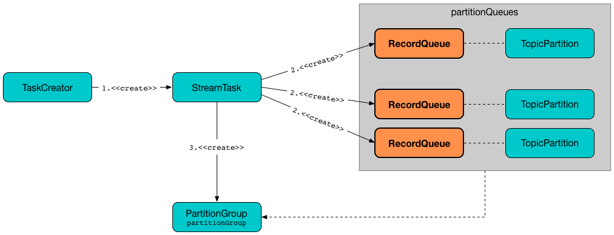

== [[RecordQueue]] RecordQueue

`RecordQueue` is a <<fifoQueue, FIFO queue of StampedRecords>> that a `StreamTask` uses for...FIXME

`RecordQueue` is <<creating-instance, created>> along with a link:kafka-streams-internals-StreamTask.adoc#creating-instance[StreamTask] exclusively.

.RecordQueue, StreamTask and TaskCreator


[[internal-registries]]
.RecordQueue's Internal Properties (e.g. Registries, Counters and Flags)
[cols="1,2",options="header",width="100%"]
|===
| Name
| Description

| `fifoQueue`
| [[fifoQueue]] Java's https://docs.oracle.com/javase/8/docs/api/index.html?java/util/ArrayDeque.html[java.util.ArrayDeque] of link:kafka-streams-StampedRecord.adoc[StampedRecords] (i.e. orderable Kafka `ConsumerRecords` with a timestamp)

Used when...FIXME

| `recordDeserializer`
| [[recordDeserializer]] link:kafka-streams-RecordDeserializer.adoc[RecordDeserializer] (for the <<source, SourceNode>> and <<deserializationExceptionHandler, DeserializationExceptionHandler>>)

Used when...FIXME

| `timeTracker`
| [[timeTracker]] link:kafka-streams-TimestampTracker.adoc[TimestampTracker]

Used when...FIXME
|===

[[logging]]
[TIP]
====
Enable `TRACE` logging level for `org.apache.kafka.streams.processor.internals.RecordQueue` logger to see what happens inside.

Add the following line to `log4j.properties`:

```
log4j.logger.org.apache.kafka.streams.processor.internals.RecordQueue=TRACE
```

Refer to link:kafka-logging.adoc#log4j.properties[Application Logging Using log4j].
====

=== [[creating-instance]] Creating RecordQueue Instance

`RecordQueue` takes the following when created:

* [[partition]] Kafka https://kafka.apache.org/11/javadoc/org/apache/kafka/common/TopicPartition.html[TopicPartition]
* [[source]] link:kafka-streams-internals-SourceNode.adoc[SourceNode]
* [[timestampExtractor]] <<kafka-streams-TimestampExtractor.adoc#, TimestampExtractor>>
* [[deserializationExceptionHandler]] `DeserializationExceptionHandler`
* [[processorContext]] link:kafka-streams-ProcessorContext.adoc[ProcessorContext]
* [[logContext]] `LogContext`

`RecordQueue` initializes the <<internal-registries, internal registries and counters>>.

=== [[addRawRecords]] Adding Kafka ConsumerRecords (as StampedRecords) -- `addRawRecords` Method

[source, java]
----
int addRawRecords(final Iterable<ConsumerRecord<byte[], byte[]>> rawRecords)
----

For every Kafka https://kafka.apache.org/20/javadoc/org/apache/kafka/clients/consumer/ConsumerRecord.html[ConsumerRecord] in the input `rawRecords`, `addRawRecords` does the following:

. Requests the <<recordDeserializer, RecordDeserializer>> to link:kafka-streams-RecordDeserializer.adoc#deserialize[deserialize the record] (with the <<processorContext, ProcessorContext>>)

. Requests the <<timeTracker, TimestampTracker>> for the link:kafka-streams-TimestampTracker.adoc#get[currently-tracked timestamp] and uses it to request the <<timestampExtractor, TimestampExtractor>> to link:kafka-streams-TimestampExtractor.adoc#extract[extract the timestamp from the record]

. Creates a link:kafka-streams-StampedRecord.adoc#creating-instance[StampedRecord] for the record and the record timestamp

. Inserts the `StampedRecord` at the end of the <<fifoQueue, fifoQueue>>

. Requests the <<timeTracker, TimestampTracker>> to link:kafka-streams-TimestampTracker.adoc#addElement[add the StampedRecord]

While processing `ConsumerRecords`, `addRawRecords` prints out the following TRACE message to the logs:

```
Source node [name] extracted timestamp [timestamp] for record [record]
```

With all `ConsumerRecords` processed, `addRawRecords` updates the <<partitionTime, partitionTime>> if the link:kafka-streams-TimestampTracker.adoc#get[current timestamp] (of the <<timeTracker, TimestampTracker>>) is greater (later time-wise).

In the end, `addRawRecords` returns the <<size, number of ConsumerRecords>> in the <<fifoQueue, queue>>.

[NOTE]
====
`addRawRecords` skips (drops) Kafka `ConsumerRecords` when either condition holds:

* <<recordDeserializer, RecordDeserializer>> could not link:kafka-streams-RecordDeserializer.adoc#deserialize[deserialize] and the `DeserializationExceptionHandler` is not set to fail upon a deserialization error

* Extracted timestamp is negative (and hence invalid)
====

NOTE: `addRawRecords` is used exclusively when `PartitionGroup` is requested to link:kafka-streams-internals-PartitionGroup.adoc#addRawRecords[add records to a RecordQueue for a Kafka partition].

=== [[clear]] Clearing (Resetting) RecordQueue -- `clear` Method

[source, java]
----
void clear()
----

`clear` removes all of the elements from the <<fifoQueue, fifoQueue>> and requests the <<timeTracker, TimestampTracker>> to link:kafka-streams-TimestampTracker.adoc#clear[clear itself].

In the end, `clear` (re)sets the <<partitionTime, partitionTime>> to `NOT_KNOWN`.

NOTE: `clear` is used exclusively when `PartitionGroup` is requested to link:kafka-streams-internals-PartitionGroup.adoc#clear[clear].

=== [[size]] Requesting Number of Records in Queue -- `size` Method

[source, java]
----
int size()
----

`size` simply returns the number of records in the <<fifoQueue, fifoQueue>>.

[NOTE]
====
`size` is used when:

* `PartitionGroup` is requested to link:kafka-streams-internals-PartitionGroup.adoc#addRawRecords[add records to a RecordQueue for a Kafka partition] and link:kafka-streams-internals-PartitionGroup.adoc#numBuffered[numBuffered]

* `RecordQueue` is requested to <<addRawRecords, add Kafka ConsumerRecords (as StampedRecords)>>

* `StreamTask` is requested to link:kafka-streams-internals-StreamTask.adoc#process[process a single record]
====
