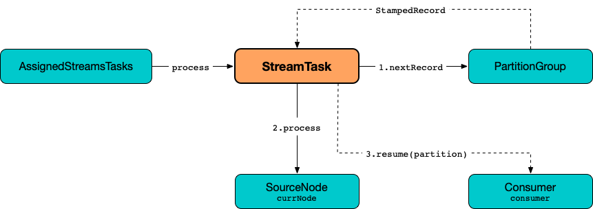
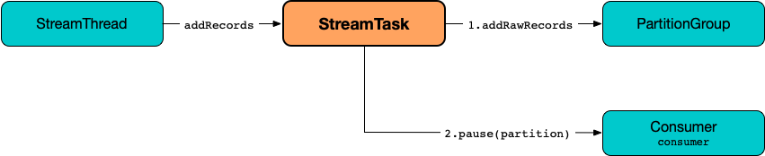

== [[StreamTask]] StreamTask

[[AbstractTask]]
`StreamTask` is a concrete <<kafka-streams-internals-AbstractTask.adoc#, stream processor task>> that uses a <<partitionGroup, PartitionGroup>> (with the <<partitions, partitions assigned>>) to determine which record should be <<process, processed>> (as ordered by partition timestamp).

When requested to <<process, process a single record>>, `StreamTask` requests the <<partitionGroup, PartitionGroup>> for the <<kafka-streams-internals-PartitionGroup.adoc#nextRecord, next stamped record (record with timestamp) and the RecordQueue>>. `StreamTask` uses a <<recordInfo, RecordInfo>> to hold the <<kafka-streams-internals-RecordQueue.adoc#, RecordQueue>> (with the source <<kafka-streams-internals-ProcessorNode.adoc#, processor node>> and the partition) of the currently-processed stamped record. Eventually, `StreamTask` requests the source processor node (of the `RecordQueue` and the partition) to <<kafka-streams-internals-ProcessorNode.adoc#process, process the record>>.

.StreamTask and Processing Single Record


NOTE: It is at the discretion of a processor node (incl. a source processor node) to <<kafka-streams-ProcessorContext.adoc#forward, forward the record downstream>> (to child processors if there are any).

`StreamTask` is <<creating-instance, created>> exclusively when `TaskCreator` is requested to <<kafka-streams-internals-TaskCreator.adoc#createTask, create one>>.

[[ProcessorNodePunctuator]]
`StreamTask` is a concrete <<kafka-streams-internals-ProcessorNodePunctuator.adoc#, ProcessorNodePunctuator>> that can <<punctuate, punctuate processors>> (_execute scheduled periodic actions_).

When requested to <<initializeTopology, initialize a processor topology>> (as a <<kafka-streams-internals-Task.adoc#, task>>), `StreamTask`...FIXME

[[commitOffsetNeeded]]
`StreamTask` uses `commitOffsetNeeded` flag to...FIXME

[[maxBufferedSize]]
[[buffered.records.per.partition]]
`StreamTask` uses <<kafka-streams-properties.adoc#buffered.records.per.partition, buffered.records.per.partition>> configuration property (default: `1000`) to control whether to pause or resume a partition (when <<process, processing a single record>> or <<addRecords, bufferring new records>>, respectively).

[[maxTaskIdleMs]]
[[max.task.idle.ms]]
`StreamTask` uses <<kafka-streams-properties.adoc#max.task.idle.ms, max.task.idle.ms>> configuration property (default: `0L`) to...FIXME

[[logging]]
[TIP]
====
Enable `ALL` logging level for `org.apache.kafka.streams.processor.internals.StreamTask` logger to see what happens inside.

Add the following line to `log4j.properties`:

```
log4j.logger.org.apache.kafka.streams.processor.internals.StreamTask=ALL
```

Refer to <<kafka-logging.adoc#log4j.properties, Application Logging Using log4j>>.
====

=== StreamTask and RecordCollector

`StreamTask` creates a new <<recordCollector, RecordCollector>> or is given one (when <<creating-instance, created>>).

The <<recordCollector, RecordCollector>> is requested to <<kafka-streams-internals-RecordCollector.adoc#init, initialize>> (with a <<producer, Kafka Producer>>) when `StreamTask` is <<creating-instance, created>> and <<resume, resumed>>.

`StreamTask` uses the <<recordCollector, RecordCollector>> for the following:

* Creating an <<kafka-streams-internals-AbstractTask.adoc#processorContext, InternalProcessorContext>> (when <<creating-instance, created>>)

* <<kafka-streams-internals-RecordCollector.adoc#offsets, Getting offsets>> when <<activeTaskCheckpointableOffsets, activeTaskCheckpointableOffsets>>

* <<kafka-streams-internals-RecordCollector.adoc#flush, Flushing the internal Kafka producer>> when <<flushState, flushState>>

* <<suspend, suspend>> and <<maybeAbortTransactionAndCloseRecordCollector, maybeAbortTransactionAndCloseRecordCollector>>

The <<recordCollector, RecordCollector>> is requested to <<kafka-streams-internals-RecordCollector.adoc#close, close>> when `StreamTask` is requested to <<suspend, suspend>> and <<maybeAbortTransactionAndCloseRecordCollector, maybeAbortTransactionAndCloseRecordCollector>>.

=== [[closeTopology]] `closeTopology` Internal Method

[source, java]
----
void closeTopology()
----

`closeTopology`...FIXME

NOTE: `closeTopology` is used exclusively when `StreamTask` is requested to <<suspend, suspend>>.

=== [[suspend]] `suspend` Method

[source, java]
----
void suspend()  // <1>

// PRIVATE API
suspend(boolean clean, boolean isZombie)
----
<1> Uses the private `suspend` with `clean` enabled and `isZombie` disabled

NOTE: `suspend` is part of <<kafka-streams-internals-Task.adoc#suspend, Task Contract>> to...FIXME

`suspend`...FIXME

NOTE: The private `suspend` is used when `StreamTask` is requested to <<close, close>>.

=== [[close]] `close` Method

[source, java]
----
void close(
  final boolean clean,
  final boolean isZombie)
----

NOTE: `close` is part of link:kafka-streams-internals-Task.adoc#close[Task Contract] to...FIXME.

`close`...FIXME

=== [[creating-instance]] Creating StreamTask Instance

`StreamTask` takes the following to be created:

* [[id]] <<kafka-streams-TaskId.adoc#, TaskId>>
* [[partitions]] Partitions (Kafka https://kafka.apache.org/22/javadoc/org/apache/kafka/common/TopicPartition.html[TopicPartition])
* [[topology]] <<kafka-streams-internals-ProcessorTopology.adoc#, ProcessorTopology>>
* [[consumer]] Kafka https://kafka.apache.org/22/javadoc/org/apache/kafka/clients/consumer/KafkaConsumer.html[Consumer] (`Consumer<byte[], byte[]>`)
* [[changelogReader]] <<kafka-streams-ChangelogReader.adoc#, ChangelogReader>>
* [[config]] <<kafka-streams-StreamsConfig.adoc#, StreamsConfig>>
* [[metrics]] <<kafka-streams-internals-StreamsMetricsImpl.adoc#, StreamsMetricsImpl>>
* [[stateDirectory]] <<kafka-streams-internals-StateDirectory.adoc#, StateDirectory>>
* [[cache]] <<kafka-streams-internals-ThreadCache.adoc#, ThreadCache>>
* [[time]] `Time`
* [[producerSupplier]] <<kafka-streams-internals-ProducerSupplier.adoc#, ProducerSupplier>>
* [[recordCollector]] <<kafka-streams-internals-RecordCollector.adoc#, RecordCollector>>
* [[closeSensor]] `closeSensor` Kafka `Sensor`

`StreamTask` initializes the <<internal-properties, internal properties>>.

=== [[initTopology]] Initializing ProcessorNodes (in ProcessorTopology) -- `initTopology` Internal Method

[source, java]
----
void initTopology()
----

`initTopology` prints out the following TRACE message to the logs:

```
Initializing processor nodes of the topology
```

`initTopology` then walks over all the <<kafka-streams-internals-ProcessorTopology.adoc#processors, processor nodes>> in the <<topology, topology>> and requests them to <<kafka-streams-internals-ProcessorNode.adoc#init, initialize>> (one by one). While doing this node initialization, `initTopology` requests the <<processorContext, InternalProcessorContext>> to <<kafka-streams-internals-InternalProcessorContext.adoc#setCurrentNode, set the current node>> to the processor node that is currently initialized and, after initialization, <<kafka-streams-internals-InternalProcessorContext.adoc#setCurrentNode, resets the current node>> (to `null`).

NOTE: `initTopology` is used exclusively when `StreamTask` is requested to <<initializeTopology, initialize the topology>>.

=== [[initializeTopology]] Initializing Topology (of Processor Nodes) -- `initializeTopology` Method

[source, java]
----
void initializeTopology()
----

NOTE: `initializeTopology` is part of <<kafka-streams-internals-Task.adoc#initializeTopology, Task Contract>> to initialize a <<kafka-streams-internals-ProcessorTopology.adoc#, topology of processor nodes>>.

`initializeTopology` <<initTopology, initialize the ProcessorNodes>> in the <<topology, ProcessorTopology>>.

With <<kafka-streams-internals-AbstractTask.adoc#eosEnabled, exactly-once support enabled>>, `initializeTopology` requests the <<producer, Kafka Producer>> to start a new transaction (using link:++https://kafka.apache.org/22/javadoc/org/apache/kafka/clients/producer/KafkaProducer.html#beginTransaction--++[Producer.beginTransaction]) and turns the <<transactionInFlight, transactionInFlight>> flag on.

`initializeTopology` then requests the <<kafka-streams-internals-AbstractTask.adoc#processorContext, InternalProcessorContext>> to <<kafka-streams-internals-InternalProcessorContext.adoc#initialize, initialize>>.

In the end, `initializeTopology` turns the <<kafka-streams-internals-AbstractTask.adoc#taskInitialized, taskInitialized>> flag on (`true`) and the <<idleStartTime, idleStartTime>> to `UNKNOWN`.

=== [[updateProcessorContext]] Updating InternalProcessorContext -- `updateProcessorContext` Internal Method

[source, java]
----
void updateProcessorContext(
  final StampedRecord record,
  final ProcessorNode currNode)
----

`updateProcessorContext` requests the <<processorContext, InternalProcessorContext>> to <<kafka-streams-internals-InternalProcessorContext.adoc#setRecordContext, set the current ProcessorRecordContext>> to a new <<kafka-streams-internals-ProcessorRecordContext.adoc#, ProcessorRecordContext>> (per the input <<kafka-streams-internals-StampedRecord.adoc#, StampedRecord>>).

`updateProcessorContext` then requests the <<processorContext, InternalProcessorContext>> to <<kafka-streams-internals-InternalProcessorContext.adoc#setCurrentNode, set the current ProcessorNode>> to the input <<kafka-streams-internals-ProcessorNode.adoc#, ProcessorNode>>.

NOTE: `updateProcessorContext` is used when `StreamTask` is requested to <<process, process a single record>> and <<punctuate, execute a scheduled periodic action (aka punctuate)>>.

=== [[process]] Processing Single Record -- `process` Method

[source, java]
----
boolean process()
----

`process` requests the <<partitionGroup, PartitionGroup>> for the <<kafka-streams-internals-PartitionGroup.adoc#nextRecord, next stamped record (record with timestamp) and the RecordQueue>> (with the <<recordInfo, RecordInfo>>).

.StreamTask and Processing Single Record


`process` prints out the following TRACE message to the logs:

```
Start processing one record [record]
```

`process` requests the <<recordInfo, RecordInfo>> for the <<kafka-streams-internals-RecordInfo.adoc#node, source processor node>>.

`process` <<updateProcessorContext, updateProcessorContext>> (with the current record and the source processor node).

`process` requests the source processor node to <<kafka-streams-internals-ProcessorNode.adoc#process, process>> the key and the value of the record.

`process` prints out the following TRACE message to the logs:

```
Completed processing one record [record]
```

`process` requests the <<recordInfo, RecordInfo>> for the <<kafka-streams-internals-RecordInfo.adoc#partition, partition>> and stores it and the record's <<kafka-streams-internals-StampedRecord.adoc#offset, offset>> in the <<consumedOffsets, consumedOffsets>> internal registry.

`process` turns the <<commitOffsetNeeded, commitOffsetNeeded>> flag on.

`process` requests the <<consumer, Kafka consumer>> to resume the partition if the size of the <<kafka-streams-internals-RecordInfo.adoc#queue, queue>> of the <<recordInfo, RecordInfo>> is exactly <<maxBufferedSize, buffered.records.per.partition>> configuration property (default: `1000`).

`process` always requests <<kafka-streams-internals-AbstractTask.adoc#processorContext, InternalProcessorContext>> to <<kafka-streams-internals-InternalProcessorContext.adoc#setCurrentNode, setCurrentNode>> as `null`.

In case of a `ProducerFencedException`, `process` throws a `TaskMigratedException`.

In case of a `KafkaException`, `process` throws a `StreamsException`.

In the end, `process` returns `true` when the single record was processed successfully, and `false` when there were no records to process.

NOTE: `process` is used exclusively when `AssignedStreamsTasks` is requested to <<kafka-streams-AssignedStreamsTasks.adoc#process, request the running stream tasks to process records (one record per task)>>.

=== [[closeSuspended]] `closeSuspended` Method

[source, java]
----
void closeSuspended(
  boolean clean,
  final boolean isZombie,
  RuntimeException firstException)
----

NOTE: `closeSuspended` is part of link:kafka-streams-internals-Task.adoc#closeSuspended[Task Contract] to...FIXME.

`closeSuspended`...FIXME

=== [[addRecords]] Buffering New Records (From Partition) -- `addRecords` Method

[source, java]
----
void addRecords(
  final TopicPartition partition,
  final Iterable<ConsumerRecord<byte[], byte[]>> records)
----

`addRecords` simply requests the <<partitionGroup, PartitionGroup>> to <<kafka-streams-internals-PartitionGroup.adoc#addRawRecords, add the new records to the RecordQueue for the specified partition>>.

.StreamTask and Buffering New Records


`addRecords` prints out the following TRACE message to the logs:

```
Added records into the buffered queue of partition [partition], new queue size is [newQueueSize]
```

When the size of the buffered record queue exceeds <<buffered.records.per.partition, buffered.records.per.partition>> configuration property, `addRecords` requests the <<consumer, Kafka Consumer>> to pause the partition.

NOTE: `addRecords` uses link:++https://kafka.apache.org/22/javadoc/org/apache/kafka/clients/consumer/KafkaConsumer.html#pause-java.util.Collection-++[Consumer.pause] method to _"pause the partition"_, i.e. to suspend fetching from the requested partitions. Future calls to link:++https://kafka.apache.org/22/javadoc/org/apache/kafka/clients/consumer/KafkaConsumer.html#poll-java.time.Duration-++[KafkaConsumer.poll] will not return any records from these partitions until they have been resumed using link:++https://kafka.apache.org/22/javadoc/org/apache/kafka/clients/consumer/KafkaConsumer.html#resume-java.util.Collection-++[KafkaConsumer.resume].

[NOTE]
====
`addRecords` is used when:

* `StreamThread` is requested to <<kafka-streams-internals-StreamThread.adoc#addRecordsToTasks, add records to active stream tasks (and report skipped records)>>

* `TopologyTestDriver` is requested to <<kafka-streams-TopologyTestDriver.adoc#pipeInput, pipeInput>>
====

=== [[recordCollectorOffsets]] `recordCollectorOffsets` Method

[source, java]
----
Map<TopicPartition, Long> recordCollectorOffsets()
----

NOTE: `recordCollectorOffsets` is part of link:kafka-streams-internals-AbstractTask.adoc#recordCollectorOffsets[AbstractTask Contract] to...FIXME.

`recordCollectorOffsets`...FIXME

=== [[punctuate]] Punctuating Processor (Executing Scheduled Periodic Action) -- `punctuate` Method

[source, java]
----
void punctuate(
  ProcessorNode node,
  long timestamp,
  PunctuationType type,
  Punctuator punctuator)
----

NOTE: `punctuate` is part of <<kafka-streams-internals-ProcessorNodePunctuator.adoc#punctuate, ProcessorNodePunctuator Contract>> to punctuate a <<kafka-streams-internals-ProcessorNode.adoc#, processor>>.

`punctuate` <<updateProcessorContext, updateProcessorContext>> with a "dummy" stamped record and the given <<kafka-streams-internals-ProcessorNode.adoc#, ProcessorNode>>.

`punctuate` prints out the following TRACE message to the logs:

```
Punctuating processor [name] with timestamp [timestamp] and punctuation type [type]
```

In the end, `punctuate` requests the given <<kafka-streams-internals-ProcessorNode.adoc#, ProcessorNode>> to <<kafka-streams-internals-ProcessorNode.adoc#punctuate, punctuate>>.

In case of a `ProducerFencedException`, `punctuate` throws a `TaskMigratedException`.

In case of a `KafkaException`, `punctuate` throws a `StreamsException`:

```
[logPrefix]Exception caught while punctuating processor '[name]'
```

=== [[maybePunctuateStreamTime]] Attempting to Punctuate by Stream Time -- `maybePunctuateStreamTime` Method

[source, java]
----
boolean maybePunctuateStreamTime()
----

`maybePunctuateStreamTime` requests the <<partitionGroup, PartitionGroup>> for the <<kafka-streams-internals-PartitionGroup.adoc#timestamp, minimum partition timestamp across all partitions>>.

`maybePunctuateStreamTime` requests the <<streamTimePunctuationQueue, stream-time PunctuationQueue>> to <<kafka-streams-PunctuationQueue.adoc#mayPunctuate, mayPunctuate>> with the minimum timestamp.

In the end, `maybePunctuateStreamTime` returns whatever the stream-time `PunctuationQueue` returned.

If the minimum timestamp is <<kafka-streams-internals-RecordQueue.adoc#UNKNOWN, UNKNOWN>>, `maybePunctuateStreamTime` returns `false`.

NOTE: `maybePunctuateStreamTime` is used exclusively when `AssignedStreamsTasks` is requested to <<kafka-streams-AssignedStreamsTasks.adoc#punctuate, punctuate running stream tasks>>.

=== [[maybePunctuateSystemTime]] Attempting to Punctuate by System Time -- `maybePunctuateSystemTime` Method

[source, java]
----
boolean maybePunctuateSystemTime()
----

`maybePunctuateSystemTime`...FIXME

NOTE: `maybePunctuateSystemTime` is used exclusively when `AssignedStreamsTasks` is requested to <<kafka-streams-AssignedStreamsTasks.adoc#punctuate, punctuate running stream tasks>>.

=== [[schedule]] Scheduling Cancellable Periodic Action (Punctuator) -- `schedule` Method

[source, java]
----
// PUBLIC API
Cancellable schedule(
  long interval,
  PunctuationType type,
  Punctuator punctuator)
// PACKAGE PROTECTED
Cancellable schedule(
  long startTime,
  long interval,
  PunctuationType type,
  Punctuator punctuator)
----

`schedule` chooses the `PunctuationQueue` and the `startTime` per the specified `PunctuationType` that can either be `STREAM_TIME` or `WALL_CLOCK_TIME`.

[[schedule-STREAM_TIME]]
For `STREAM_TIME`, `schedule` always uses `0L` as the `startTime` and the <<streamTimePunctuationQueue, stream-time PunctuationQueue>>.

[[schedule-WALL_CLOCK_TIME]]
For `WALL_CLOCK_TIME`, `schedule` uses the current time and the specified `interval` as the `startTime` and the <<systemTimePunctuationQueue, system-time PunctuationQueue>>.

`schedule` then creates a new <<kafka-streams-PunctuationSchedule.adoc#, PunctuationSchedule>> (with the <<kafka-streams-internals-InternalProcessorContext.adoc#currentNode, current processor>> of the <<kafka-streams-internals-AbstractTask.adoc#processorContext, InternalProcessorContext>>) and requests the appropriate `PunctuationQueue` to <<kafka-streams-PunctuationQueue.adoc#schedule, schedule>> it.

NOTE: `schedule` is used exclusively when `ProcessorContextImpl` is requested to <<kafka-streams-internals-ProcessorContextImpl.adoc#schedule, schedule a cancellable periodic action>>.

=== [[initializeStateStores]] Initializing State Stores -- `initializeStateStores` Method

[source, java]
----
boolean initializeStateStores()
----

NOTE: `initializeStateStores` is part of <<kafka-streams-internals-Task.adoc#initializeStateStores, Task Contract>> to initialize <<kafka-streams-StateStore.adoc#, state stores>>.

`initializeStateStores` prints out the following TRACE message to the logs:

```
Initializing state stores
```

`initializeStateStores` <<kafka-streams-internals-AbstractTask.adoc#registerStateStores, registerStateStores>>.

In the end, `initializeStateStores` returns `true` if the <<kafka-streams-internals-Task.adoc#changelogPartitions, task has any changelog partitions>>. Otherwise, `initializeStateStores` returns `false`.

=== [[commitOffsets]] `commitOffsets` Internal Method

[source, java]
----
void commitOffsets(final boolean startNewTransaction)
----

`commitOffsets`...FIXME

NOTE: `commitOffsets` is used exclusively when `StreamTask` is requested to <<commit, commit>>.

=== [[commit]] Committing Task -- `commit` Method

[source, java]
----
void commit() // <1>
void commit(final boolean startNewTransaction)
----
<1> Uses the other `commit` with the `startNewTransaction` flag on

NOTE: `commit` is part of <<kafka-streams-internals-Task.adoc#commit, Task Contract>> to commit the task.

`commit` simply <<commit-startNewTransaction, commits>> with the `startNewTransaction` flag on.

=== [[commit-startNewTransaction]] `commit` Internal Method

[source, java]
----
void commit(final boolean startNewTransaction)
----

`commit` prints out the following DEBUG message to the logs:

```
Committing
```

`commit` <<flushState, flushState>>.

(only when <<kafka-streams-internals-AbstractTask.adoc#eosEnabled, exactly-once support>> is off) `commit` requests the <<stateMgr, ProcessorStateManager>> to <<kafka-streams-ProcessorStateManager.adoc#checkpoint, checkpoint>> with the <<activeTaskCheckpointableOffsets, checkpointable offsets>>.

`commit` <<commitOffsets, commitOffsets>> with the input `startNewTransaction` flag.

`commit` turns the <<commitRequested, commitRequested>> internal flag off.

In the end, `commit` requests the <<taskMetrics, TaskMetrics>> for the <<taskCommitTimeSensor, taskCommitTimeSensor>> and records the duration (i.e. the time since `commit` was executed).

NOTE: `commit` is used when `StreamTask` is requested to <<commit, commit>> (that turns the input `startNewTransaction` flag on) and <<suspend, suspend>> (with the input `startNewTransaction` flag off).

=== [[activeTaskCheckpointableOffsets]] `activeTaskCheckpointableOffsets` Method

[source, java]
----
Map<TopicPartition, Long> activeTaskCheckpointableOffsets()
----

NOTE: `activeTaskCheckpointableOffsets` is part of the <<kafka-streams-internals-AbstractTask.adoc#activeTaskCheckpointableOffsets, AbstractTask Contract>> to return the checkpointable offsets.

`activeTaskCheckpointableOffsets`...FIXME

=== [[flushState]] Flushing State Stores And Producer (RecordCollector) -- `flushState` Method

[source, java]
----
void flushState()
----

NOTE: `flushState` is part of link:kafka-streams-internals-AbstractTask.adoc#flushState[AbstractTask Contract] to flush all <<kafka-streams-StateStore.adoc#, state stores>> registered with the task.

`flushState` prints out the following TRACE message to the logs:

```
Flushing state and producer
```

`flushState` <<kafka-streams-internals-AbstractTask.adoc#flushState, flushes state stores>>.

`flushState` requests the <<recordCollector, RecordCollector>> to <<kafka-streams-internals-RecordCollector.adoc#flush, flush the internal Kafka producer>>.

=== [[isProcessable]] `isProcessable` Method

[source, java]
----
boolean isProcessable(final long now)
----

`isProcessable` returns `true` when one of the following is met:

* <<kafka-streams-internals-PartitionGroup.adoc#allPartitionsBuffered, All RecordQueues have at least one record buffered>> of the <<partitionGroup, PartitionGroup>>

* The task is enforced to be processable, i.e. the time between `now` and the <<idleStartTime, idleStartTime>> is at least or larger than the <<maxTaskIdleMs, max.task.idle.ms>> configuration property (default: `0L`)

Otherwise, `isProcessable` returns `false`.

NOTE: (FIXME) `isProcessable` does some minor accounting.

NOTE: `isProcessable` is used exclusively when `AssignedStreamsTasks` is requested to <<kafka-streams-AssignedStreamsTasks.adoc#process, request the running stream tasks to process records (one record per task)>>.

=== [[resume]] Resuming Task -- `resume` Method

[source, java]
----
void resume()
----

NOTE: `resume` is part of the <<kafka-streams-internals-Task.adoc#resume, Task Contract>> to resume the task.

`resume` prints out the following DEBUG message to the logs:

```
Resuming
```

`resume` then does further processing only when <<kafka-streams-internals-AbstractTask.adoc#eosEnabled, Exactly-Once Support>> is enabled.

`resume`...FIXME

=== [[maybeAbortTransactionAndCloseRecordCollector]] `maybeAbortTransactionAndCloseRecordCollector` Internal Method

[source, java]
----
void maybeAbortTransactionAndCloseRecordCollector(final boolean isZombie)
----

`maybeAbortTransactionAndCloseRecordCollector`...FIXME

NOTE: `maybeAbortTransactionAndCloseRecordCollector` is used when...FIXME

=== [[initializeTransactions]] `initializeTransactions` Internal Method

[source, java]
----
void initializeTransactions()
----

`initializeTransactions`...FIXME

NOTE: `initializeTransactions` is used when...FIXME

=== [[producerMetrics]] `producerMetrics` Method

[source, java]
----
Map<MetricName, Metric> producerMetrics()
----

`producerMetrics`...FIXME

NOTE: `producerMetrics` is used when...FIXME

=== [[numBuffered]] `numBuffered` Method

[source, java]
----
int numBuffered()
----

`numBuffered` simply requests the <<partitionGroup, PartitionGroup>> for the <<kafka-streams-internals-PartitionGroup.adoc#numBuffered, numBuffered>>.

NOTE: `numBuffered` seems to be used for tests only.

=== [[requestCommit]] `requestCommit` Method

[source, java]
----
void requestCommit()
----

`requestCommit` simply turns the <<commitRequested, commitRequested>> internal flag on (`true`).

NOTE: `requestCommit` is used exclusively when `ProcessorContextImpl` is requested to <<kafka-streams-internals-ProcessorContextImpl.adoc#commit, commit>>.

=== [[purgableOffsets]] `purgableOffsets` Method

[source, java]
----
Map<TopicPartition, Long> purgableOffsets()
----

In essence, `purgableOffsets` returns the partition-offset pairs for the <<consumedOffsets, consumedOffsets>> of the repartition topics (i.e. the <<topology, ProcessorTopology>> uses as <<kafka-streams-internals-ProcessorTopology.adoc#isRepartitionTopic, repartition topics>>).

`purgableOffsets`...FIXME

NOTE: `purgableOffsets` is used when...FIXME

=== [[internal-properties]] Internal Properties

[cols="30m,70",options="header",width="100%"]
|===
| Name
| Description

| commitRequested
a| [[commitRequested]] Flag that indicates whether a <<requestCommit, commit was requested>> (`true`) or not (`false`)

Default: `false`

Disabled after <<commit, commit>>

| consumedOffsets
| [[consumedOffsets]] Offsets by https://kafka.apache.org/22/javadoc/org/apache/kafka/common/TopicPartition.html[TopicPartitions] (`Map<TopicPartition, Long>`) that `StreamTask` has <<process, processed>> successfully

| idleStartTime
a| [[idleStartTime]]

| partitionGroup
a| [[partitionGroup]] <<kafka-streams-internals-PartitionGroup.adoc#, PartitionGroup>> (with <<kafka-streams-internals-RecordQueue.adoc#, RecordQueues>> per every <<partitions, partition assigned>>)

Used when `StreamTask` is requested for the following:

* <<addRecords, Buffer new records (from a partition)>>

* <<isProcessable, isProcessable>>

* <<process, Process a single record>>

* <<closeTopology, closeTopology>>

* <<closeSuspended, closeSuspended>>

* <<numBuffered, numBuffered>>

* <<maybePunctuateStreamTime, maybePunctuateStreamTime>>

| processorContext
a| [[processorContext]] <<kafka-streams-internals-ProcessorContextImpl.adoc#, ProcessorContextImpl>>

| producer
a| [[producer]][[getProducer]] Kafka xref:https://kafka.apache.org/22/javadoc/org/apache/kafka/clients/producer/KafkaProducer.html#[Producer] (`Producer<byte[], byte[]>`)

Created when `StreamTask` is <<creating-instance, created>> and <<resume, resumed>> by requesting the <<producerSupplier, ProducerSupplier>> to <<kafka-streams-internals-ProducerSupplier.adoc#get, supply a Producer>>

Cleared (_nullified_) when `StreamTask` is requested to <<suspend, suspend>> and <<maybeAbortTransactionAndCloseRecordCollector, maybeAbortTransactionAndCloseRecordCollector>>

Used for the following:

* Requesting the <<recordCollector, RecordCollector>> to <<kafka-streams-internals-RecordCollector.adoc#init, initialize>> (when `StreamTask` is <<creating-instance, created>> and <<resume, resumed>>)

* <<initializeTopology, initializeTopology>>, <<initializeTransactions, initializeTransactions>>, <<maybeAbortTransactionAndCloseRecordCollector, maybeAbortTransactionAndCloseRecordCollector>>, and <<commit, commit>> for <<kafka-streams-exactly-once-support-eos.adoc#, exactly-once support>>

* <<producerMetrics, producerMetrics>>

| recordInfo
a| [[recordInfo]] <<kafka-streams-internals-RecordInfo.adoc#, RecordInfo>> (that holds a <<kafka-streams-internals-RecordQueue.adoc#, RecordQueue>> with the source <<kafka-streams-internals-ProcessorNode.adoc#, processor node>> and the partition the <<process, currently-processed stamped record>> came from)

Created empty alongside the <<StreamTask, StreamTask>> and _"fill up"_ with the <<kafka-streams-internals-RecordQueue.adoc#, RecordQueue>> when requested to <<process, process a single record>>

| streamTimePunctuationQueue
a| [[streamTimePunctuationQueue]] <<kafka-streams-PunctuationQueue.adoc#, PunctuationQueue>>

| systemTimePunctuationQueue
a| [[systemTimePunctuationQueue]] <<kafka-streams-PunctuationQueue.adoc#, PunctuationQueue>>

| taskMetrics
a| [[taskMetrics]] <<kafka-streams-StreamTask-TaskMetrics.adoc#, TaskMetrics>> for the <<id, TaskId>> and the <<metrics, StreamsMetricsImpl>>

Used when `StreamTask` is requested for the following:

* <<isProcessable, isProcessable>> (to record an occurence of <<kafka-streams-StreamTask-TaskMetrics.adoc#taskEnforcedProcessSensor, taskEnforcedProcessSensor>> sensor)

* <<commit, commit>> (to record a value of <<kafka-streams-StreamTask-TaskMetrics.adoc#taskCommitTimeSensor, taskCommitTimeSensor>> sensor)

* <<closeSuspended, closeSuspended>> (to <<kafka-streams-StreamTask-TaskMetrics.adoc#removeAllSensors, remove all task sensors>>)

| transactionInFlight
a| [[transactionInFlight]] Controls whether...FIXME
|===
