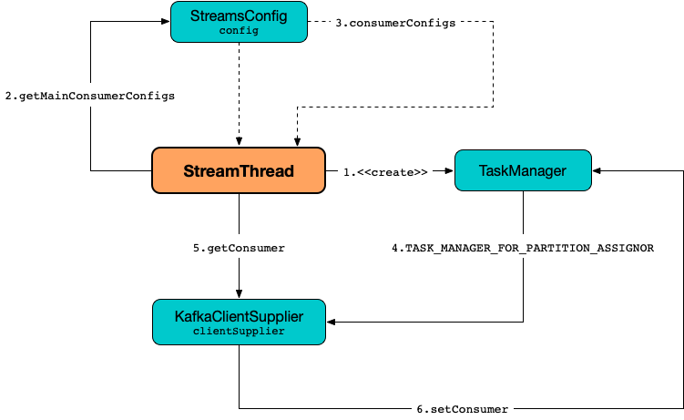
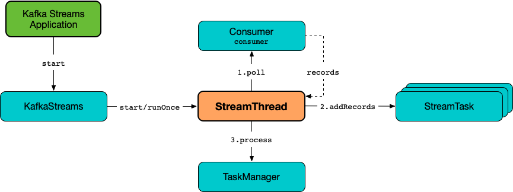
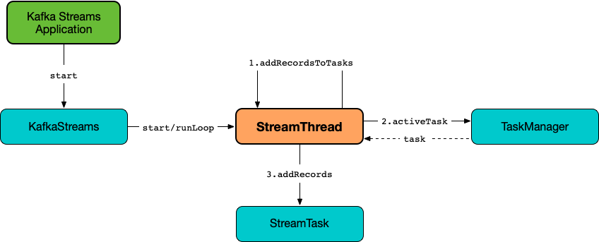

== [[StreamThread]] StreamThread -- Stream Processor Thread

`StreamThread` is a *stream processor thread* (a Java https://docs.oracle.com/en/java/javase/11/docs/api/java.base/java/lang/Thread.html[Thread]) that <<runLoop, runs the main record processing loop>> when <<run, started>>.

.StreamThread and Stream Processing
image::images/kafka-streams-StreamThread.png[align="center"]

`StreamThread` is <<create, created>> exclusively alongside <<kafka-streams-KafkaStreams.adoc#creating-instance, KafkaStreams>> (which is one of the main entities that a Kafka Streams developer uses in a Kafka Streams application).

NOTE: `KafkaStreams` uses <<kafka-streams-KafkaStreams.adoc#threads, num.stream.threads>> configuration property for the number of `StreamThreads` to create (default: `1`).

`StreamThread` uses a <<consumer, Kafka Consumer>> and a custom <<rebalanceListener, ConsumerRebalanceListener>> (with the <<taskManager, TaskManager>>) when subscribing to source topics (when requested to <<runLoop, run the main record processing loop>> and <<enforceRebalance, enforce a rebalance>>). `StreamThread` uses an <<builder, InternalTopologyBuilder>> for the <<kafka-streams-internals-InternalTopologyBuilder.adoc#sourceTopicPattern, source topics>> to subscribe to.

NOTE: When <<kafka-streams-StreamThread-RebalanceListener.adoc#onPartitionsAssigned, partitions get assigned>>, the <<rebalanceListener, custom ConsumerRebalanceListener>> requests the `TaskManager` to <<kafka-streams-internals-TaskManager.adoc#createTasks, create tasks for the assigned partitions>>.

`StreamThread` uses a <<consumer, Kafka Consumer>> and a <<taskManager, TaskManager>> that are both created when `StreamThread` object is requested to <<create, create an instance of itself>>. That is when the `StreamThread` sets the <<kafka-streams-StreamsConfig.adoc#TASK_MANAGER_FOR_PARTITION_ASSIGNOR, TASK_MANAGER_FOR_PARTITION_ASSIGNOR>> internal property and indirectly associates the <<taskManager, TaskManager>> with <<kafka-streams-internals-StreamsPartitionAssignor.adoc#, StreamsPartitionAssignor>>. `StreamThread` also requests the given <<kafka-streams-KafkaClientSupplier.adoc#, KafkaClientSupplier>> to <<getConsumer, create a KafkaConsumer>> (with the <<taskManager, TaskManager>>) and so when the <<kafka-streams-internals-StreamsPartitionAssignor.adoc#PARTITION_ASSIGNMENT_STRATEGY_CONFIG, partition.assignment.strategy>> configuration property is picked up, `StreamsPartitionAssignor` is <<kafka-streams-internals-StreamsPartitionAssignor.adoc#, created>> and eventually <<kafka-streams-internals-StreamsPartitionAssignor.adoc#configure, configured>> (that will use the <<kafka-streams-StreamsConfig.adoc#TASK_MANAGER_FOR_PARTITION_ASSIGNOR, TASK_MANAGER_FOR_PARTITION_ASSIGNOR>> internal property).

.StreamThread and Registering TaskManager under TASK_MANAGER_FOR_PARTITION_ASSIGNOR


[[pollTime]]
`StreamThread` uses the <<kafka-streams-properties.adoc#poll.ms, poll.ms>> configuration property (default: `100` ms) as the *polling interval* when requested to <<runOnce, poll records once and process them using active stream tasks>>.

[[commitTimeMs]]
`StreamThread` uses the <<kafka-streams-properties.adoc#commit.interval.ms, commit.interval.ms>> configuration property as the *flush interval* for persisting the position of a processor (when <<runOnce, polling records once and processing them using active stream tasks>> and <<maybeCommit, maybeCommit>>).

`StreamThread` uses the <<consumer, Kafka Consumer>> to:

* Subscribe to topics (with <<rebalanceListener, RebalanceListener>>) right after `StreamThread` has been requested to <<runLoop, run the main record processing loop>>

* Poll the topics subscribed (and fetch records if available) right after `StreamThread` has been requested to <<pollRequests, get the next batch of records by polling>>

* <<resetInvalidOffsets, resetInvalidOffsets>> (when an `InvalidOffsetException` is reported while <<pollRequests, polling the topics for records>>)

`StreamThread` uses *stream-thread [[clientId]-StreamThread-[STREAM_THREAD_ID]]* for the logging prefix.

`StreamThread` requires an <<builder, InternalTopologyBuilder>> to be <<create, created>> and uses it for the following:

* Creating a <<kafka-streams-internals-TaskCreator.adoc#, TaskCreator>> and a <<kafka-streams-internals-StandbyTaskCreator.adoc#, StandbyTaskCreator>>

* <<runLoop, Running the main record processing loop>> (and subscribing to the <<kafka-streams-internals-InternalTopologyBuilder.adoc#sourceTopicPattern, source topics>>)

* <<resetInvalidOffsets, resetInvalidOffsets>>

`StreamThread` uses the <<taskManager, TaskManager>> for the following:

* FIXME

[[logging]]
[TIP]
====
Enable any of `ALL` logging levels for `org.apache.kafka.streams.processor.internals.StreamThread` logger to see what happens inside.

Add the following line to `log4j.properties`:

```
log4j.logger.org.apache.kafka.streams.processor.internals.StreamThread=ALL
```

Refer to <<kafka-logging.adoc#log4j.properties, Application Logging Using log4j>>.
====

=== [[creating-instance]] Creating StreamThread Instance

`StreamThread` takes the following to be created:

* [[time]] `Time`
* [[config]] <<kafka-streams-StreamsConfig.adoc#, StreamsConfig>>
* [[producer]] Kafka http://kafka.apache.org/22/javadoc/org/apache/kafka/clients/producer/KafkaProducer.html[Producer] (`Producer<byte[], byte[]>`)
* [[restoreConsumer]] Kafka "restore" https://kafka.apache.org/22/javadoc/org/apache/kafka/clients/consumer/KafkaConsumer.html[Consumer] (`Consumer<byte[], byte[]>`)
* [[consumer]] <<StreamThread-Consumer, ++Consumer<byte[], byte[]>++>>
* [[originalReset]] `originalReset`
* [[taskManager]] <<kafka-streams-internals-TaskManager.adoc#, TaskManager>>
* [[streamsMetrics]] <<kafka-streams-internals-StreamsMetricsThreadImpl.adoc#, StreamsMetricsThreadImpl>>
* [[builder]] <<kafka-streams-internals-InternalTopologyBuilder.adoc#, InternalTopologyBuilder>>
* [[threadClientId]] Thread Client ID
* [[logContext]] `LogContext`
* [[assignmentErrorCode]] Assignment Error Code (`AtomicInteger`)

`StreamThread` initializes the <<internal-properties, internal properties>>.

=== [[StreamThread-Consumer]] StreamThread and Kafka Consumer

When <<create, created>>, `StreamThread` is given a <<kafka-streams-KafkaClientSupplier.adoc#, KafkaClientSupplier>>.

`StreamThread` uses the `KafkaClientSupplier` to <<kafka-streams-KafkaClientSupplier.adoc#getConsumer, get a Kafka consumer>> with the consumer-specific configuration.

The Kafka Consumer is then assigned to the <<kafka-streams-internals-TaskManager.adoc#setConsumer, TaskManager>> and to <<creating-instance, create the StreamThread>>.

The Kafka Consumer is used in the following:

* <<runLoop, runLoop>> (to subscribe to <<kafka-streams-internals-InternalTopologyBuilder.adoc#sourceTopicPattern, source topics>> with the <<rebalanceListener, ConsumerRebalanceListener>>)

* <<enforceRebalance, enforceRebalance>> (by unsubscribing from the source topics and (re)subscribing)

* <<pollRequests, pollRequests>> (to poll records)

* <<resetInvalidOffsets, resetInvalidOffsets>> (to seek to the beginning or the end of partitions assigned)

* <<completeShutdown, completeShutdown>> (to close the consumer)

* <<consumerMetrics, consumerMetrics>> (for the consumer metrics)

=== [[AdminClient]] StreamThread and AdminClient

When <<create, created>>, `StreamThread` is given an `AdminClient` that is only used to create the <<taskManager, TaskManager>>.

=== [[create]] Creating StreamThread Instance -- `create` Factory Method

[source, java]
----
StreamThread create(
  InternalTopologyBuilder builder,
  StreamsConfig config,
  KafkaClientSupplier clientSupplier,
  AdminClient adminClient,
  UUID processId,
  String clientId,
  Metrics metrics,
  Time time,
  StreamsMetadataState streamsMetadataState,
  long cacheSizeBytes,
  StateDirectory stateDirectory,
  StateRestoreListener userStateRestoreListener,
  int threadIdx)
----

.Creating StreamThread
image::images/kafka-streams-StreamThread-create.png[align="center"]

`create` prints out the following INFO message to the logs:

```
Creating restore consumer client
```

`create` requests the input `StreamsConfig` for link:kafka-streams-StreamsConfig.adoc#getRestoreConsumerConfigs[getRestoreConsumerConfigs] for a new `threadClientId` (of the format `[clientId]-StreamThread-[STREAM_THREAD_ID]`).

`create` requests the given `KafkaClientSupplier` for link:kafka-streams-KafkaClientSupplier.adoc#getRestoreConsumer[getRestoreConsumer] for the `restoreConsumerConfigs`.

[[create-StoreChangelogReader]]
`create` creates a <<kafka-streams-internals-StoreChangelogReader.adoc#, StoreChangelogReader>> (with the `restoreConsumer`, the given <<kafka-streams-StateRestoreListener.adoc#, StateRestoreListener>> and the configured <<kafka-streams-properties.adoc#poll.ms, poll.ms>>).

NOTE: The input <<kafka-streams-StateRestoreListener.adoc#, StateRestoreListener>> is a <<kafka-streams-DelegatingStateRestoreListener.adoc#, DelegatingStateRestoreListener>> actually.

(Only with eos enabled) `create`...FIXME

`create` creates a link:kafka-streams-internals-StreamsMetricsThreadImpl.adoc#creating-instance[StreamsMetricsThreadImpl] with the following:

* the input `Metrics`
* *stream-metrics* link:kafka-streams-internals-StreamsMetricsThreadImpl.adoc#groupName[group name]
* `thread.[clientId]-StreamThread-[STREAM_THREAD_ID]` link:kafka-streams-internals-StreamsMetricsThreadImpl.adoc#prefix[prefix]
* link:kafka-streams-internals-StreamsMetricsThreadImpl.adoc#tags[Tags] with one entry with `client-id` and the `[clientId]-StreamThread-[STREAM_THREAD_ID]` value.

`create` creates a <<kafka-streams-internals-ThreadCache.adoc#, ThreadCache>> (with `cacheSizeBytes` for the `maxCacheSizeBytes` and the `StreamsMetricsThreadImpl`).

`create` creates a link:kafka-streams-internals-TaskCreator.adoc#creating-instance[TaskCreator] and a link:kafka-streams-internals-StandbyTaskCreator.adoc#creating-instance[StandbyTaskCreator] that are used exclusively to create a <<kafka-streams-internals-TaskManager.adoc#, TaskManager>> (with a new link:kafka-streams-internals-AssignedStreamsTasks.adoc#creating-instance[AssignedStreamsTasks] and link:kafka-streams-internals-AssignedStandbyTasks.adoc#creating-instance[AssignedStandbyTasks] as well as the given <<kafka-streams-internals-StreamsMetadataState.adoc#, StreamsMetadataState>>).

`create` prints out the following INFO message to the logs:

```
Creating consumer client
```

`create` requests the input `StreamsConfig` for link:kafka-streams-properties.adoc#application.id[application.id] configuration property.

`create` requests the input `StreamsConfig` for the link:kafka-streams-StreamsConfig.adoc#getMainConsumerConfigs[configuration of a Kafka Consumer] for the application ID and the `threadClientId` (of the format `[clientId]-StreamThread-[STREAM_THREAD_ID]`) and adds the following internal properties:

* <<kafka-streams-StreamsConfig.adoc#TASK_MANAGER_FOR_PARTITION_ASSIGNOR, TASK_MANAGER_FOR_PARTITION_ASSIGNOR>> to be the `TaskManager` just created

* <<kafka-streams-StreamsConfig.adoc#ASSIGNMENT_ERROR_CODE, ASSIGNMENT_ERROR_CODE>> to be a new `AtomicInteger`

(Only with non-empty `latestResetTopicsPattern` and `earliestResetTopicsPattern` patterns) `create`...FIXME

`create` requests the given `KafkaClientSupplier` for a link:kafka-streams-KafkaClientSupplier.adoc#getConsumer[Kafka Consumer] (with the `consumerConfigs`) and link:kafka-streams-internals-TaskManager.adoc#setConsumer[associates] it with the `TaskManager`.

In the end, `create` creates a <<creating-instance, StreamThread>>.

NOTE: `create` is used exclusively when `KafkaStreams` is <<kafka-streams-KafkaStreams.adoc#, created>>.

=== [[run]] Starting Stream Thread -- `run` Method

[source, java]
----
void run()
----

NOTE: `run` is part of Java's https://docs.oracle.com/javase/10/docs/api/java/lang/Thread.html#run--[Thread Contract] to be executed by a JVM thread.

`run` prints out the following INFO message to the logs.

```
Starting
```

`run` <<setState, sets the state>> to <<RUNNING, RUNNING>> and <<runLoop, runs the main record processing loop>>.

At the end, `run` <<completeShutdown, shuts down>> (per `cleanRun` flag that says whether <<runLoop, running the main loop>> stopped cleanly or not).

`run` re-throws any `KafkaException`.

`run` prints out the following ERROR message to the logs for any other `Exception`:

```
Encountered the following error during processing: [exception]
```

NOTE: `run` is used exclusively when `KafkaStreams` is requested to <<kafka-streams-KafkaStreams.adoc#start, start>>.

=== [[state]][[State]] Life Cycle of StreamThread -- StreamThread's States

`StreamThread` can be in exactly one of the following *states* at any given point in time:

[start=0]
1. [[CREATED]] `CREATED` - The initial state of `StreamThread` right after it was <<creating-instance, created>>
1. [[RUNNING]] `RUNNING` - `StreamThread` was requested for the following:
* <<run, run>>
* <<runOnce, Polling records once and processing them using active stream tasks>> when `StreamThread` is in <<PARTITIONS_ASSIGNED, PARTITIONS_ASSIGNED>> state and <<taskManager, TaskManager>> was positive after link:kafka-streams-internals-TaskManager.adoc#updateNewAndRestoringTasks[updateNewAndRestoringTasks]
* <<runOnce, Polling records once and processing them using active stream tasks>> when `StreamThread` polled for records and happened to transition to <<PARTITIONS_ASSIGNED, PARTITIONS_ASSIGNED>> state, but (again) only when <<taskManager, TaskManager>> was positive after link:kafka-streams-internals-TaskManager.adoc#updateNewAndRestoringTasks[updateNewAndRestoringTasks]
1. [[STARTING]] `STARTING`
1. [[PARTITIONS_REVOKED]] `PARTITIONS_REVOKED` - `RebalanceListener` was requested to link:kafka-streams-StreamThread-RebalanceListener.adoc#onPartitionsRevoked[handle partition revocation]
1. [[PARTITIONS_ASSIGNED]] `PARTITIONS_ASSIGNED` - `RebalanceListener` was requested to link:kafka-streams-StreamThread-RebalanceListener.adoc#onPartitionsAssigned[handle partition assignment]
1. [[PENDING_SHUTDOWN]] `PENDING_SHUTDOWN` - `StreamThread` was requested to <<shutdown, shutdown>> or <<completeShutdown, completeShutdown>>
1. [[DEAD]] `DEAD` - `StreamThread` is requested to <<completeShutdown, completeShutdown>>

.StreamThread's Life Cycle
image::images/kafka-streams-StreamThread-lifecycle.png[align="center"]

`StreamThread` can be transitioned to another state by executing <<setState, setState>>.

NOTE: `StreamThread` defines a Java enumeration `State` with the states above ordered by ordinal. When created, they are assigned the state ordinals that could transition to. You can check whether a transition is valid or not using `State.isValidTransition`.

[source, scala]
----
import org.apache.kafka.streams.processor.internals.StreamThread.State._

// CREATED is the 0th state
assert(CREATED.ordinal == 0)

// RUNNING is the next possible state after CREATED
assert(CREATED.isValidTransition(RUNNING))

// DEAD cannot the next possible state after CREATED
assert(CREATED.isValidTransition(DEAD) == false)
----

=== [[shutdown]] Shutting Down Stream Thread -- `shutdown` Method

[source, java]
----
void shutdown()
----

`shutdown` prints out the following INFO message to the logs:

```
Informed to shut down
```

`shutdown` <<setState, tries to transition the current state>> to <<PENDING_SHUTDOWN, PENDING_SHUTDOWN>>.

(only when transitioning from <<CREATED, CREATED>> state) `shutdown` <<completeShutdown, completeShutdown>> (with `cleanRun` flag enabled).

[NOTE]
====
`shutdown` is used when:

* `KafkaStreams` is requested to <<kafka-streams-KafkaStreams.adoc#close, close>>

* `RebalanceListener` is requested to <<kafka-streams-StreamThread-RebalanceListener.adoc#onPartitionsAssigned, handle partition assignment>> (and failed due to `INCOMPLETE_SOURCE_TOPIC_METADATA` error).
====

=== [[runOnce]] Polling Records Once And Processing Them Using Active Stream Tasks -- `runOnce` Method

[source, java]
----
void runOnce()
----

In essence, `runOnce` requests the <<consumer, Consumer>> to poll records, <<addRecordsToTasks, adds the records to active stream tasks>> and requests the <<taskManager, TaskManager>> to <<kafka-streams-internals-TaskManager.adoc#process, process the records by running stream tasks>>.

.StreamThread and Polling Records Once And Processing Them Using Active Stream Tasks


NOTE: `runOnce` uses the <<streamsMetrics, StreamsMetricsThreadImpl>> to access <<kafka-streams-internals-StreamsMetricsThreadImpl.adoc#sensors, sensors>> and record metrics.

Internally, `runOnce` <<pollRequests, pollRequests>> with different poll times as follows:

* `0L` when in <<PARTITIONS_ASSIGNED, PARTITIONS_ASSIGNED>> state

* <<pollTime, pollTime>> when in <<PARTITIONS_REVOKED, PARTITIONS_REVOKED>>, <<STARTING, STARTING>> or <<RUNNING, RUNNING>> state

[NOTE]
====
When in the other <<state, states>> (when <<pollRequests, pollRequests>> above), `runOnce` prints out the following ERROR message to the logs followed by throwing a `StreamsException`:

```
Unexpected state [state] during normal iteration
```
====

`runOnce` <<advanceNowAndComputeLatency, advanceNowAndComputeLatency>>.

With records polled, `runOnce` requests the <<streamsMetrics, StreamsMetricsThreadImpl>> for the <<kafka-streams-internals-StreamsMetricsThreadImpl.adoc#pollTimeSensor, pollTimeSensor>> and requests it to record the above `pollLatency` followed by <<addRecordsToTasks, adding the records polled to active stream tasks>>.

If in <<PARTITIONS_ASSIGNED, PARTITIONS_ASSIGNED>> state, `runOnce` requests the <<taskManager, TaskManager>> to <<kafka-streams-internals-TaskManager.adoc#updateNewAndRestoringTasks, updateNewAndRestoringTasks>> and (when all stream tasks are running) changes to the <<RUNNING, RUNNING>> state.

`runOnce` <<advanceNowAndComputeLatency, advanceNowAndComputeLatency>>.

`runOnce` requests the <<taskManager, TaskManager>> to <<kafka-streams-internals-TaskManager.adoc#hasActiveRunningTasks, check out if hasActiveRunningTasks>> and if so...FIXME

In the end, `runOnce` <<maybeUpdateStandbyTasks, maybeUpdateStandbyTasks>> followed by <<maybeCommit, maybeCommit>>.

NOTE: `runOnce` is used exclusively when `StreamThread` is requested to <<runLoop, run the main record processing loop>>.

=== [[pollRequests]] Polling Records -- `pollRequests` Internal Method

[source, java]
----
ConsumerRecords<byte[], byte[]> pollRequests(
  Duration pollTime)
----

`pollRequests` simply requests the <<consumer, Kafka Consumer>> to poll record with the given `pollTime`.

In case of an `InvalidOffsetException`, `pollRequests` <<resetInvalidOffsets, resetInvalidOffsets>>.

In case of a <<rebalanceException, rebalanceException>>, `pollRequests` re-throws it as a `TaskMigratedException` or a `StreamsException`.

NOTE: `pollRequests` is used exclusively when `StreamThread` is requested to <<runOnce, poll records once and process them using active stream tasks>>.

=== [[resetInvalidOffsets]] `resetInvalidOffsets` Internal Method

[source, java]
----
void resetInvalidOffsets(
  InvalidOffsetException e)
----

`resetInvalidOffsets`...FIXME

NOTE: `resetInvalidOffsets` is used exclusively when `StreamThread` is requested to <<pollRequests, pollRequests>> (and an `InvalidOffsetException` is reported).

=== [[maybeUpdateStandbyTasks]] Attempting to Update Running StandbyTasks -- `maybeUpdateStandbyTasks` Internal Method

[source, java]
----
void maybeUpdateStandbyTasks()
----

`maybeUpdateStandbyTasks`...FIXME

`maybeUpdateStandbyTasks` does nothing and simply returns when `StreamThread` is not in <<RUNNING, RUNNING>> state or the <<taskManager, TaskManager>> has no <<kafka-streams-internals-TaskManager.adoc#hasStandbyRunningTasks, hasStandbyRunningTasks>>.

NOTE: `maybeUpdateStandbyTasks` is used exclusively when `StreamThread` is requested to <<runOnce, poll records once and process them using active stream tasks>>.

=== [[runLoop]] Running Main Record Processing Loop -- `runLoop` Internal Method

[source, java]
----
void runLoop()
----

`runLoop` simply requests the <<consumer, Consumer>> to subscribe to the <<kafka-streams-internals-InternalTopologyBuilder.adoc#sourceTopicPattern, source topics>> (with the custom <<rebalanceListener, ConsumerRebalanceListener>>) and keeps <<runOnce, polling records and processing them using active stream tasks>> until the <<isRunning, isRunning>> flag is off.

.StreamThread and Running Main Record Processing Loop
image::images/kafka-streams-StreamThread-runLoop.png[align="center"]

`runLoop` requests the <<consumer, Consumer>> to subscribe to the <<kafka-streams-internals-InternalTopologyBuilder.adoc#sourceTopicPattern, source topics>> (from the <<builder, InternalTopologyBuilder>>) with the custom <<rebalanceListener, ConsumerRebalanceListener>>.

`runLoop` then keeps <<runOnce, polling records and processing them using active stream tasks>> until the <<isRunning, isRunning>> flag is off.

In case of the <<assignmentErrorCode, assignmentErrorCode>> set to `VERSION_PROBING`, `runLoop` prints out the following INFO message to the logs followed by <<enforceRebalance, enforcing a rebalance>>.

```
Version probing detected. Triggering new rebalance.
```

In case of `TaskMigratedException`, `runLoop` prints out the following WARN message to the logs followed by <<enforceRebalance, enforcing a rebalance>>.

```
Detected task [taskId] that got migrated to another thread. This implies that this thread missed a rebalance and dropped out of the consumer group. Will try to rejoin the consumer group. Below is the detailed description of the task:
[migratedTask]
```

NOTE: `runLoop` is used exclusively when `StreamThread` is requested to <<run, start>>.

=== [[setState]] Setting New State -- `setState` Method

[source, java]
----
State setState(
  State newState)
----

`setState`...FIXME

NOTE: `setState` is used when...FIXME

=== [[setRebalanceException]] `setRebalanceException` Internal Method

[source, java]
----
void setRebalanceException(
  Throwable rebalanceException)
----

`setRebalanceException`...FIXME

NOTE: `setRebalanceException` is used when...FIXME

=== [[toString]] Describing Itself (Textual Representation) -- `toString` Method

[source, java]
----
String toString() // <1>
String toString(
  String indent)
----
<1> Uses an empty indent

`toString` gives a text representation with "StreamsThread threadId:" and the thread name followed by the link:kafka-streams-internals-TaskManager.adoc#toString[text representation] of the <<taskManager, TaskManager>>.

[source, scala]
----
FIXME toString in action
----

=== [[isRunning]] Checking If StreamThread Is Running -- `isRunning` Method

[source, java]
----
boolean isRunning()
----

`isRunning` is `true` when `StreamThread` is in one of the following <<state, states>>:

* <<RUNNING, RUNNING>>
* <<STARTING, STARTING>>
* <<PARTITIONS_REVOKED, PARTITIONS_REVOKED>>
* <<PARTITIONS_ASSIGNED, PARTITIONS_ASSIGNED>>

Otherwise, `isRunning` is `false`.

NOTE: `isRunning` is simply a pass-through variant of <<State, State.isRunning>>.

[NOTE]
====
`isRunning` is used when:

* `StreamThread` is requested to <<runLoop, run the main record processing loop>>

* `KafkaStreams` is requested to link:kafka-streams-KafkaStreams.adoc#close[close].
====

=== [[adminClientMetrics]] `adminClientMetrics` Method

[source, java]
----
Map<MetricName, Metric> adminClientMetrics()
----

`adminClientMetrics`...FIXME

NOTE: `adminClientMetrics` is used when...FIXME

=== [[consumerMetrics]] `consumerMetrics` Method

[source, java]
----
Map<MetricName, Metric> consumerMetrics()
----

`consumerMetrics`...FIXME

NOTE: `consumerMetrics` is used when...FIXME

=== [[producerMetrics]] `producerMetrics` Method

[source, java]
----
Map<MetricName, Metric> producerMetrics()
----

`producerMetrics`...FIXME

NOTE: `producerMetrics` is used when...FIXME

=== [[getConsumerClientId]] `getConsumerClientId` Static Method

[source, java]
----
String getConsumerClientId(
  String threadClientId)
----

`getConsumerClientId`...FIXME

NOTE: `getConsumerClientId` is used when...FIXME

=== [[getRestoreConsumerClientId]] `getRestoreConsumerClientId` Static Method

[source, java]
----
String getRestoreConsumerClientId(
  String threadClientId)
----

`getRestoreConsumerClientId`...FIXME

NOTE: `getRestoreConsumerClientId` is used when...FIXME

=== [[getSharedAdminClientId]] `getSharedAdminClientId` Static Method

[source, java]
----
String getSharedAdminClientId(
  String clientId)
----

`getSharedAdminClientId`...FIXME

NOTE: `getSharedAdminClientId` is used when...FIXME

=== [[tasks]] `tasks` Method

[source, java]
----
Map<TaskId, StreamTask> tasks()
----

`tasks`...FIXME

NOTE: `tasks` is used when...FIXME

=== [[getTaskProducerClientId]] `getTaskProducerClientId` Internal Static Method

[source, java]
----
String getTaskProducerClientId(
  String threadClientId,
  TaskId taskId)
----

`getTaskProducerClientId`...FIXME

NOTE: `getTaskProducerClientId` is used when...FIXME

=== [[getThreadProducerClientId]] `getThreadProducerClientId` Internal Static Method

[source, java]
----
String getThreadProducerClientId(
  String threadClientId)
----

`getThreadProducerClientId`...FIXME

NOTE: `getThreadProducerClientId` is used when...FIXME

=== [[addRecordsToTasks]] Adding Records to Active Stream Tasks -- `addRecordsToTasks` Internal Method

[source, java]
----
void addRecordsToTasks(
  ConsumerRecords<byte[], byte[]> records)
----

For every https://kafka.apache.org/22/javadoc/org/apache/kafka/common/TopicPartition.html[partition] of the input link:++https://kafka.apache.org/22/javadoc/org/apache/kafka/clients/consumer/ConsumerRecords.html#partitions--++[records] `addRecordsToTasks` requests the <<taskManager, TaskManager>> for the <<kafka-streams-internals-TaskManager.adoc#activeTask, active stream processor task>> responsible for the partition.

NOTE: The input records may (and often will) be from different partitions or even topics. Unless you use as many `StreamThread` instances as there are partitions (among the source topics), `addRecordsToTasks` will be given records from many partitions.

With the <<kafka-streams-internals-StreamTask.adoc#, StreamTask>>, `addRecordsToTasks` requests the input mixed-partition `ConsumerRecords` for the link:++https://kafka.apache.org/22/javadoc/org/apache/kafka/clients/consumer/ConsumerRecords.html#records-org.apache.kafka.common.TopicPartition-++[records for the given partition only] and then requests the `StreamTask` to <<kafka-streams-internals-StreamTask.adoc#addRecords, buffer the new records>> (for the partition).

.StreamThread and Adding Records to Active Stream Tasks


NOTE: https://kafka.apache.org/22/javadoc/org/apache/kafka/clients/consumer/ConsumerRecords.html[ConsumerRecords] is a container that holds the list of `ConsumerRecord` per partition for a particular topic. There is one `ConsumerRecord` list for every topic partition returned by a `Consumer.poll(long)` operation.

NOTE: `addRecordsToTasks` is used exclusively when `StreamThread` is requested to <<runOnce, poll records once and process them using active stream tasks>>.

=== [[enforceRebalance]] Enforcing Rebalance -- `enforceRebalance` Internal Method

[source, java]
----
void enforceRebalance()
----

`enforceRebalance`...FIXME

NOTE: `enforceRebalance` is used when...FIXME

=== [[maybeCommit]] Committing All Active and Standby Tasks (When Commit Interval Elapsed) -- `maybeCommit` Method

[source, java]
----
boolean maybeCommit()
----

`maybeCommit` commits all tasks (owned by this <<taskManager, TaskManager>>) if the <<commitTimeMs, commit interval>> has elapsed (i.e. the commit interval is non-negative and the time since the <<lastCommitMs, last commit>> is long gone).

Internally, `maybeCommit` prints out the following TRACE message to the logs:

```
Committing all active tasks [activeTaskIds] and standby tasks [standbyTaskIds] since [time]ms has elapsed (commit interval is [commitTimeMs]ms)
```

`maybeCommit` requests the <<taskManager, TaskManager>> to <<kafka-streams-internals-TaskManager.adoc#commitAll, commitAll>>.

Only if there are still running active and standby tasks, `maybeCommit` does the following:

. Requests the <<streamsMetrics, StreamsMetricsThreadImpl>> for the <<kafka-streams-internals-StreamsMetricsThreadImpl.adoc#commitTimeSensor, commitTimeSensor>> and records the commit time (as the latency of committing all the tasks by their number)

. Requests the <<taskManager, TaskManager>> to <<kafka-streams-internals-TaskManager.adoc#maybePurgeCommitedRecords, maybePurgeCommitedRecords>>

`maybeCommit` prints out the following DEBUG message to the logs:

```
Committed all active tasks [activeTaskIds] and standby tasks [standbyTaskIds] in [duration]ms
```

`maybeCommit` updates the <<lastCommitMs, lastCommitMs>> internal counter with the input `now` time.

`maybeCommit` turns the <<processStandbyRecords, processStandbyRecords>> flag on.

NOTE: `maybeCommit` is used exclusively when `StreamThread` is requested to <<runOnce, poll records once and process them using active stream tasks>>.

=== [[maybePunctuate]] Attempting to Punctuate (Running Stream Tasks) -- `maybePunctuate` Internal Method

[source, java]
----
boolean maybePunctuate()
----

`maybePunctuate` requests the <<taskManager, TaskManager>> to <<kafka-streams-internals-TaskManager.adoc#punctuate, punctuate stream tasks>>.

If the punctuate returned a positive number (greater than `0`), `maybePunctuate` <<advanceNowAndComputeLatency, advanceNowAndComputeLatency>> and requests the <<streamsMetrics, StreamsMetricsThreadImpl>> for the <<kafka-streams-internals-StreamsMetricsThreadImpl.adoc#punctuateTimeSensor, punctuateTimeSensor>> to record the punctuate time.

In the end, `maybePunctuate` returns whether the punctuate returned a positive number (`true`) or not (`false`).

NOTE: `maybePunctuate` is used exclusively when `StreamThread` is requested to <<runOnce, poll records once and process them using active stream tasks>>.

=== [[addToResetList]] `addToResetList` Internal Method

[source, java]
----
void addToResetList(
  TopicPartition partition,
  Set<TopicPartition> partitions,
  String logMessage,
  String resetPolicy,
  Set<String> loggedTopics)
----

`addToResetList`...FIXME

NOTE: `addToResetList` is used when `StreamThread`...FIXME

=== [[advanceNowAndComputeLatency]] Computing Latency -- `advanceNowAndComputeLatency` Internal Method

[source, java]
----
long advanceNowAndComputeLatency()
----

`advanceNowAndComputeLatency` updates (_advances_) the <<now, "now" timestamp>> to be the current timestamp and returns the timestamp difference (_latency_).

NOTE: `advanceNowAndComputeLatency` is used when `StreamThread` is requested to <<runOnce, poll records once and process them using active stream tasks>>, <<maybePunctuate, maybePunctuate>>, <<maybeCommit, maybeCommit>>, and <<maybeUpdateStandbyTasks, maybeUpdateStandbyTasks>>.

=== [[clearStandbyRecords]] `clearStandbyRecords` Internal Method

[source, java]
----
void clearStandbyRecords()
----

`clearStandbyRecords`...FIXME

NOTE: `clearStandbyRecords` is used when `StreamThread`...FIXME

=== [[completeShutdown]] `completeShutdown` Internal Method

[source, java]
----
void completeShutdown(
  boolean cleanRun)
----

`completeShutdown`...FIXME

NOTE: `completeShutdown` is used when `StreamThread` is requested to <<run, run>> and <<shutdown, shutdown>>.

=== [[updateThreadMetadata]] `updateThreadMetadata` Internal Method

[source, java]
----
void updateThreadMetadata(
  Map<TaskId, StreamTask> activeTasks,
  Map<TaskId, StandbyTask> standbyTasks)
StreamThread updateThreadMetadata(
  String adminClientId)
----

`updateThreadMetadata`...FIXME

NOTE: `updateThreadMetadata` is used when `StreamThread`...FIXME

=== [[internal-properties]] Internal Properties

[cols="30m,70",options="header",width="100%"]
|===
| Name
| Description

| builder
a| [[builder]] <<kafka-streams-internals-InternalTopologyBuilder.adoc#, InternalTopologyBuilder>>

| lastCommitMs
a| [[lastCommitMs]] Time of the last <<maybeCommit, commit>>

| numIterations
a| [[numIterations]][[currentNumIterations]] Number of iterations when the <<taskManager, TaskManager>> is requested to <<kafka-streams-internals-TaskManager.adoc#process, process records by running stream tasks (one record per task)>> (while `StreamThread` is <<runOnce, polling records once and processing them using active stream tasks>>)

Default: `1`

Incremented while <<runOnce, polling records once and processing them using active stream tasks>>

Decremented by half while <<runOnce, polling records once and processing them using active stream tasks>>

| processStandbyRecords
a| [[processStandbyRecords]] Flag to control whether to <<maybeUpdateStandbyTasks, maybeUpdateStandbyTasks>> after <<maybeCommit, maybeCommit>>

Default: `false`

Turned off (`false`) in <<maybeUpdateStandbyTasks, maybeUpdateStandbyTasks>> (after requesting the `StandbyTasks` to <<kafka-streams-internals-StandbyTask.adoc#update, update>>)

Turned on (`true`) when <<maybeCommit, attempting to commit>> (and the time to commit has come per <<commitTimeMs, commit.interval.ms>> configuration property)

| now
a| [[now]] *"now" timestamp*

| rebalanceListener
a| [[rebalanceListener]] <<kafka-streams-StreamThread-RebalanceListener.adoc#, RebalanceListener>>

* Used exclusively when `StreamThread` is requested to <<runLoop, run the main record processing loop>> (and requests the Kafka <<consumer, Consumer>> to subscribe to get dynamically assigned partitions of topics matching specified pattern)

NOTE: `StreamThread` requests <<builder, InternalTopologyBuilder>> for the link:kafka-streams-internals-InternalTopologyBuilder.adoc#sourceTopicPattern[source topic pattern] to subscribe to.

| standbyRecords
a| [[standbyRecords]]

| stateListener
a| [[stateListener]][[setStateListener]] <<kafka-streams-StreamThread-StateListener.adoc#, StateListener>>

Used when `StreamThread` is requested to <<setState, change a state>>

Set when `KafkaStreams` is <<kafka-streams-KafkaStreams.adoc#creating-instance, created>>

Reset (`null`) when:

* `KafkaStreams` is requested to <<kafka-streams-KafkaStreams.adoc#close, close>>

* `RebalanceListener` is requested to <<kafka-streams-StreamThread-RebalanceListener.adoc#onPartitionsAssigned, handle a partition assignment>> (and there was `INCOMPLETE_SOURCE_TOPIC_METADATA` error)

| timerStartedMs
a| [[timerStartedMs]] The timestamp when the timer has started
|===
