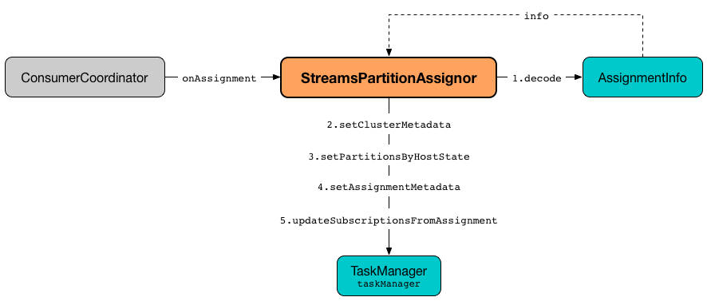

== [[StreamsPartitionAssignor]] StreamsPartitionAssignor -- Dynamic Partition Assignment Strategy

`StreamsPartitionAssignor` is a custom `PartitionAssignor` (from the Kafka Consumer API) that is used to <<assign, assign partitions dynamically>> to the stream processor threads of a Kafka Streams application (identified by the required <<kafka-streams-StreamsConfig.adoc#APPLICATION_ID_CONFIG, StreamsConfig.APPLICATION_ID_CONFIG>> configuration property with the number of stream processor threads per <<kafka-streams-StreamsConfig.adoc#NUM_STREAM_THREADS_CONFIG, StreamsConfig.NUM_STREAM_THREADS_CONFIG>> configuration property).

[TIP]
====
`PartitionAssignor` is used for a dynamic partition assignment and distributing partition ownership across the members of a consumer group.

Read up https://cwiki.apache.org/confluence/display/KAFKA/Kafka+Client-side+Assignment+Proposal[Kafka Client-side Assignment Proposal] on the group management in Apache Kafka's Consumer API.
====

From https://cwiki.apache.org/confluence/display/KAFKA/Kafka+Client-side+Assignment+Proposal[Kafka Client-side Assignment Proposal] (with extra formatting of mine):

> To support client-side assignment, we propose to split the group management protocol into two phases: *group membership* and *state synchronization*.

> *Group Membership* phase is used to set the active members of the group and to elect a group leader.

> *State Synchronization* phase is used to enable the group leader to synchronize member state in the group (in other words to assign each member's state).

> From the perspective of the consumer, group membership phase is used to collect member subscriptions, while state synchronization phase is used to propagate partition assignments.

> The elected leader in the join group phase is responsible for setting the assignments for the whole group.

Given the above, there will be just one elected `StreamsPartitionAssignor` among the members of a Kafka Streams application (so you should see the <<logging, log messages>> from just a single thread).

[[PARTITION_ASSIGNMENT_STRATEGY_CONFIG]]
[[partition.assignment.strategy]]
`StreamsPartitionAssignor` (as a fully-qualified class name) is registered under *partition.assignment.strategy* (`ConsumerConfig.PARTITION_ASSIGNMENT_STRATEGY_CONFIG`) configuration property when `StreamsConfig` is requested for the <<kafka-streams-StreamsConfig.adoc#getMainConsumerConfigs, configuration for the main Kafka Consumer>> (when `StreamThread` is requested to <<kafka-streams-StreamThread.adoc#create, create a new StreamThread instance>> and requests the `KafkaClientSupplier` for a <<kafka-streams-KafkaClientSupplier.adoc#getConsumer, Kafka Consumer>>).

[[creating-instance]]
`StreamsPartitionAssignor` is a Kafka https://kafka.apache.org/21/javadoc/org/apache/kafka/common/Configurable.html[Configurable] that is instantiated by reflection with <<configure, configuration parameters>>. That is when `StreamsPartitionAssignor` finds the current <<taskManager, TaskManager>> (using <<kafka-streams-StreamsConfig.adoc#TASK_MANAGER_FOR_PARTITION_ASSIGNOR, TASK_MANAGER_FOR_PARTITION_ASSIGNOR>> internal property set when the `StreamThread` is <<kafka-streams-StreamThread.adoc#create, created>>).

[[logPrefix]]
`StreamsPartitionAssignor` uses *stream-thread [client.id]* for the `logPrefix` (that uses <<kafka-streams-StreamsConfig.adoc#CLIENT_ID_CONFIG, client.id>> configuration property).

[[numStandbyReplicas]]
`StreamsPartitionAssignor` uses <<kafka-streams-properties.adoc#num.standby.replicas, num.standby.replicas>> configuration property for the number of standby replicas per processing task when <<assign, performing partition assignment>> (and requesting `StickyTaskAssignor` to <<kafka-streams-internals-StickyTaskAssignor.adoc#assign, assign tasks>>).

[[internal-registries]]
.StreamsPartitionAssignor's Internal Properties (e.g. Registries, Counters and Flags)
[cols="1m,3",options="header",width="100%"]
|===
| Name
| Description

| assignmentErrorCode
a| [[assignmentErrorCode]] https://docs.oracle.com/en/java/javase/11/docs/api/java.base/java/util/concurrent/atomic/AtomicInteger.html[java.util.concurrent.atomic.AtomicInteger]

| copartitionedTopicsValidator
a| [[copartitionedTopicsValidator]] <<kafka-streams-internals-CopartitionedTopicsValidator.adoc#, CopartitionedTopicsValidator>>

| internalTopicManager
| [[internalTopicManager]] <<kafka-streams-internals-InternalTopicManager.adoc#, InternalTopicManager>>

Initialized when `StreamsPartitionAssignor` is requested to <<configure, configure>> itself

Used exclusively when `StreamsPartitionAssignor` is requested to <<prepareTopic, prepareTopic>>

| partitionGrouper
a| [[partitionGrouper]] <<kafka-streams-PartitionGrouper.adoc#, PartitionGrouper>>

| supportedVersions
a| [[supportedVersions]] *Supported versions*

All bindings removed (cleared) and then populated in <<assign, assign>>

NOTE: `supportedVersions` does not seem to be used except to hold the entries.

| taskManager
a| [[taskManager]] <<kafka-streams-internals-TaskManager.adoc#, TaskManager>>

| userEndPoint
a| [[userEndPoint]] *User-defined endpoint* in the format of `host:port` as <<configure, configured>> by link:kafka-streams-properties.adoc#application.server[application.server] configuration property (default: empty).

Used when `StreamsPartitionAssignor` is requested to <<subscription, subscription>> (and create a `SubscriptionInfo`)
|===

[[logging]]
[TIP]
====
Enable `ERROR`, `WARN`, `INFO`, `DEBUG` logging level for `org.apache.kafka.streams.processor.internals.StreamsPartitionAssignor` logger to see what happens inside.

Add the following line to `log4j.properties`:

```
log4j.logger.org.apache.kafka.streams.processor.internals.StreamsPartitionAssignor=DEBUG
```

Refer to link:kafka-logging.adoc#log4j.properties[Application Logging Using log4j].
====

=== [[subscription]] `subscription` Method

[source, java]
----
Subscription subscription(Set<String> topics)
----

NOTE: `subscription` is part of Kafka Consumer's `PartitionAssignor` contract to...FIXME.

`subscription`...FIXME

=== [[onAssignment]] Handling Partition Assignment From Group Leader -- `onAssignment` Method

[source, java]
----
void onAssignment(Assignment assignment)
----

[NOTE]
====
`onAssignment` is part of Kafka Consumer's `PartitionAssignor` contract for a group member to handle assignment from the leader.

`onAssignment` is executed when a group member has successfully joined a group.
====

.StreamsPartitionAssignor.onAssignment


`onAssignment` takes the partitions (from the given `assignment`) and sorts them by topic and partition.

`onAssignment` requests `AssignmentInfo` helper object to link:kafka-streams-internals-AssignmentInfo.adoc#decode[decode] the additional metadata (i.e. the `userData` from the input `assignment`).

CAUTION: FIXME Finish me

In the end, `onAssignment` requests the <<taskManager, TaskManager>> for the following:

. <<kafka-streams-internals-TaskManager.adoc#setClusterMetadata, Setting cluster metadata>>

. <<kafka-streams-internals-TaskManager.adoc#setPartitionsByHostState, Notifying StreamsMetadataState about Cluster Metadata Changes>>

. <<kafka-streams-internals-TaskManager.adoc#setAssignmentMetadata, Setting task assignment metadata>> with active and standby tasks

. <<kafka-streams-internals-TaskManager.adoc#updateSubscriptionsFromAssignment, updateSubscriptionsFromAssignment>> with the assigned partitions

`onAssignment` reports an `TaskAssignmentException` if the numbers of partitions and active tasks are not equal.

```
Number of assigned partitions [partitions] is not equal to the number of active taskIds [activeTasks], assignmentInfo=[info]
```

=== [[configure]] Configuring Partition Assignor -- `configure` Method

[source, java]
----
void configure(final Map<String, ?> configs)
----

NOTE: `configure` is part of Kafka Consumer's `Configurable` contract for classes that are instantiated by reflection and need to take configuration parameters.

`configure` creates a <<kafka-streams-StreamsConfig.adoc#InternalStreamsConfig, InternalStreamsConfig>> for the given `configs`.

`configure` initializes the <<logPrefix, logPrefix>> (with <<kafka-streams-properties.adoc#client.id, client.id>> configuration property).

`configure` uses `upgrade.from` property for...FIXME

`configure` uses the given `configs` to find the current <<taskManager, TaskManager>> using <<kafka-streams-StreamsConfig.adoc#TASK_MANAGER_FOR_PARTITION_ASSIGNOR, TASK_MANAGER_FOR_PARTITION_ASSIGNOR>> internal property. If not found or of a different type than `TaskManager`, `configure` throws a `KafkaException`:

```
TaskManager is not specified
```

```
[className] is not an instance of org.apache.kafka.streams.processor.internals.TaskManager
```

`configure` uses the given `configs` to find the current <<assignmentErrorCode, assignmentErrorCode>> using <<kafka-streams-StreamsConfig.adoc#ASSIGNMENT_ERROR_CODE, ASSIGNMENT_ERROR_CODE>> internal property. If not found or of a different type than `AtomicInteger`, `configure` throws a `KafkaException`:

```
assignmentErrorCode is not specified
```

```
[className] is not an instance of java.util.concurrent.atomic.AtomicInteger
```

`configure` uses the given `configs` to find the current <<numStandbyReplicas, numStandbyReplicas>> using the <<kafka-streams-properties.adoc#num.standby.replicas, num.standby.replicas>> configuration property.

`configure` uses the given `configs` to find the current <<partitionGrouper, partitionGrouper>> using the <<kafka-streams-properties.adoc#partition.grouper, partition.grouper>> configuration property.

`configure` uses the given `configs` to find the current <<userEndPoint, userEndPoint>> using the <<kafka-streams-properties.adoc#application.server, application.server>> configuration property if defined.

`configure` creates the <<internalTopicManager, InternalTopicManager>> (with the Kafka <<kafka-streams-internals-TaskManager.adoc#adminClient, AdminClient>> of the <<taskManager, TaskManager>> and the `InternalStreamsConfig`).

`configure` creates the <<copartitionedTopicsValidator, CopartitionedTopicsValidator>> (with the <<logPrefix, logPrefix>>).

=== [[prepareTopic]] `prepareTopic` Internal Method

[source, java]
----
void prepareTopic(final Map<String, InternalTopicMetadata> topicPartitions)
----

`prepareTopic` prints out the following DEBUG message to the logs:

```
Starting to validate internal topics [topicPartitions] in partition assignor.
```

For every `InternalTopicMetadata` (in the given `topicPartitions` collection), `prepareTopic` makes sure that the number of partition is defined, i.e. is `0` or more. If not, `prepareTopic` throws a `StreamsException`:

```
stream-thread [client.id] Topic [[name]] number of partitions not defined
```

In the end, `prepareTopic` requests the <<internalTopicManager, InternalTopicManager>> to <<kafka-streams-internals-InternalTopicManager.adoc#makeReady, makeReady>> the topics and prints out the following DEBUG message to the logs:

```
Completed validating internal topics [topicPartitions] in partition assignor.
```

NOTE: `prepareTopic` is used exclusively when `StreamsPartitionAssignor` is requested to <<assign, perform partition assignment>> (and finds repartition source and change log topics).

=== [[assign]] Performing Group Assignment (Assigning Tasks To Consumer Clients) -- `assign` Method

[source, java]
----
Map<String, Assignment> assign(
  Cluster metadata,
  Map<String, Subscription> subscriptions)
----

NOTE: `assign` is part of Kafka Consumer's `PartitionAssignor` contract to perform *group assignment* given the member subscriptions and current cluster metadata.

NOTE: The input `Map<String, Subscription>` contains bindings of a consumer ID and the Kafka `Subscription` with a list of topics (their names) and a user data encoded (as a https://docs.oracle.com/en/java/javase/11/docs/api/java.base/java/nio/ByteBuffer.html[java.nio.ByteBuffer]).

`assign` constructs the client metadata (as `Map<UUID, ClientMetadata>`) from the decoded <<kafka-streams-internals-SubscriptionInfo.adoc#, subscription info>> (from the user data).

. `assign` takes consumer IDs with subscriptions (from `subscriptions`).

. `assign` requests `SubscriptionInfo` to link:kafka-streams-internals-SubscriptionInfo.adoc#decode[decode] the user data of the subscription (aka _metadata_) and makes sure that the version is supported, i.e. up to 2 currently.

. `assign` finds the client metadata (by the process ID) and creates one if not available.

. `assign` requests the `ClientMetadata` to link:kafka-streams-internals-ClientMetadata.adoc#addConsumer[addConsumer].

`assign` prints out the following INFO message to the logs only if the minimal version received is smaller than the latest supported version (i.e. `4`).

```
Downgrading metadata to version [minReceivedMetadataVersion]. Latest supported version is 4.
```

`assign` prints out the following DEBUG message to the logs:

```
Constructed client metadata [clientsMetadata] from the member subscriptions.
```

CAUTION: FIXME

`assign` reports a `IllegalStateException` when the subscription version is unsupported.

```
Unknown metadata version: [usedVersion]; latest supported version: " + SubscriptionInfo.LATEST_SUPPORTED_VERSION
```

=== [[errorAssignment]] `errorAssignment` Method

[source, java]
----
Map<String, Assignment> errorAssignment(
  final Map<UUID, ClientMetadata> clientsMetadata,
  final String topic,
  final int errorCode)
----

`errorAssignment`...FIXME

NOTE: `errorAssignment` is used exclusively when `StreamsPartitionAssignor` is requested to <<assign, perform partition assignment>>.

=== [[versionProbingAssignment]] `versionProbingAssignment` Internal Method

[source, java]
----
Map<String, Assignment> versionProbingAssignment(
  final Map<UUID, ClientMetadata> clientsMetadata,
  final Map<TaskId, Set<TopicPartition>> partitionsForTask,
  final Map<HostInfo, Set<TopicPartition>> partitionsByHostState,
  final Set<String> futureConsumers,
  final int minUserMetadataVersion)
----

`versionProbingAssignment`...FIXME

NOTE: `versionProbingAssignment` is used exclusively when `StreamsPartitionAssignor` is requested to <<assign, perform partition assignment>>.

=== [[computeNewAssignment]] `computeNewAssignment` Internal Method

[source, java]
----
Map<String, Assignment> computeNewAssignment(
  final Map<UUID, ClientMetadata> clientsMetadata,
  final Map<TaskId, Set<TopicPartition>> partitionsForTask,
  final Map<HostInfo, Set<TopicPartition>> partitionsByHostState,
  final int minUserMetadataVersion)
----

`computeNewAssignment`...FIXME

NOTE: `computeNewAssignment` is used exclusively when `StreamsPartitionAssignor` is requested to <<assign, perform partition assignment>>.
