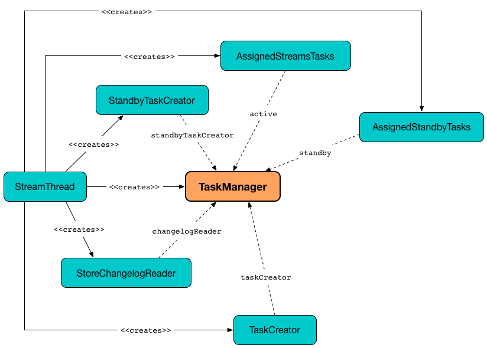
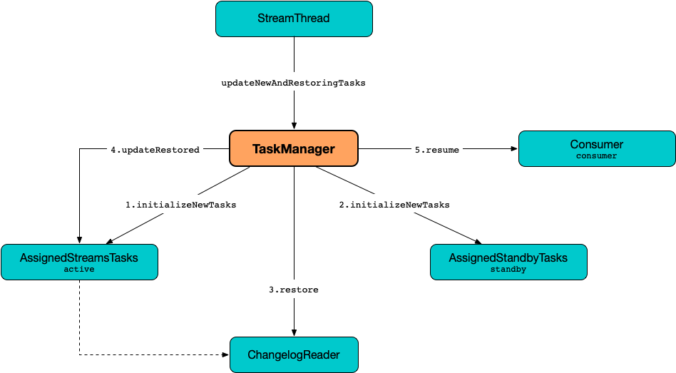
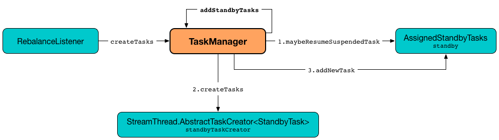

== [[TaskManager]] TaskManager

`TaskManager` manages <<active, active>> and <<standby, standby>> tasks of a KafkaStreams application.

`TaskManager` <<createTasks, creates new tasks>> when `RebalanceListener` handles link:kafka-streams-StreamThread-RebalanceListener.adoc#onPartitionsAssigned[onPartitionsAssigned] (and requests to <<createTasks, create processor tasks for assigned topic partitions>> that in turn <<addStreamTasks, adds new stream tasks>>).

`TaskManager` uses the <<standbyTaskCreator, StandbyTaskCreator>> to <<kafka-streams-internals-StandbyTaskCreator.adoc#createTasks, create standby tasks>> when requested to <<addStandbyTasks, addStandbyTasks>>.

`TaskManager` is <<creating-instance, created>> along with a <<kafka-streams-internals-StreamThread.adoc#create, StreamThread>> (with empty <<active, AssignedStreamsTasks>> and <<standby, AssignedStandbyTasks>>).

.Creating TaskManager


When <<creating-instance, created>>, `TaskManager` is given a Kafka <<adminClient, AdminClient>> that is used for the following:

* `TaskManager` is requested to <<maybePurgeCommitedRecords, maybePurgeCommitedRecords>> (and deletes records)

* `StreamsPartitionAssignor` is requested to <<kafka-streams-internals-StreamsPartitionAssignor.adoc#configure, configure>> (and creates an <<kafka-streams-internals-StreamsPartitionAssignor.adoc#internalTopicManager, InternalTopicManager>>)

When <<creating-instance, created>>, `TaskManager` is given a <<streamsMetadataState, StreamsMetadataState>> that is used exclusively to <<setPartitionsByHostState, get notifications about the changes in cluster metadata>>. The <<streamsMetadataState, StreamsMetadataState>> can then be displayed when `TaskManager` is requested for <<toString, text representation>>.

.Displaying StreamsMetadataState (In Textual Representation)
[source, scala]
----
// FIXME: TaskManager.toString
----

[[logging]]
[TIP]
====
Enable one of `ERROR`, `WARN`, `DEBUG`, `TRACE` logging levels for `org.apache.kafka.streams.processor.internals.TaskManager` logger to see what happens inside.

Add the following line to `log4j.properties`:

```
log4j.logger.org.apache.kafka.streams.processor.internals.TaskManager=TRACE
```

Refer to link:kafka-logging.adoc#log4j.properties[Application Logging Using log4j].
====

=== [[setPartitionsByHostState]] Notifying StreamsMetadataState About Changes in Cluster Metadata -- `setPartitionsByHostState` Method

[source, java]
----
void setPartitionsByHostState(final Map<HostInfo, Set<TopicPartition>> partitionsByHostState)
----

`setPartitionsByHostState` simply notifies the <<streamsMetadataState, StreamsMetadataState>> that <<kafka-streams-StreamsMetadataState.adoc#onChange, cluster metadata has changed>>.

NOTE: `setPartitionsByHostState` is used when `StreamsPartitionAssignor` is requested to <<kafka-streams-internals-StreamsPartitionAssignor.adoc#assign, assign>> and <<kafka-streams-internals-StreamsPartitionAssignor.adoc#onAssignment, onAssignment>>.

=== [[setAssignmentMetadata]] Setting Assignment Metadata with Active and Standby Tasks -- `setAssignmentMetadata` Method

[source, java]
----
setAssignmentMetadata(
  final Map<TaskId, Set<TopicPartition>> activeTasks,
  final Map<TaskId, Set<TopicPartition>> standbyTasks)
----

`setAssignmentMetadata` simply initializes the <<assignedActiveTasks, assignedActiveTasks>> and <<assignedStandbyTasks, assignedStandbyTasks>> internal registries with the given `activeTasks` and `standbyTasks`, respectively.

NOTE: `setAssignmentMetadata` is used exclusively when `StreamsPartitionAssignor` is requested to <<kafka-streams-internals-StreamsPartitionAssignor.adoc#onAssignment, handle assignment from the consumer group leader>>.

=== [[updateSubscriptionsFromAssignment]] `updateSubscriptionsFromAssignment` Method

[source, java]
----
void updateSubscriptionsFromAssignment(List<TopicPartition> partitions)
----

`updateSubscriptionsFromAssignment`...FIXME

NOTE: `updateSubscriptionsFromAssignment` is used exclusively when `StreamsPartitionAssignor` is requested to link:kafka-streams-internals-StreamsPartitionAssignor.adoc#onAssignment[handle assignment from the leader]

=== [[updateSubscriptionsFromMetadata]] `updateSubscriptionsFromMetadata` Method

[source, java]
----
void updateSubscriptionsFromMetadata(Set<String> topics)
----

`updateSubscriptionsFromMetadata`...FIXME

NOTE: `updateSubscriptionsFromMetadata` is used when `StreamsPartitionAssignor` is requested to link:kafka-streams-internals-StreamsPartitionAssignor.adoc#subscription[subscription].

=== [[suspendTasksAndState]] Suspending All (Active and Standby) Stream Tasks And State -- `suspendTasksAndState` Method

[source, java]
----
void suspendTasksAndState()
----

`suspendTasksAndState`...FIXME

NOTE: `suspendTasksAndState` is used exclusively when `RebalanceListener` handles link:kafka-streams-StreamThread-RebalanceListener.adoc#onPartitionsAssigned[onPartitionsAssigned].

=== [[updateNewAndRestoringTasks]] `updateNewAndRestoringTasks` Method

[source, java]
----
boolean updateNewAndRestoringTasks()
----

`updateNewAndRestoringTasks` returns `true` only when the <<active, AssignedStreamsTasks>> tasks are <<kafka-streams-AssignedStreamsTasks.adoc#allTasksRunning, all running>> in the end. Otherwise, `updateNewAndRestoringTasks` returns `false`.

.TaskManager and updateNewAndRestoringTasks


Internally, `updateNewAndRestoringTasks` requests the <<active, AssignedStreamsTasks>> and the <<standby, AssignedStandbyTasks>> tasks to <<kafka-streams-internals-AssignedTasks.adoc#initializeNewTasks, initialize new tasks>>.

`updateNewAndRestoringTasks` requests the <<changelogReader, ChangelogReader>> to <<kafka-streams-ChangelogReader.adoc#restore, restore>> the <<active, AssignedStreamsTasks>> tasks.

`updateNewAndRestoringTasks` requests the <<active, AssignedStreamsTasks>> tasks to <<kafka-streams-AssignedStreamsTasks.adoc#updateRestored, updateRestored>>.

`updateNewAndRestoringTasks` requests the <<active, AssignedStreamsTasks>> tasks to <<kafka-streams-AssignedStreamsTasks.adoc#allTasksRunning, check out if allTasksRunning>>.

If not <<kafka-streams-AssignedStreamsTasks.adoc#allTasksRunning, all active tasks are running>>, `updateNewAndRestoringTasks` returns `false`.

Otherwise, if <<kafka-streams-AssignedStreamsTasks.adoc#allTasksRunning, all active tasks are running>>, `updateNewAndRestoringTasks` requests the <<consumer, Kafka consumer>> for the partition assignment (using link:++https://kafka.apache.org/22/javadoc/org/apache/kafka/clients/consumer/KafkaConsumer.html#assignment--++[Consumer.assignment]) and prints out the following TRACE message to the logs:

```
Resuming partitions [assignment]
```

`updateNewAndRestoringTasks` then requests the <<consumer, Kafka consumer>> to resume partitions (using link:++https://kafka.apache.org/22/javadoc/org/apache/kafka/clients/consumer/KafkaConsumer.html#resume-java.util.Collection-++[Consumer.resume]), <<assignStandbyPartitions, assignStandbyPartitions>> and returns `true`.

NOTE: `updateNewAndRestoringTasks` is used exclusively when `StreamThread` is requested to <<kafka-streams-internals-StreamThread.adoc#runOnce, poll records once and add them to active stream tasks>> (while <<kafka-streams-internals-StreamThread.adoc#runLoop, running the main record processing loop>> and transitioning from <<kafka-streams-internals-StreamThread.adoc#PARTITIONS_ASSIGNED, PARTITIONS_ASSIGNED>> to <<kafka-streams-internals-StreamThread.adoc#RUNNING, RUNNING>> state).

=== [[assignStandbyPartitions]] `assignStandbyPartitions` Internal Method

[source, java]
----
void assignStandbyPartitions()
----

`assignStandbyPartitions`...FIXME

NOTE: `assignStandbyPartitions` is used when...FIXME

=== [[activeTask]] Getting Active Stream Processor Task for Topic Partition -- `activeTask` Method

[source, java]
----
StreamTask activeTask(final TopicPartition partition)
----

`activeTask` simply looks up the <<kafka-streams-internals-StreamTask.adoc#, StreamTask>> for the input https://kafka.apache.org/22/javadoc/org/apache/kafka/common/TopicPartition.html[partition] (in the internal <<active, active>> registry).

NOTE: `activeTask` is used exclusively when `StreamThread` is requested to <<kafka-streams-internals-StreamThread.adoc#addRecordsToTasks, add records to active stream tasks>>.

=== [[creating-instance]] Creating TaskManager Instance

`TaskManager` takes the following to be created:

* [[changelogReader]] <<kafka-streams-ChangelogReader.adoc#, ChangelogReader>>
* [[processId]] Process ID
* [[logPrefix]] `logPrefix`
* [[restoreConsumer]] Kafka "restore" https://kafka.apache.org/22/javadoc/org/apache/kafka/clients/consumer/KafkaConsumer.html[Consumer] (`Consumer<byte[], byte[]>`)
* [[streamsMetadataState]] <<kafka-streams-StreamsMetadataState.adoc#, StreamsMetadataState>>
* [[taskCreator]] <<kafka-streams-internals-AbstractTaskCreator.adoc#, AbstractTaskCreator>> of <<kafka-streams-internals-StreamTask.adoc#, StreamTasks>> (`StreamThread.AbstractTaskCreator<StreamTask>`)
* [[standbyTaskCreator]] <<kafka-streams-internals-AbstractTaskCreator.adoc#, AbstractTaskCreator>> of <<kafka-streams-internals-StandbyTask.adoc#, StandbyTasks>> (`StreamThread.AbstractTaskCreator<StandbyTask>`)
* [[adminClient]] Kafka https://kafka.apache.org/22/javadoc/org/apache/kafka/clients/admin/AdminClient.html[AdminClient]
* [[active]] <<kafka-streams-AssignedStreamsTasks.adoc#, AssignedStreamsTasks>>
* [[standby]] <<kafka-streams-AssignedStandbyTasks.adoc#, AssignedStandbyTasks>>

`TaskManager` initializes the <<internal-properties, internal properties>>.

=== [[hasActiveRunningTasks]] `hasActiveRunningTasks` Method

[source, java]
----
boolean hasActiveRunningTasks()
----

`hasActiveRunningTasks` simply asks <<active, AssignedStreamsTasks>> whether it link:kafka-streams-internals-AssignedTasks.adoc#hasRunningTasks[has any tasks registered or not].

.TaskManager and AssignedStreamsTasks
image::images/kafka-streams-TaskManager-hasActiveRunningTasks.png[align="center"]

NOTE: `hasActiveRunningTasks` is used exclusively when `StreamThread` is requested to link:kafka-streams-internals-StreamThread.adoc#runOnce[consume records once] (and there are records to be processed).

=== [[hasStandbyRunningTasks]] `hasStandbyRunningTasks` Method

[source, java]
----
boolean hasStandbyRunningTasks()
----

`hasStandbyRunningTasks` simply asks <<standby, AssignedStandbyTasks>> whether it link:kafka-streams-internals-AssignedTasks.adoc#hasRunningTasks[has any tasks registered or not].

.TaskManager and AssignedStandbyTasks
image::images/kafka-streams-TaskManager-hasStandbyRunningTasks.png[align="center"]

NOTE: `hasStandbyRunningTasks` is used exclusively when `StreamThread` is requested to link:kafka-streams-internals-StreamThread.adoc#maybeUpdateStandbyTasks[maybeUpdateStandbyTasks] (while link:kafka-streams-internals-StreamThread.adoc#runOnce[consuming records once]).

=== [[createTasks]] Creating Tasks for Assigned Partitions -- `createTasks` Method

[source, java]
----
void createTasks(final Collection<TopicPartition> assignment)
----

.TaskManager.createTasks
image::images/kafka-streams-TaskManager-createTasks.png[align="center"]

`createTasks` requests the <<standby, AssignedStandbyTasks>> and the <<active, AssignedStreamsTasks>> to <<kafka-streams-internals-AssignedTasks.adoc#closeNonAssignedSuspendedTasks, closeNonAssignedSuspendedTasks>> (with the <<assignedStandbyTasks, assignedStandbyTasks>> and the <<assignedActiveTasks, assignedActiveTasks>>, respectively).

`createTasks` <<addStreamTasks, (re)creates the stream tasks>> for the input `assignment` partitions.

`createTasks` <<addStandbyTasks, addStandbyTasks>>.

`createTasks` prints out the following TRACE message to the logs:

```
Pausing partitions: [assignment]
```

In the end, `createTasks` requests the <<consumer, Kafka consumer>> to pause the `assignment` partitions.

NOTE: `createTasks` triggers `Consumer.pause` method that suspends fetching records from partitions until they have been resumed using `Consumer.resume`.

`createTasks` reports an `IllegalStateException` if the <<consumer, consumer>> is not defined (`null`):

```
stream-thread [threadClientId] consumer has not been initialized while adding stream tasks. This should not happen.
```

NOTE: `createTasks` is used exclusively when `RebalanceListener` is requested to <<kafka-streams-StreamThread-RebalanceListener.adoc#onPartitionsAssigned, handles an onPartitionsAssigned event>>.

=== [[addStreamTasks]] (Re)Creating Stream Tasks Per Assigned Partitions -- `addStreamTasks` Internal Method

[source, java]
----
void addStreamTasks(final Collection<TopicPartition> assignment)
----

`addStreamTasks` registers new stream tasks.

NOTE: `addStreamTasks` does nothing (and simply returns back) unless <<assignedActiveTasks, assignedActiveTasks>> has at least one task id.

.TaskManager.addStreamTasks
image::images/kafka-streams-TaskManager-addStreamTasks.png[align="center"]

`addStreamTasks` prints out the following DEBUG message to the logs:

```
Adding assigned tasks as active: [assignedActiveTasks]
```

For every task id in <<assignedActiveTasks, assignedActiveTasks>>, if the partitions of a task are all included in the input `assignment` partitions `addStreamTasks` requests <<active, AssignedStreamsTasks>> to <<maybeResumeSuspendedTask, maybeResumeSuspendedTask>> (passing in the task id and partitions). If negative, `addStreamTasks` records the task and partitions in a local registry of new tasks to be created.

If the partitions of a task are not all included in the input `assignment` partitions `addStreamTasks` prints out the following WARN message to the logs:

```
Task [taskId] owned partitions [partitions] are not contained in the assignment [assignment]
```

When there are new tasks to be created, `addStreamTasks` prints out the following TRACE message to the logs:

```
New active tasks to be created: [newTasks]
```

`addStreamTasks` then requests <<taskCreator, StreamThread.AbstractTaskCreator<StreamTask&gt;>> to <<kafka-streams-internals-AbstractTaskCreator.adoc#createTasks, createTasks>> for every new task (with the <<consumer, Kafka Consumer>>) and requests <<active, AssignedStreamsTasks>> to link:kafka-streams-internals-AssignedTasks.adoc#addNewTask[register a new task].

NOTE: `addStreamTasks` is used exclusively when `TaskManager` is requested to <<createTasks, create processor tasks for assigned topic partitions>>.

=== [[addStandbyTasks]] Adding Standby Tasks -- `addStandbyTasks` Internal Method

[source, java]
----
void addStandbyTasks()
----

`addStandbyTasks` registers new standby tasks.

NOTE: `addStandbyTasks` does nothing and simply exits when the <<assignedStandbyTasks, assignedStandbyTasks>> internal registry has no standby tasks assigned.

.TaskManager.addStandbyTasks


`addStandbyTasks` prints out the following DEBUG message to the logs:

```
Adding assigned standby tasks [assignedStandbyTasks]
```

For every task (id and partitions) in the <<assignedStandbyTasks, assignedStandbyTasks>> registry, `addStandbyTasks` requests <<standby, AssignedStandbyTasks>> to link:kafka-streams-internals-AssignedTasks.adoc#maybeResumeSuspendedTask[maybeResumeSuspendedTask] and, if negative, adds the task to tasks to be created in standby mode.

If no new tasks should be in standby mode, `addStandbyTasks` simply exits.

When there are new tasks to be in standby mode, `addStandbyTasks` prints out the following TRACE message to the logs:

```
New standby tasks to be created: [newStandbyTasks]
```

`addStandbyTasks` then requests <<standbyTaskCreator, StreamThread.AbstractTaskCreator<StandbyTask&gt;>> to <<kafka-streams-internals-AbstractTaskCreator.adoc#createTasks, createTasks>> for every new standby task (with the <<consumer, Kafka Consumer>>) and requests <<standby, AssignedStandbyTasks>> to link:kafka-streams-internals-AssignedTasks.adoc#addNewTask[register a new task].

NOTE: `addStandbyTasks` is used exclusively when `TaskManager` is requested to <<createTasks, create tasks for assigned topic partitions>>.

=== [[toString]] Describing Itself (Textual Representation) -- `toString` Method

[source, java]
----
String toString(final String indent)
----

`toString` gives a text representation with the following:

* "Active tasks:" followed by the link:kafka-streams-internals-AssignedTasks.adoc#toString[text representation] of <<active, AssignedStreamsTasks>>

* "Standby tasks:" followed by the link:kafka-streams-internals-AssignedTasks.adoc#toString[text representation] of <<standby, AssignedStandbyTasks>>

[source, scala]
----
FIXME toString in action
----

NOTE: `toString` is used exclusively when `StreamThread` is requested to <<kafka-streams-internals-StreamThread.adoc#toString, describe itself>>.

=== [[maybePurgeCommitedRecords]] `maybePurgeCommitedRecords` Method

[source, java]
----
void maybePurgeCommitedRecords()
----

`maybePurgeCommitedRecords`...FIXME

NOTE: `maybePurgeCommitedRecords` is used exclusively when `StreamThread` is requested to <<kafka-streams-internals-StreamThread.adoc#maybeCommit, maybeCommit>> (when `StreamThread` is requested to <<kafka-streams-internals-StreamThread.adoc#runOnce, poll records once>> in the <<kafka-streams-internals-StreamThread.adoc#runLoop, main record processing loop>>).

=== [[process]] Processing Records by Running Stream Tasks (One Record Per Task) -- `process` Method

[source, java]
----
int process()
----

`process` simply requests <<active, AssignedStreamsTasks>> to <<kafka-streams-AssignedStreamsTasks.adoc#process, request the running stream tasks to process a single record (per task)>>.

In the end, `process` gives the number of <<kafka-streams-internals-StreamTask.adoc#, stream tasks>> that processed a record.

NOTE: `process` is used exclusively when `StreamThread` is requested to <<kafka-streams-internals-StreamThread.adoc#processAndMaybeCommit, process records (with optional commit)>> (when requested to <<kafka-streams-internals-StreamThread.adoc#runOnce, poll records once>>).

=== [[maybeCommitActiveTasks]] Committing Active Running Stream Tasks that Requested It -- `maybeCommitActiveTasks` Method

[source, java]
----
int maybeCommitActiveTasks()
----

`maybeCommitActiveTasks` simply requests <<active, AssignedStreamsTasks>> to link:kafka-streams-AssignedStreamsTasks.adoc#maybeCommit[commit running stream tasks that requested it].

In the end, `maybeCommitActiveTasks` gives the number of running stream tasks that link:kafka-streams-internals-StreamTask.adoc#commitNeeded[needed a commit].

NOTE: `maybeCommitActiveTasks` is used exclusively when `StreamThread` is requested to link:kafka-streams-internals-StreamThread.adoc#processAndMaybeCommit[processAndMaybeCommit].

=== [[punctuate]] Punctuating Stream Tasks -- `punctuate` Method

[source, java]
----
int punctuate()
----

`punctuate` simply requests the <<active, AssignedStreamsTasks>> to <<kafka-streams-AssignedStreamsTasks.adoc#punctuate, punctuate running stream tasks (by stream and system time)>>.

NOTE: `punctuate` is used exclusively when `StreamThread` is requested to <<kafka-streams-internals-StreamThread.adoc#maybePunctuate, attempt to punctuate>>.

=== [[commitAll]] Committing Active and Standby Tasks -- `commitAll` Method

[source, java]
----
int commitAll()
----

`commitAll`...FIXME

NOTE: `commitAll` is used exclusively when `StreamThread` is requested to <<kafka-streams-internals-StreamThread.adoc#maybeCommit, commit all tasks (when commit interval elapsed)>>.

=== [[activeTaskIds]] `activeTaskIds` Method

[source, java]
----
Set<TaskId> activeTaskIds()
----

`activeTaskIds`...FIXME

NOTE: `activeTaskIds` is used when...FIXME

=== [[standbyTaskIds]] `standbyTaskIds` Method

[source, java]
----
Set<TaskId> standbyTaskIds()
----

`standbyTaskIds`...FIXME

NOTE: `standbyTaskIds` is used when...FIXME

=== [[cachedTasksIds]] `cachedTasksIds` Method

[source, java]
----
Set<TaskId> cachedTasksIds()
----

`cachedTasksIds`...FIXME

NOTE: `cachedTasksIds` is used when...FIXME

=== [[internal-properties]] Internal Properties

.TaskManager's Internal Properties (e.g. Registries, Counters and Flags)
[cols="30m,70",options="header",width="100%"]
|===
| Name
| Description

| assignedActiveTasks
a| [[assignedActiveTasks]]

[source, java]
----
Map<TaskId, Set<TopicPartition>> assignedActiveTasks
----

*Assigned active tasks* with the https://kafka.apache.org/22/javadoc/org/apache/kafka/common/TopicPartition.html[partitions] per <<kafka-streams-TaskId.adoc#, task id>>

Initialized when <<setAssignmentMetadata, setting assignment metadata with active and standby tasks>>

Used exclusively when `TaskManager` is requested to <<createTasks, create tasks for the assigned partitions>>

| assignedStandbyTasks
a| [[assignedStandbyTasks]]

[source, java]
----
Map<TaskId, Set<TopicPartition>> assignedStandbyTasks
----

*Assigned standby tasks* (as Kafka https://kafka.apache.org/22/javadoc/org/apache/kafka/common/TopicPartition.html[TopicPartitions] per <<kafka-streams-TaskId.adoc#, task id>>)

* Set when <<setAssignmentMetadata, setting assignment metadata with active and standby tasks>>

* Used when <<createTasks, creating processor tasks for assigned topic partitions>> (and <<addStandbyTasks, addStandbyTasks>>)

| cluster
a| [[cluster]] *Cluster metadata*, i.e. Kafka https://kafka.apache.org/22/javadoc/org/apache/kafka/common/Cluster.html[Cluster] with topic partitions

[[setClusterMetadata]]
* Set when `StreamsPartitionAssignor` does link:kafka-streams-internals-StreamsPartitionAssignor.adoc#assign[assign] and link:kafka-streams-internals-StreamsPartitionAssignor.adoc#onAssignment[onAssignment]

| consumer
a| [[consumer]] Kafka https://kafka.apache.org/22/javadoc/org/apache/kafka/clients/consumer/KafkaConsumer.html[Consumer] (`Consumer<byte[], byte[]>`)

[[setConsumer]]
Assigned right when `StreamThread` is link:kafka-streams-internals-StreamThread.adoc#create[created] (and corresponds to the link:kafka-streams-internals-StreamThread.adoc#consumer[Kafka consumer] from the link:kafka-streams-KafkaClientSupplier.adoc#getConsumer[KafkaClientSupplier] that was used to create the link:kafka-streams-KafkaStreams.adoc#creating-instance[KafkaStreams])

|===
