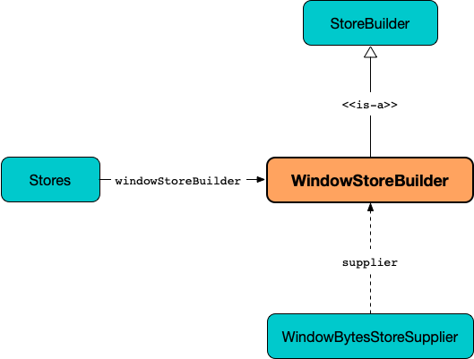

== [[WindowStoreBuilder]] WindowStoreBuilder

`WindowStoreBuilder` is a <<kafka-streams-StoreBuilder.adoc#, StoreBuilder>> (indirectly as an <<kafka-streams-internals-AbstractStoreBuilder.adoc#, AbstractStoreBuilder>>) that is used to <<build, build WindowStores>> (using a given <<storeSupplier, WindowBytesStoreSupplier>>).

[[creating-instance]]
`WindowStoreBuilder` takes the following when created:

* [[storeSupplier]] <<kafka-streams-WindowBytesStoreSupplier.adoc#, WindowBytesStoreSupplier>>
* [[keySerde]] `Serde` for keys
* [[valueSerde]] `Serde` for values
* [[time]] `Time`

`WindowStoreBuilder` can however be <<creating-instance, created>> using <<kafka-streams-Stores.adoc#windowStoreBuilder, Stores.windowStoreBuilder>>.

.Creating WindowStoreBuilder using Stores.windowStoreBuilder

[source, scala]
----
import org.apache.kafka.streams.state.Stores
// Using Scala API for Kafka Streams
import org.apache.kafka.streams.scala.Serdes
import java.time.Duration
val storeBuilder = Stores.windowStoreBuilder(
  Stores.persistentWindowStore(
    "queryable-store-name",
    Duration.ofMinutes(1),
    Duration.ofSeconds(30),
    false),
  Serdes.Integer,
  Serdes.Long)
scala> :type storeBuilder
org.apache.kafka.streams.state.StoreBuilder[org.apache.kafka.streams.state.WindowStore[Int,Long]]

import org.apache.kafka.streams.state.internals.WindowStoreBuilder
assert(storeBuilder.isInstanceOf[WindowStoreBuilder[_, _]])
----

[[build]]
When requested to <<kafka-streams-StoreBuilder.adoc#build, build a state store>>, `WindowStoreBuilder` creates a new <<kafka-streams-internals-MeteredWindowStore.adoc#, MeteredWindowStore>> (with the <<kafka-streams-WindowBytesStoreSupplier.adoc#get, state store>> and the <<kafka-streams-StoreSupplier.adoc#metricsScope, metricsScope>> from the <<storeSupplier, WindowBytesStoreSupplier>>).

[source, scala]
----
scala> :type storeBuilder
org.apache.kafka.streams.state.StoreBuilder[org.apache.kafka.streams.state.WindowStore[Int,Long]]

val windowStore = storeBuilder.build
scala> :type windowStore
org.apache.kafka.streams.state.WindowStore[Int,Long]
----

With <<kafka-streams-StoreBuilder.adoc#withCachingEnabled, caching enabled>>, `build` creates a <<kafka-streams-internals-MeteredWindowStore.adoc#, MeteredWindowStore>> (with a <<kafka-streams-StateStore-CachingWindowStore.adoc#, CachingWindowStore>>).

[source, scala]
----
scala> :type storeBuilder
org.apache.kafka.streams.state.StoreBuilder[org.apache.kafka.streams.state.WindowStore[Int,Long]]

val withCachingWindowStoreBuilder = storeBuilder.withCachingEnabled

val windowStore = withCachingWindowStoreBuilder.build
import org.apache.kafka.streams.state.internals.MeteredWindowStore
assert(windowStore.isInstanceOf[MeteredWindowStore[_, _]])
----

With <<kafka-streams-StoreBuilder.adoc#withLoggingEnabled, logging enabled>>, `build` creates a <<kafka-streams-internals-MeteredWindowStore.adoc#, MeteredWindowStore>> (with a <<kafka-streams-StateStore-ChangeLoggingWindowBytesStore.adoc#, ChangeLoggingWindowBytesStore>>).

=== [[maybeWrapLogging]] `maybeWrapLogging` Internal Method

[source, java]
----
WindowStore<Bytes, byte[]> maybeWrapLogging(
  final WindowStore<Bytes, byte[]> inner)
----

`maybeWrapLogging`...FIXME

NOTE: `maybeWrapLogging` is used when...FIXME

=== [[maybeWrapCaching]] `maybeWrapCaching` Internal Method

[source, java]
----
WindowStore<Bytes, byte[]> maybeWrapCaching(
  final WindowStore<Bytes, byte[]> inner)
----

`maybeWrapCaching`...FIXME

NOTE: `maybeWrapCaching` is used when...FIXME

=== [[retentionPeriod]] `retentionPeriod` Method

[source, java]
----
long retentionPeriod()
----

`retentionPeriod`...FIXME

NOTE: `retentionPeriod` is used when...FIXME
